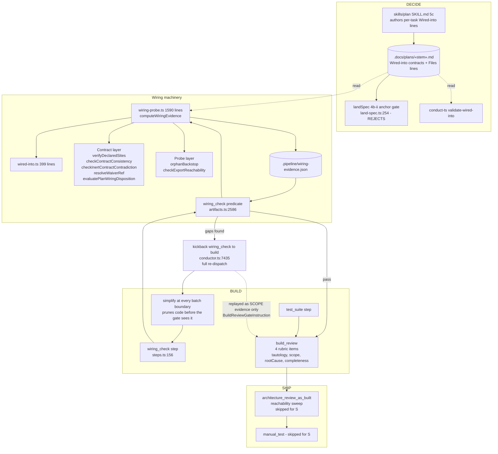
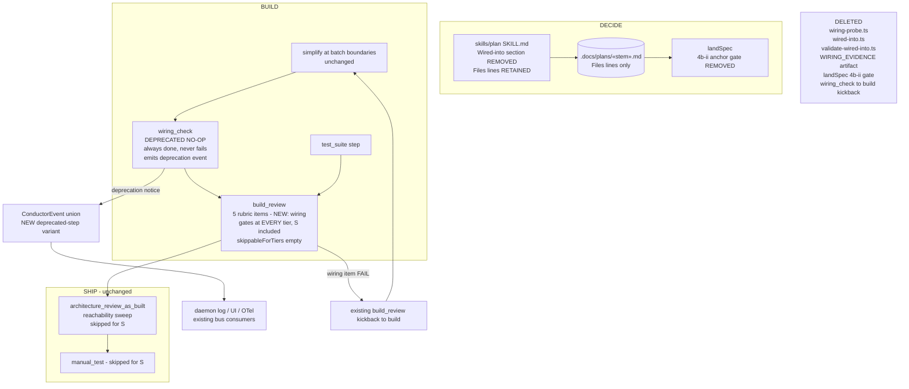

# Components: Move wiring judgement into build_review

**Last updated:** 2026-08-11
**Scope:** Deleting the wiring machinery — both the per-task `**Wired-into:**` contract layer and the deterministic reachability probe — and moving the reachability judgement into `build_review` as a fifth rubric item. The `wiring_check` step is retained as a deprecated no-op so live state, consumer config, and `build_review`'s own prerequisites keep resolving. The SHIP as-built reachability sweep is unchanged.

## Diagram — current state

## Diagram — after this change

## Legend

- **DELETED** collects what is removed outright. **DEPRECATED NO-OP** is retained deliberately — see `adr-2026-08-11-deprecated-no-op-step-retirement`.
- Solid arrows: control/step flow. Dotted arrows: reads and replayed evidence.
- The BUILD parallel group keeps both branches, so `types/events.ts:489,500` need no narrowing — `wiring_check` remains a valid member name.
- `build_review` is `skippableForTiers: []` (`steps.ts:185`), which is why moving the judgement there covers S-tier, something neither the removed gate's replacement-by-SHIP nor `manual_test` would have done.

## Removal surface

**Deleted outright**
- `src/engine/wiring-probe.ts`, `src/engine/wired-into.ts`, `src/engine/validate-wired-into.ts`
- Tests: `wiring-probe.test.ts`, `wiring-layer2.test.ts`, `wiring-waiver.test.ts`, `wired-into.test.ts`, `engine/validate-wired-into-cli.test.ts`, `acceptance/wiring-evidence-end-to-end.acceptance.test.ts`

**Edited**
- `engine/artifacts.ts` — the `wiring_check` predicate at 2586 collapses to an unconditional pass; `WIRING_EVIDENCE` (1350), `validateWiringEvidence`, and the artifact glob (282) are deleted
- `engine/conductor.ts` — the `wiring_check → build` kickback routing at 3811, 4445, 4680-4756, 7416-7486
- `engine/build-review-prompt.ts` — the fifth rubric item, the all-or-FAIL count, and the verdict JSON schema
- `engine/build-review-inputs.ts` — the now-vestigial `BuildReviewGateInstruction` wiring feed
- `engine/engineer/land-spec.ts:254-290` — the 4b-ii gate
- `engine/steps.ts` — `wiring_check` marked deprecated no-op; `types/events.ts` — new deprecation variant
- `src/cli.ts` — the `validate-wired-into` subcommand; `src/index.ts` — re-exports
- `engine/skill-invocation.ts`, `engine/step-runners.ts:525`, `engine/gate-invalidation.ts`, `engine/model-table-metadata.ts`, `engine/resolved-config.ts`, `engine/rebase.ts`, `engine/daemon-rekick.ts`, `src/daemon-cli.ts` — entries that assume the step does work
- `engine/plan-task-parse.ts` — only the `WIRED_INTO_LINE` export and its documented ESM cycle (`wired-into.ts:1-12`) go

**Explicitly retained**
- **`**Files:**` per-task lines and `parsePlanTaskPaths`.** Three live non-wiring consumers depend on them: `plan-protected-targets.ts:23` (the protected-artifact seal), `autoheal.ts:541`, and `remediation-append.ts:63`. Only wiring's *use* of per-task file scoping is removed.
- The SHIP as-built reachability sweep (`skills/architecture-review/SKILL.md:383-405`), unchanged.

**Docs and skills**
- `skills/plan/SKILL.md` — task template line 101, §5c grammar 140-191, self-authoring 286, checklist 501
- `skills/architecture-review/SKILL.md:304` — plan-contract references; §12 sweep untouched but gains an ADR citation
- `HARNESS.md`, `docs/explanation/gates.md`, `docs/reference/steps.md`, `docs/reference/cli.md`, `docs/reference/skills.md`, `docs/contributing/validation.md`

## Compatibility

Retaining the step as a no-op is what makes this change low-risk, and it removes the hazard class entirely rather than mitigating it:

1. **`build_review` prerequisites** (`steps.ts:184`) still resolve — the name is still live.
2. **In-flight `conduct-state.json`** still parses. `getStepDefinition` throws `Unknown step`
   (`steps.ts:435`), a throw that `steps.ts:411` records as having killed a run mid-flight; nothing here can reach it.
3. **Consumer `settings.json`** step-keyed retry/autonomy entries still resolve (`resolved-config.ts:46,77,397`).
4. **`.pipeline/build-review.json`** gains a `wiring` rubric key. Verdicts written before this change lack it and must read as "not judged", never as a silent pass.
