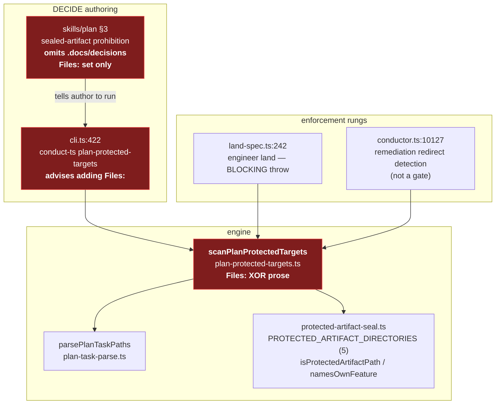
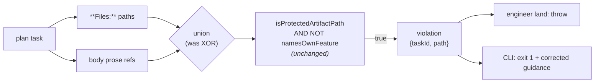

# Architecture: Protected-target scan enforcement path

**Date:** 2026-08-19
**Feature:** plan-tasks-can-declare-a-protected-artifact-outcom
**Governing decision:** [adr-2026-08-04-decide-owned-amendment-of-accepted-artifacts](../decisions/adr-2026-08-04-decide-owned-amendment-of-accepted-artifacts.md) §4

## Scope

One pure function and its three callers. No new component, no new channel, no new store — this
feature repairs detection inside an existing seam.

## C4 L3 — component view (current, with the defect marked)

**Defect surface (red).** Three components state the same wrong rule:

| Component | Wrong rule |
| --- | --- |
| `scanPlanProtectedTargets` | Scans `**Files:**` paths **or** body prose, never both. |
| `skills/plan` §3 | Prohibition scoped to the `**Files:**` set; omits `.docs/decisions/`. |
| `cli.ts:433` message | Advises adding `**Files:**` — the change that silences the prose scan. |

## Target state

The single structural change is `XOR → union`. The predicate, the return shape, the three callers,
and the `parsePlanTaskPaths` / seal-module dependencies are all unchanged — the governing ADR §4
requires the policy to reuse "the seal module's own directory set and own-feature predicate … so a
future change to what 'sealed' means propagates for free."

**Unchanged by design.** `namesOwnFeature` stays: the seal reports own-feature drift as a
`selfAmendment` and returns `ok: true` (`protected-artifact-seal.ts:1000`, `conductor.ts:6092`),
and the governing ADR §3 states the exclusion is deliberate.

## Deliberately absent

- No build-dispatch rung. The ADR: enforcement is "at authoring and land, not retroactive over
  merged plans." Measured exposure across 112 unshipped plans is effectively zero.
- No plan-declared bypass. Rejected by name in the governing ADR's alternatives.
- No marker-word detection for a prose reference carrying no path. Never observed, and measured at
  a 31% false-positive rate on a gate that fronts every land — see the architecture review's R1.
- No new event, ledger, or sidecar. The violation is a return value consumed in-process by the
  caller that asked for it.
