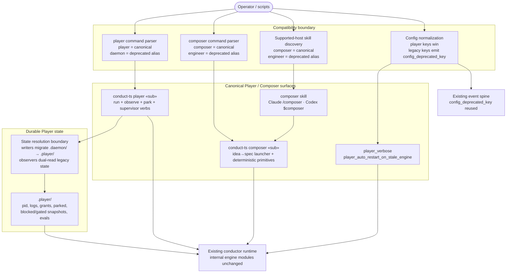

# Components: Music-Vocabulary Rename Surfaces (daemon→Player, engineer→Composer)

**Last updated:** 2026-08-26
**Scope:** The naming surfaces the 1.0 rename touches, and the alias/deprecation transition
layer that keeps old names working through the major. Decision + scoping feature for #227;
implementation ships with cutover PR #226's major. Verdict vocabulary is out of scope (#1918).

> **Amended 2026-08-26 by operator review of #1921:** this spec now owns the complete
> Player/Composer implementation rather than a later scoping-only handoff. The diagram below
> reflects the planned production architecture: canonical commands and skill names, compatibility
> aliases, canonical config keys, and single-write `.player/` state with legacy migration.

## Diagram

## Legend

- **Compatibility boundary** — canonicalizes old names once. New code consumes only Player/Composer
  names; old CLI and skill names remain temporary aliases and produce a deprecation warning.
- **Config normalization** — `player_verbose` and `player_auto_restart_on_stale_engine` are
  canonical. `daemon_verbose` and `auto_restart_on_stale_engine` remain accepted temporarily;
  canonical values win when both forms are present, and legacy use reuses the existing
  `config_deprecated_key` event.
- **State resolution boundary** — writes only `.player/`. A mutating Player command migrates an
  old-only `.daemon/` tree before writing; read-only `status`/`logs` commands may read an old-only
  tree without mutating it. Ambiguous old+new state fails closed without overwriting either tree.
  The v1 migration block uses the same mapping, including `daemon.pid`/`daemon.log` to their
  Player-named counterparts.
- **Internal engine** — `engine` remains the correct name for the Conductor runtime whose identity
  the Player watches. Internal module/type renaming is not part of the vocabulary boundary.
- `« »` marks variable parts.
- Repo name `ai-conductor`, the `conduct`/`conduct-ts` entrypoints, and event-spine internals
  keep their names; existing event identifiers do not rename (resolved by
  adr-2026-08-26-music-vocabulary-player-composer-rename — the `ConductorEvent` union carries no
  daemon-named identifiers).

## Change Log

| Date | Change | Reason |
|------|--------|--------|
| 2026-08-26 | Initial generation | DECIDE for #227 (music-vocabulary rename scoping) |
| 2026-08-26 | EVENTS open question resolved: no rename | ADR approved; plan authored |
| 2026-08-26 | Replaced the scoping-only view with the implementation architecture | Operator selected complete rename implementation in #1921 review |
