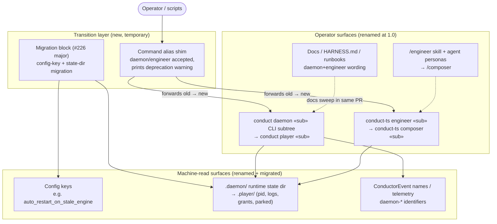

# Components: Music-Vocabulary Rename Surfaces (daemon→Player, engineer→Composer)

**Last updated:** 2026-08-26
**Scope:** The naming surfaces the 1.0 rename touches, and the alias/deprecation transition
layer that keeps old names working through the major. Decision + scoping feature for #227;
implementation ships with cutover PR #226's major. Verdict vocabulary is out of scope (#1918).

## Diagram

## Legend

- **Operator surfaces** — human-facing names; renamed with alias/deprecation cover.
- **Machine-read surfaces** — parsed by code; rename requires migration, not just wording.
- **Transition layer** — new machinery this decision scopes: the alias shim (old subcommand
  names forward to the new ones with a deprecation warning) and the `## Migration` block that
  travels with the #226 major. Dashed edges are documentation relationships, not calls.
- `« »` marks variable parts.
- Repo name `ai-conductor`, the `conduct`/`conduct-ts` entrypoints, and event-spine internals
  keep their names; `EVENTS` identifiers do not rename (resolved by
  adr-2026-08-26-music-vocabulary-player-composer-rename — the `ConductorEvent` union carries no
  daemon-named identifiers).

## Change Log

| Date | Change | Reason |
|------|--------|--------|
| 2026-08-26 | Initial generation | DECIDE for #227 (music-vocabulary rename scoping) |
| 2026-08-26 | EVENTS open question resolved: no rename | ADR approved; plan authored |
