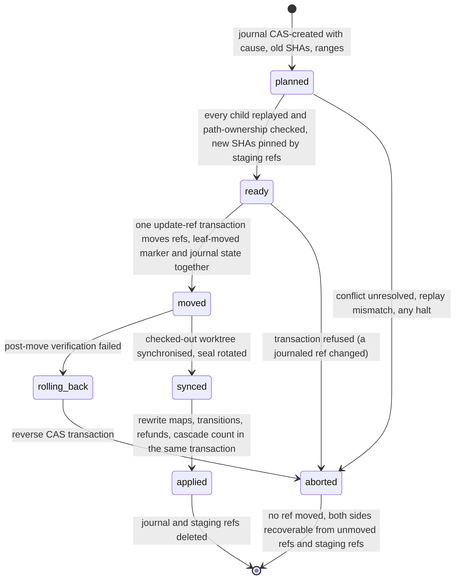
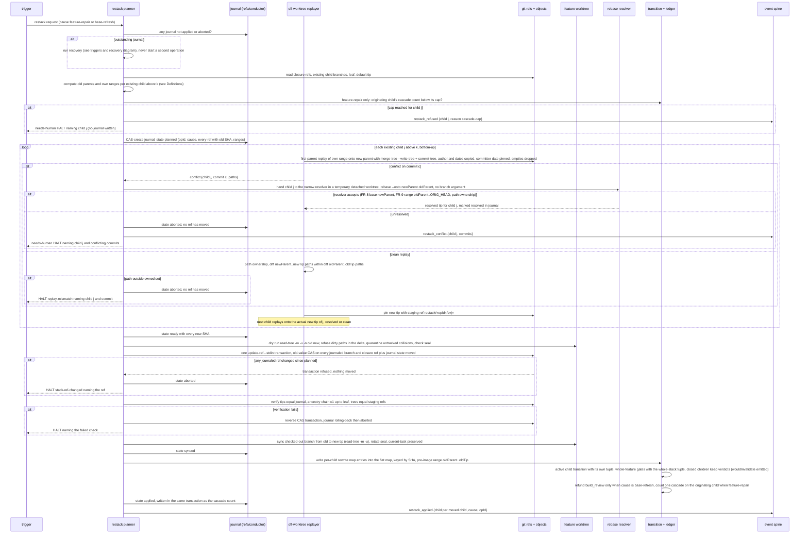
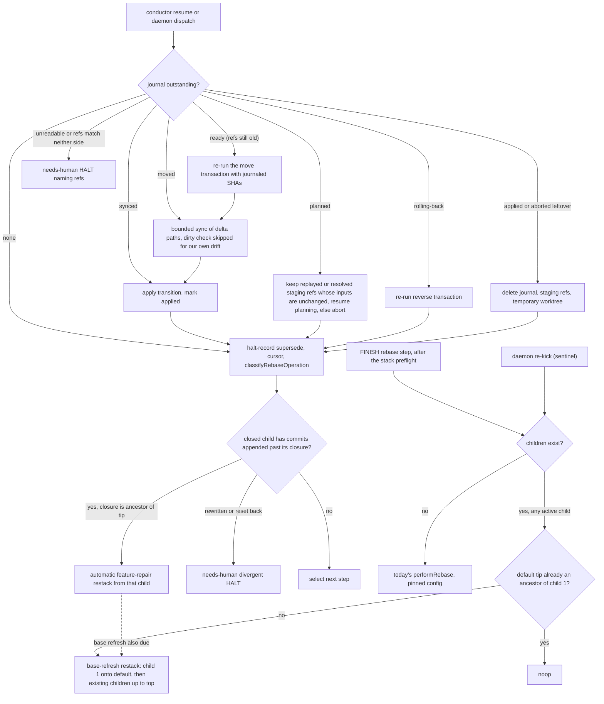
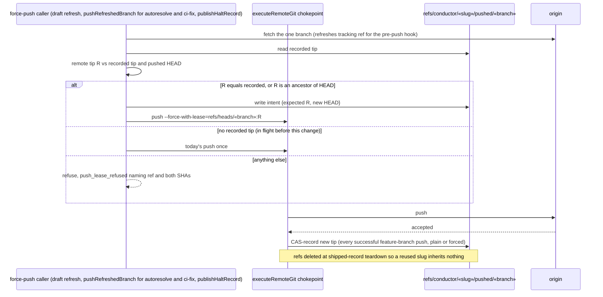
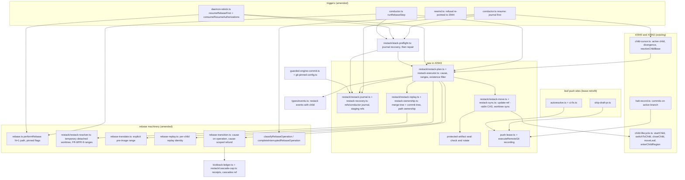

# Sequence + Components: Multi-branch restack for stacked child plans

**Last updated:** 2026-10-10
**Scope:** How a change to stacked child k is carried into every existing child above it (#2943).

Covered:
- the triggers: FINISH `rebase` step, daemon re-kick, automatic repair of an operator commit on a
  closed child, and interrupted-operation recovery. Restacks happen only where rebases happen today;
- the ref-backed restack journal and its state machine;
- the off-worktree replay, tree-prediction verification and the atomic compare-and-swap ref move;
- conflict hand-off, cause-scoped refunds and the per-child cascade cap;
- expected-SHA push leases.

Out of scope:
- routed-fix producers, re-validating closed children, and rewinding a closed child (#2944);
- child publication and published-stack adoption (#2945).

With no child, every path below collapses to today's `performRebase`. The only N=1 difference is the
expected-SHA push lease.

## Definitions used by every diagram

- **Existing children.** Restack moves only branches that exist: closed children plus the active
  child. Unstarted children have no branch; they are created later from the moved closure tip, as
  today. The leaf `feat/daemon-«slug»` is moved by restack only when it is the active child.
  Otherwise it stays with `moveLeaf`, whose stray-commit guard is unchanged.
- **Ranges.**
  - Child 1's old parent is `merge-base(c1, old default tip)`. Child j>1's old parent is the
    journaled closure tip of j-1.
  - A closed child's own range is `oldParent..closure(j)`. The active child's own range is
    `oldParent..tip(j)`.
  - Halt-record-only commits past a closure are not replayed: the cursor already tolerates them, and
    the halt record lives on the active branch.
  - Halt-record commits inside a range are replayed like any other commit. A conflict on
    `.docs/halted/«slug».md` is resolved mechanically: the record on the child above wins.
- **Cause.** `feature-repair` means a child below moved: an operator commit on a closed child, a
  rewind, or, from #2944, a routed fix. `base-refresh` means the default branch moved. When both are
  needed they run as two chained operations: repair first, then refresh. Each has its own operation
  id, refund receipt and cap accounting.
- **Durable homes.** Everything the restack must keep across a worktree recreation (#497) lives
  under `refs/conductor/«slug»/`, following the `positions` precedent. Nothing lives in
  `.pipeline/`.
  - the journal blob: `restack/«opId»`;
  - staging refs that pin planned commits: `restack/«opId»/c«j»`;
  - recorded pushed tips: `pushed/«branch»`;
  - the per-child cascade counters, in a ref-backed blob.

## Diagram: journal state machine

## Diagram: restack operation

## Diagram: triggers and recovery

Resume reads the journal before the halt-record supersede, the cursor, `classifyRebaseOperation`
and `consumeResumeAuthorizations`. A journal that is still outstanding is therefore never misread as
divergence. The one-shot `REKICK` sentinel is consumed before the restack runs, so crash recovery
depends only on the journal.

## Diagram: expected-SHA push leases

## Diagram: components touched

## Legend

- **closure ref** is `refs/conductor/«slug»/closed/c«k»`. Until now it was create-only (ADR D1).
  This feature lets it move by compare-and-swap, but only inside a journaled restack transaction.
- **Atomicity** covers refs and the journal state together. A crash between `moved` and `synced`
  leaves the worktree out of step with its branch. A commit fence stops engine commits in that
  window, and recovery syncs only the delta paths.
- **Halts and the journal.** A halt raised while the journal is `ready`, `moved` or `rolling-back`
  writes its HALT marker immediately. Its committed record waits until the journal reaches `synced`
  or `aborted`.
- **N=1** never enters the planner. It uses `performRebase` as today, with pinned git config, and
  push leases are recorded for every feature.

## Change Log

| Date | Change | Reason |
|------|--------|--------|
| 2026-10-10 | Initial generation | #2943 DECIDE: Approach B (journaled off-worktree replay) |
