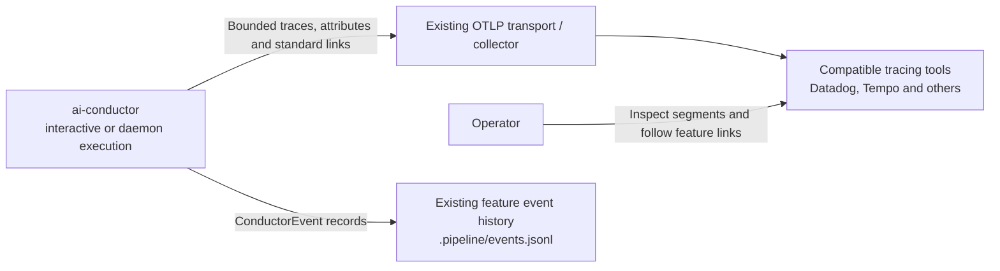
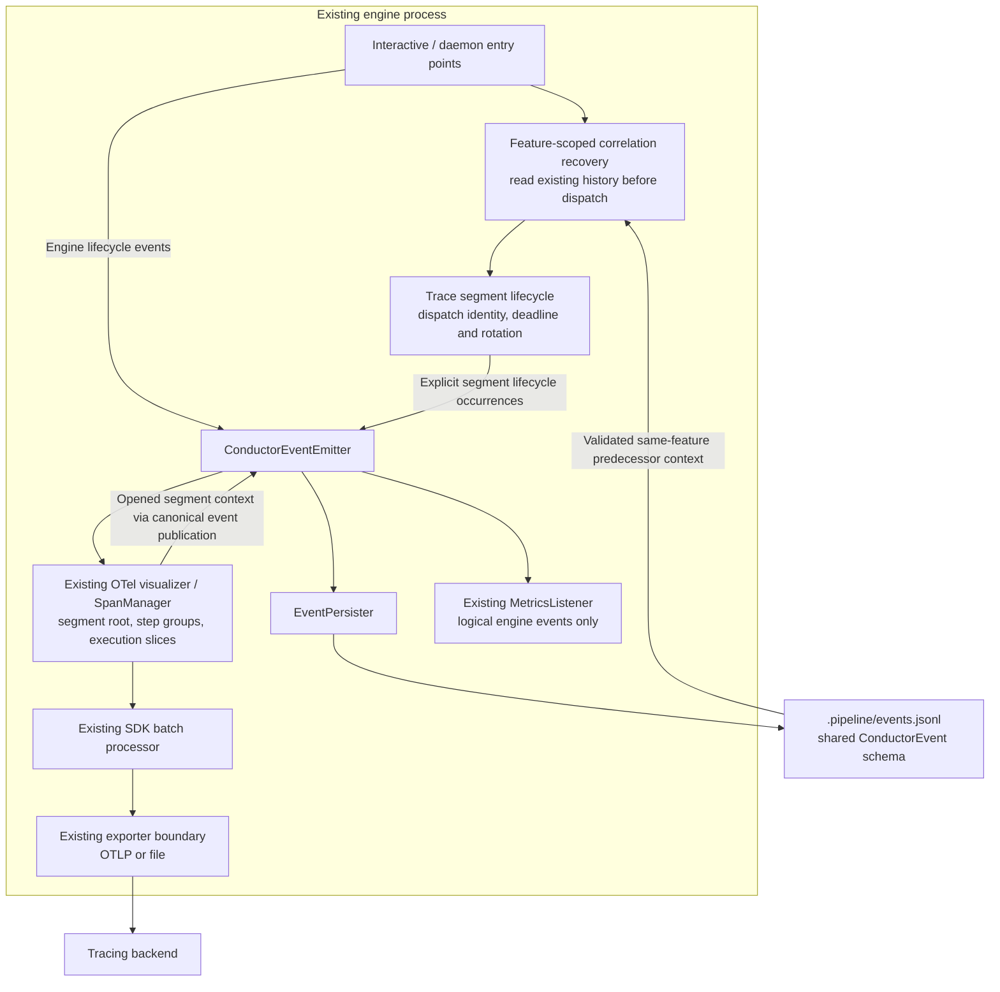
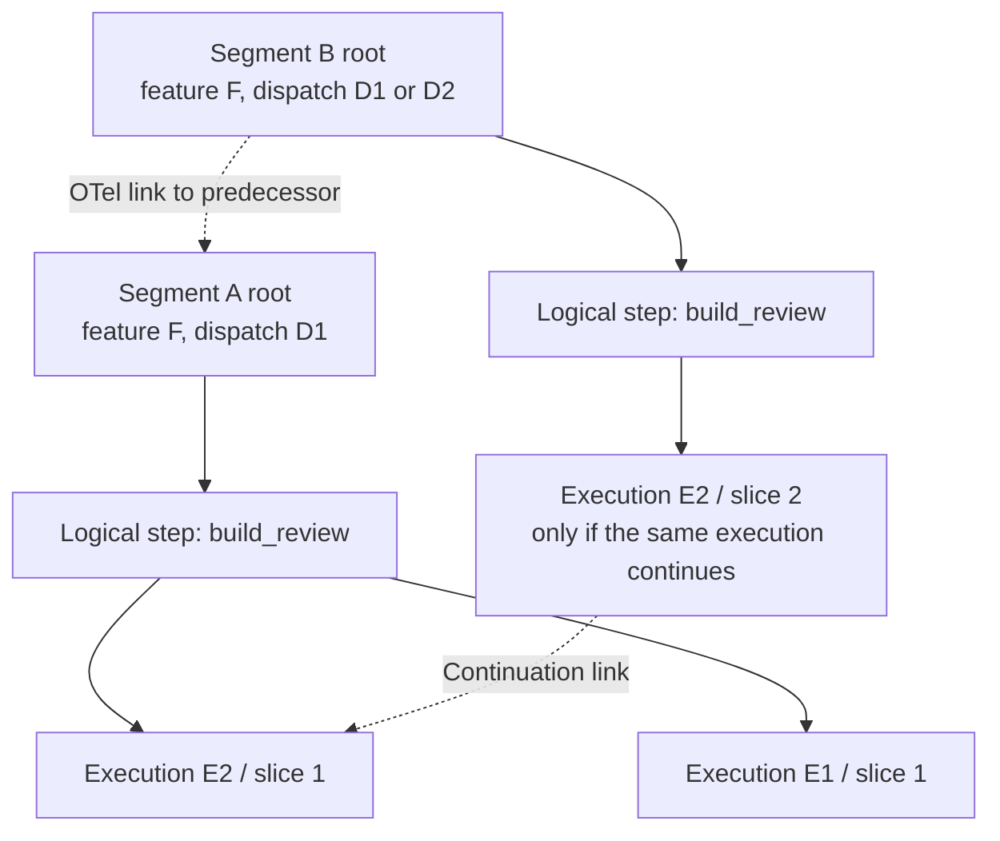

# Components: Portable feature history across bounded trace segments

**Last updated:** 2026-09-30
**Scope:** Proposed architecture for #2011 plus consolidated #2009, following the
operator-approved bounded-linked-trace approach. Technical track, Large tier.
**Review:** Diagrams approved by the operator on 2026-09-30. Architectural details remain subject to architecture review.

## System context

The export contract is tool-independent. Datadog and Tempo are named compatibility
targets, not required services or new hard-coded clients. Existing file export continues
to carry the same trace structure without a backend.

## Components

The lifecycle and recovery boxes denote responsibilities inside the existing OTel/entry-point
integration, not new processes, services, endpoints, or bespoke log formats. Architecture
review will pin their exact ownership and event schema. Recovery does no backend search and
does not replay old spans. A timer closes a known segment at its deadline; it does not poll
artifacts to infer what the engine did.

Trace-context publication is a typed occurrence on the existing bus. Subscribers must handle
those new event variants deliberately; publication must not recursively create more segments.
The exporter remains failure-isolated. Metric consumers must not treat telemetry segmentation
as a second engine dispatch, step execution, completion, or halt.

## Exported structure

Solid arrows are real parent/child relationships within a bounded trace. Dotted arrows
are OpenTelemetry links across traces, never extra parents. A new dispatch has a new
dispatch identity; an uninterrupted execution rotated within its dispatch keeps its
execution identity. A retry or a re-run remains a distinct execution under its logical
step group. Concurrent executions remain separate children with overlapping timestamps.

> **Amended 2026-09-30 by #2011:** A policy retry remains inside the same logical
> execution and increments its retry data; a later step re-run gets a new execution
> identity. This preserves Decision 2 of adr-2026-09-10-shared-step-lifecycle-telemetry.
> Trace rotation creates a new slice, never a new logical execution.

Group spans represent the observed grouping envelope in that segment, including gaps;
their elapsed duration is not summed execution time. They are not synthetic successes
and do not alter step metrics. Across segments, stable feature and logical-step attributes
allow correlation even when a viewer exposes links differently. No single global lane
or pixel-identical layout is promised.

## Required behavioral boundaries

- Bound every emitted span, including segment roots, group spans, and slices of a long
  execution. Closing a segment is a telemetry boundary, not an engine completion.
- End and export slices as work proceeds. Do not hold three days of spans until ship.
- Preserve retry state and execution identity during rotation; only real engine terminal
  events determine final execution outcome.
- Recover predecessor context across normal process restarts from the existing event
  history. Distinct feature instances must never be linked by similar names or an
  unrelated worktree's history.
- Missing or invalid context starts a visibly unlinked segment with bounded diagnostics;
  it must not fabricate a predecessor or stop the build.
- A process crash can lose the current in-memory export window. A saved link target is
  correlation evidence, not proof that a backend retained that span.
- After a long suspension or export outage, preserve actual timestamps and report gaps
  or delivery failure. Rotation cannot promise acceptance of already-stale telemetry.
- Backend sampling/indexing/retention can remove link targets. The implementation and
  operator documentation must distinguish this from an emission/correlation defect.
- Existing per-dispatch inspection remains possible through dispatch identity, segment
  order, outcomes, and links. An exceptionally long dispatch may occupy multiple segments.
- Final completion, halt, graceful termination, and timed continuation remain distinct.

## Event-spine decision

Channel? yes — segment lifecycle and emitted trace correlation become observable.
Concern: occurrence — a segment opened, rotated, or ended at a particular time.
Does the bus carry this concern? yes — these are lifecycle occurrences and must be
represented in ConductorEvent even though the variants do not exist yet.
Verdict: extend the union and use EventPersister plus the existing event reader path.
Exception: none. No second ledger, context sidecar, artifact timestamps, or polling channel.

## Evidence and unresolved design details

Verified current structure: span-manager.ts opens an independent conductor.run root;
step executions are direct children. otel-visualizer.ts exports through the SDK batch
processor. event-persister.ts owns feature-scoped event history and daemon forwarding.
The daemon injects its resolved feature run identity into the visualizer; StepRunner
owns persistence of conduct-session-id.

> **Amended 2026-09-30 by #2011:** Approved ADR-014 D22 centralizes persistence
> in the shared create-if-absent helper, also called before enabled OTel startup.

The component responsibilities above are complete at diagram level. Architecture review
still owns concrete duration/count bounds, atomic ordering of context publication,
feature/dispatch identity resolution before the first provider step, bounded recovery,
clock discontinuities, and the compatible amendment to ADR-014's projection contract.
These are not delegated as unspecified BUILD tasks.

> **Amended 2026-09-30 by #2011:** Architecture approval is complete. ADR-014
> D21–D26 now specify the duration/count bounds, publication/recovery ordering,
> identity ownership, clock gaps, and late classification behavior.

External constraints:
- [OpenTelemetry tracing API](https://opentelemetry.io/docs/specs/otel/trace/api/):
  spans have one parent and may carry links; standard links supply cross-trace correlation.
- [Datadog span links](https://docs.datadoghq.com/tracing/trace_collection/span_links/):
  OpenTelemetry links are supported.
- [Datadog trace view](https://docs.datadoghq.com/tracing/trace_explorer/trace_view/):
  link navigation depends on ingestion/indexing; viewers control rendering.
- [Datadog APM limits](https://docs.datadoghq.com/tracing/troubleshooting/):
  spans may be submitted with timestamps up to 18 hours in the past. This is not a
  documented maximum trace duration.
- [Tempo long-running traces](https://grafana.com/docs/tempo/latest/troubleshooting/querying/long-running-traces/):
  search and spanset evaluation can see only portions of a trace spread across blocks.

Documentation was checked during exploration on 2026-09-30. No live Datadog/Tempo
compatibility smoke test has been run, and no backend-specific success is claimed.

**Plan-update review:** Approved with the implementation plan in chat on 2026-09-30.

## Plan update: prepared identity and recovery

> **Amended 2026-09-30 by #2011:** The implementation plan makes the approved
> bootstrap responsibilities explicit below. Tasks 1–5 and 21 own preparation;
> tasks 22/23 connect it at the composition roots. This refines the approved
> component responsibilities without introducing a new service or plugin method.

```mermaid
graph LR
    entry["Interactive or daemon composition root"]
    enabled["Existing OTel enablement gate"]
    identity["Shared atomic feature-identity helper"]
    scope["Canonical repository and worktree scope"]
    recovery["Bounded recovery via shared event decoder"]
    factory["Built-in registry factory<br/>prepared OTel-private context"]
    start["Existing synchronous visualizer start"]
    entry --> enabled
    enabled -->|"Enabled only"| identity
    identity --> scope
    scope --> recovery
    recovery --> factory
    factory --> start
```

Bootstrap stays outside ordinary event handlers. Disabled tracing exits before identity
or correlation I/O. Failed identity/scope/history yields explicit isolated continuity;
it does not make another feature a parent. The existing component diagram's publication
arrows mean queued lifecycle-owned publication, not synchronous ledger I/O inside projection.
The deadline owner and SDK exporter stay in the existing visualizer lifecycle.

## Legend

C4 context identifies users and external systems. Components describe engine responsibilities;
none of the new boxes is independently deployed. Trace groups are display structure;
engine events remain the outcome authority.

## Change Log

| Date | Change | Reason |
|---|---|---|
| 2026-09-30 | Initial component and trace-structure diagrams | Operator approved portable bounded linked traces and consolidated step grouping |
| 2026-09-30 | Plan update adds prepared identity/recovery flow | Bind the approved responsibilities to shared bootstrap and both composition roots |
