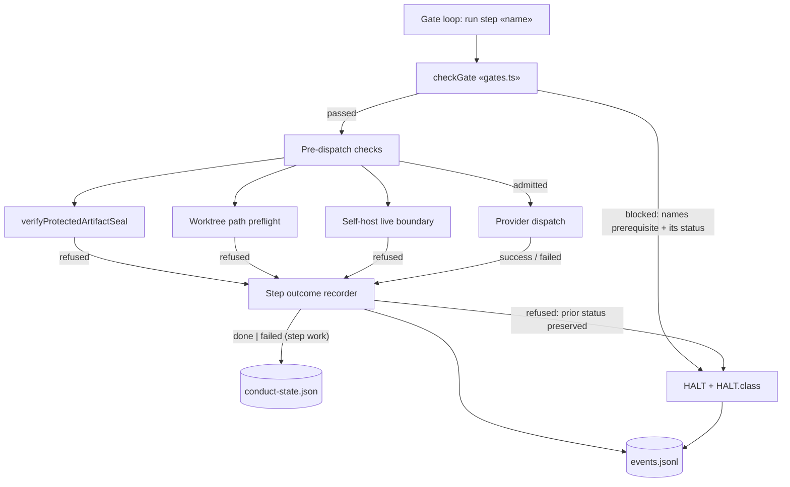
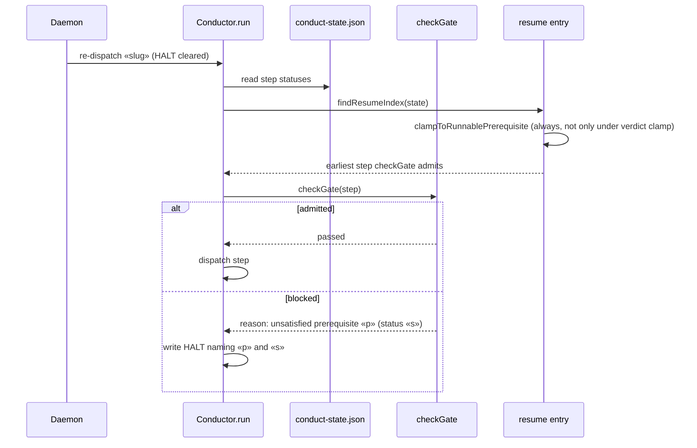

# Components: step dispatch refusal outcome and resume entry (a-gate-halt-marks-a-completed-build-failed-and-the)

**Last updated:** 2026-08-21
**Scope:** the BUILD/SHIP step dispatch seam in `src/conductor/src/engine/conductor.ts` — how a pre-dispatch refusal (protected-artifact seal, missing worktree preflight, live-boundary) is recorded, how that record drives resume entry, and how a blocked prerequisite gate is reported. Source issue jstoup111/ai-conductor#1753.

## Diagram: dispatch → outcome → state (proposed)

## Diagram: resume after a cleared halt (proposed)

## Legend

- **Refused** — the step's own work never ran; an entry condition rejected the dispatch. Today this flows into the retries-exhausted path and stamps `failed`; proposed: a typed outcome that leaves the prior status (e.g. `done`) untouched and halts with the refusal reason.
- **Failed** — the dispatched work itself failed. Unchanged: stamps `failed`, blocks dependents.
- Cylinders are persisted files under `.pipeline/`.
- `«x»` marks a variable placeholder.

## Change Log

| Date | Change | Reason |
|------|--------|--------|
| 2026-08-21 | Initial generation | DECIDE for #1753 (approach A) |
| 2026-08-21 | Plan update: refusal event named `step_refused` (persisted); gate residual halt class `needs-human` | /plan for #1753 |
