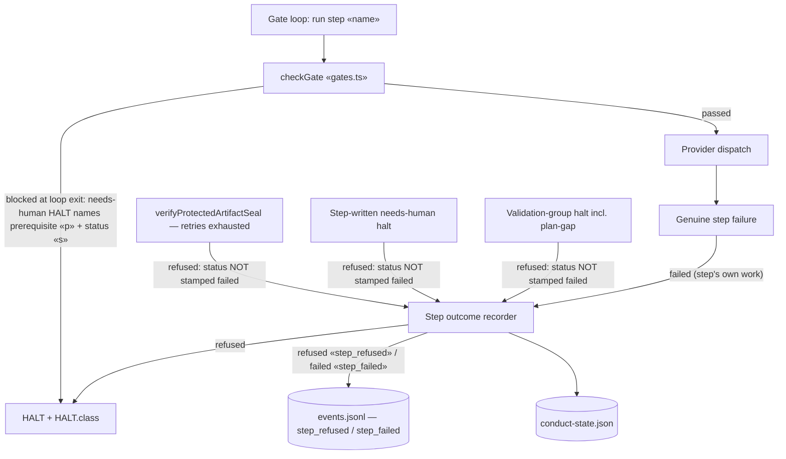
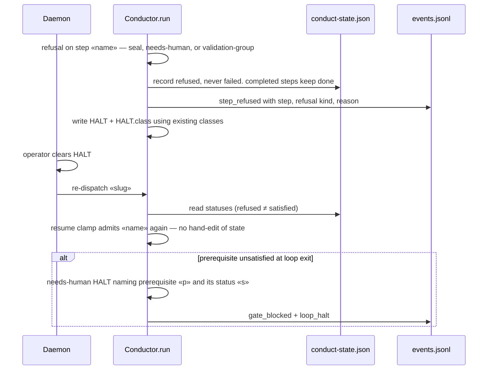

# Components: step dispatch refusal outcome and gate-blocked reporting (a-gate-halt-marks-a-completed-build-failed-and-the)

**Last updated:** 2026-08-24
**Scope:** the BUILD/SHIP step dispatch seam in `src/conductor/src/engine/conductor.ts` on
post-#1824 main — how the three refusal paths that still stamp `failed` (protected-artifact seal
at retries-exhausted, step-written needs-human halts, validation-group/plan-gap halts) record a
typed `refused` outcome instead, and how a prerequisite-blocked loop exit is reported. Paths
already fixed on main (live-boundary deferral, missing-worktree preflight, finish-gate `stale`
restaging, `clampToRunnablePrerequisite` resume walk) are out of scope. Source issue
jstoup111/ai-conductor#1753; respec after PR #1824.

## Diagram: dispatch → outcome → state (proposed)

## Diagram: refusal, clear, resume (proposed)

## Legend

- **Refused** — an entry/environmental condition rejected the step; its own work never ran.
  Recorded as a typed `refused` step status plus a `step_refused` spine event; earlier completed
  steps keep their verdicts. `refused` does not satisfy `stepSatisfied` — the step re-runs after
  the halt is cleared.
- **Failed** — the dispatched work itself failed. Unchanged: stamps `failed`, emits
  `step_failed`, blocks dependents.
- Cylinders are persisted files under `.pipeline/`.
- `«x»` marks a variable placeholder.

## Change Log

| Date | Change | Reason |
|------|--------|--------|
| 2026-08-21 | Initial generation | DECIDE for #1753 (approach A) |
| 2026-08-21 | Plan update: refusal event named `step_refused` (persisted); gate residual halt class `needs-human` | /plan for #1753 |
| 2026-08-24 | Respec against post-#1824 main: scope narrowed to the three remaining `failed`-stamp paths; resume-walk diagram dropped (delivered by #1052/#1824-era clamp); gate-blocked HALT naming retained | Respec after PR #1824 retired build_review rubrics and rewrote the dispatch seam |
