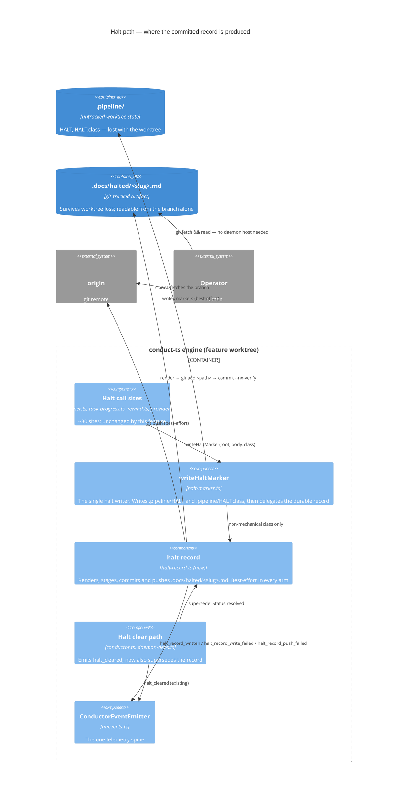
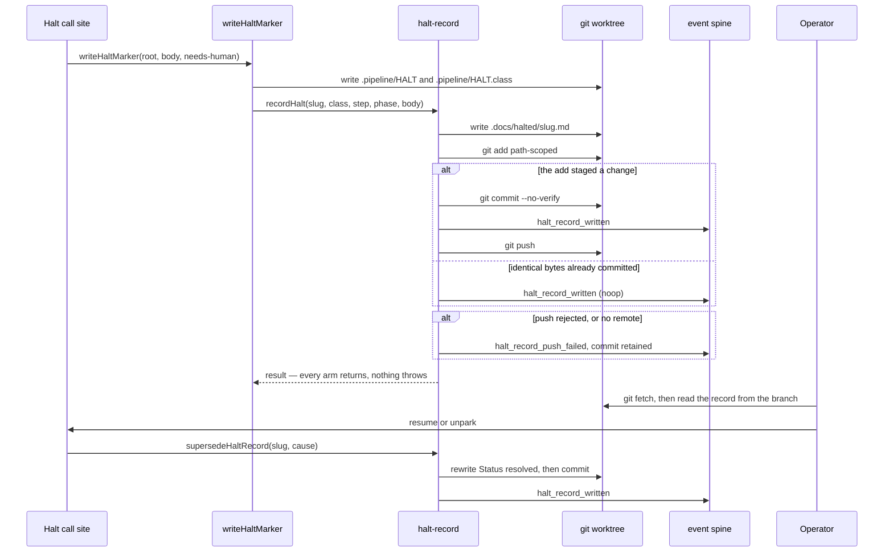

# Architecture: committed halt record

Feature: A halt leaves no committed, pushed record for the operator to pick up from
Source: jstoup111/ai-conductor#1809

## C4 — Component view (engine halt path, after the change)

## Sequence — halt, pick up, resume

## Design notes

- The record is produced at the seam, not at the call sites, so no halt path can forget it and no
  future halt path has to remember it.
- `mechanical` halts are excluded. The daemon re-kicks them without an operator, so a commit per
  mechanical halt is churn on the feature branch with no reader.
- The commit is path-scoped (`git add -- <record path>`), so a halt raised over a dirty worktree
  never sweeps in-progress work into the record commit.
- The push is of the current feature branch. At halt time the branch already carries the
  committed build work, so pushing it is what makes the halt readable from another machine —
  which is the outcome the issue asks for.
