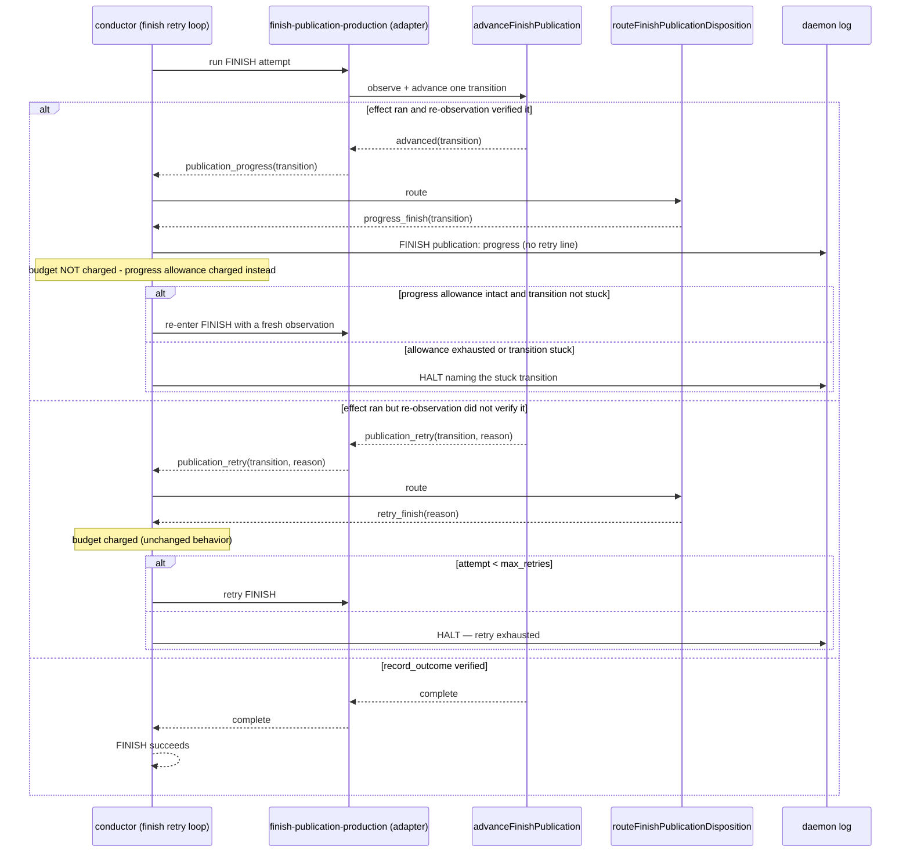

# Sequence: FINISH publication progress accounting

**Last updated:** 2026-08-06
**Scope:** How one publication transition's outcome reaches the conductor's retry gate,
which outcomes charge the `finish` retry budget, and what bounds a non-charging re-entry.

## Diagram

## The seam that changes

Today the adapter erases the distinction the state machine already makes. `advance`
returns `{ kind: 'advanced', transition }` on a verified effect, and the adapter rewrites
that into `{ kind: 'publication_retry', transition, reason: '<transition>_not_verified_*' }`
(`finish-publication-production.ts:338-356`). Those same reason strings are ALSO returned
by `advance` itself for real verification failures (`finish-publication.ts:1085`, `:1132`,
`:1201`, `:1230`, `:1269`), so downstream the two are indistinguishable by reason.

The fix restores the distinction at the type level: `advanced` becomes its own disposition
kind that survives to the conductor, and only that kind bypasses the budget. No reason
string changes meaning, and no failure path is exempted.

## Bounding the non-charging re-entry

A re-entry that never charges the failure budget needs its own termination proof. This
mirrors the existing progress-bypass precedent in the same file — the build step's
`progressAttempts` counter checked against `build_progress_halt.attempt_ceiling`
(`conductor.ts:4933-4936`, `:6276-6303`), which likewise undoes the attempt increment and
is bounded by a separate ceiling.

Two independent bounds, either of which halts:

1. **Total progress allowance.** The publication machine has six transitions; a healthy run
   uses five to six advances and may legitimately revisit one (the observed `establish_pr`
   twice, when the shipped-record commit left the branch unpushed again). A fixed ceiling
   above that permits legitimate revisits and still terminates.
2. **Per-transition stuck cap.** A single transition reporting progress more times than the
   cap means the machine is advancing without the snapshot moving forward. That halts with
   the offending transition named, which is the operator-actionable signal.

Both bounds are engine constants, not configuration, so `settings.json` schema is untouched.
