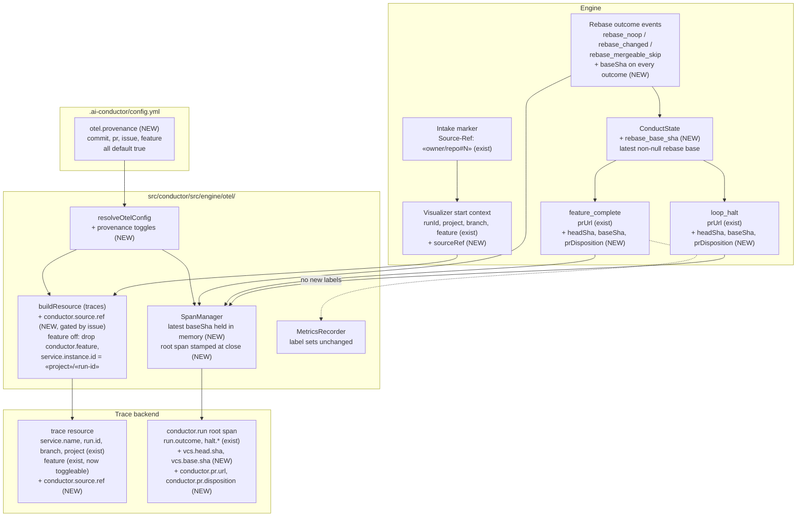

# Components: Trace provenance — commit, base, PR, and originating issue (#2000)

**Last updated:** 2026-10-02
**Scope:** How the provenance the engine already holds — built commit, base commit, pull request,
and originating tracker issue — reaches the exported trace through
`src/conductor/src/engine/otel/`. Approach A: additive fields on events that already describe the
run (ADR-014 D11), stamped on the trace resource or root run span only (ADR-014 D10, trace-only),
gated by a new `otel.provenance` config block whose four toggles all default on.

## Diagram

## Placement contract

| Value | Source today | New carrier | Placement | Toggle |
|-------|--------------|-------------|-----------|--------|
| Originating issue | `Source-Ref:` line of the intake marker (`artifacts.ts`) | visualizer start context `sourceRef` | trace resource `conductor.source.ref` — known at run start, survives a crashed run | `issue` |
| Base commit | resolved by the rebase step; only `rebase_mergeable_skip` emits it | `baseSha` on every rebase outcome event, and on `feature_complete` / `loop_halt` | root span `vcs.base.sha`; latest rebase value held so a halt after rebase still carries it | `commit` |
| Built commit | `git rev-parse HEAD` in the worktree; never emitted | `headSha` on `feature_complete` / `loop_halt` | root span `vcs.head.sha` at close — HEAD moves with every task commit, so it is a close-time value, not a resource value | `commit` |
| Pull request | `state.pr_url`; already on `feature_complete.prUrl` / `loop_halt.prUrl` | unchanged | root span `conductor.pr.url` | `pr` |
| PR disposition | finish choice `pr` / `keep` | `prDisposition` on `feature_complete` / `loop_halt` | root span `conductor.pr.disposition`: `opened` (URL present), `none` (finish choice `keep` — legitimately no PR), `unrecorded` (closed with neither, including force-close) | `pr` |
| Feature name | `conductor.feature` (exist) | unchanged | trace resource; off drops it and falls `service.instance.id` back to `«project»/«run-id»` | `feature` |

Every new value is unbounded and therefore trace-only (ADR-014 D10). No metric data-point or
`target_info` label changes; the `feature` toggle governs traces only.

## Legend

- **(NEW)** — added by this feature; all other nodes and fields exist on main today.
- Dashed edge — the metrics projection receives the same events but derives no new labels.
- A disabled toggle omits its attributes entirely; it never emits a placeholder.
- An absent value with its toggle on is omitted; the disposition attribute is what distinguishes
  "no PR" from "PR not recorded".
- Projections stay in-memory with no I/O (ADR-014 D4): SHAs are resolved at the emit sites, never
  by the visualizer.

## Change Log

| Date | Change | Reason |
|------|--------|--------|
| 2026-10-02 | Initial generation | #2000 trace provenance, DECIDE |
| 2026-10-02 | Added ConductState.rebase_base_sha carrier | Plan update: terminal events read the latest rebase base from conduct state |
