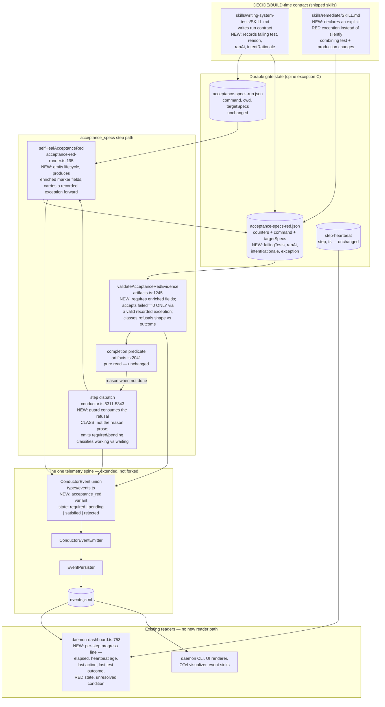
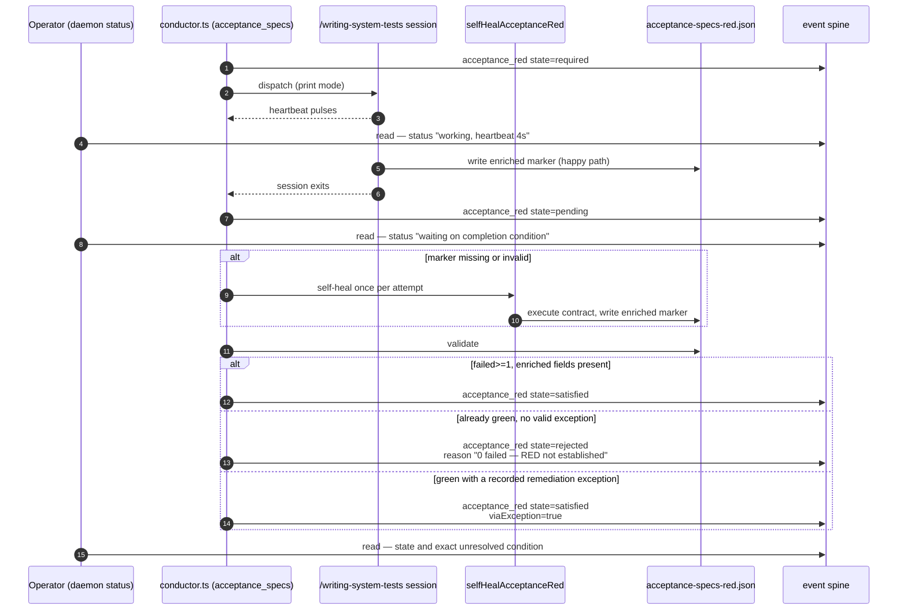

# Components: Acceptance-specs RED evidence visibility and completion-wait discrimination (#1246)

**Last updated:** 2026-08-09
**Scope:** The `acceptance_specs` observability and evidence seam — the RED lifecycle on the
`ConductorEvent` union (`types/events.ts`), the durable RED marker
(`.pipeline/acceptance-specs-red.json`) and its validator (`artifacts.ts:1245`), the engine
self-heal runner (`acceptance-red-runner.ts`, `conductor.ts:5311-5343`), the live operator
surface (`daemon-dashboard.ts:753`), and the `/writing-system-tests` + `/remediate` skill
contracts that write and waive the evidence.

## Diagram

## Lifecycle sequence

## Component Notes

- **No new subsystem and no second channel.** Every NEW box extends a seam that already exists.
  The lifecycle rides the `ConductorEvent` union through the existing
  emitter → persister → `events.jsonl` path, so the daemon CLI, UI renderer, OTel visualizer and
  event sinks all gain the signal without a new reader. The marker is durable gate state read by
  name (event-spine exception C), so enriching its fields is not a parallel channel — but nothing
  is stamped into it to stand in for an event.

- **The gate's pass/fail semantics do not change.** `errors==0`, `skipped==0`, `executed>=1`,
  `failed>=1` remain the RED bar. The change is that the evidence must now say *which* test failed,
  *why*, *when*, and *why that failure corresponds to the intended missing behavior* — and that the
  verdict is visible while the step runs rather than only at its end.

- **Backward compatibility is re-run, not hard-fail.** A marker written by the current runner lacks
  the enriched fields, so the validator reports it invalid. That is precisely the condition the
  existing `selfHealAcceptanceRed` path already handles: the engine re-executes the recorded run
  contract once per attempt and writes a fresh, enriched marker. No in-flight build hard-fails on a
  legacy marker; it pays one extra spec run. This is the load-bearing design decision and carries
  its own ADR.

- **`working` vs `waiting` is derived from what the spine already sees.** A step is *working* when
  the heartbeat belongs to the current dispatch (`heartbeatBelongsToDispatch`, `step-heartbeat.ts`)
  and is fresh; it is *waiting* once the dispatch has returned but the completion gate has not
  passed. In the waiting state the status line reports the completion predicate's own `reason`
  string — which the engine already computes and currently discards from the live surface. This is
  the honest, in-scope half of desired outcome 4 and all of outcome 5.

- **Child-count and cached/uncached token burn are NOT delivered here.** The provider layer
  configures subagents but never observes them (`claude-provider.ts:749-750`,
  `llm-provider.ts:226`), and the only token fields are the end-of-feature
  `feature_usage_total` aggregate (`events.ts:183-184`). Deferred to
  `jstoup111/ai-conductor#1441`; the status line must say "unknown" rather than render a count it
  cannot compute.

- **The remediation exception is recorded, not assumed.** A remediation run that legitimately
  combines test and production changes records an exception in the marker and is reported as
  `satisfied viaException=true` on the spine. An unrecorded green run stays `rejected` — the
  exception makes the waiver observable, it does not weaken the gate.

## Change Log

| Date | Change | Reason |
|------|--------|--------|
| 2026-08-09 | Initial generation | DECIDE for #1246, tier M, approach A |
| 2026-08-09 | Guard consumes the refusal class; self-heal carries a recorded exception forward | Conflict-check found the guard substring-matches reason prose (never reaches a refused marker) and that the self-heal's wholesale write erases a recorded waiver — see `.docs/conflicts/acceptance-specs-hide-missing-red-evidence-and-com.md` |
