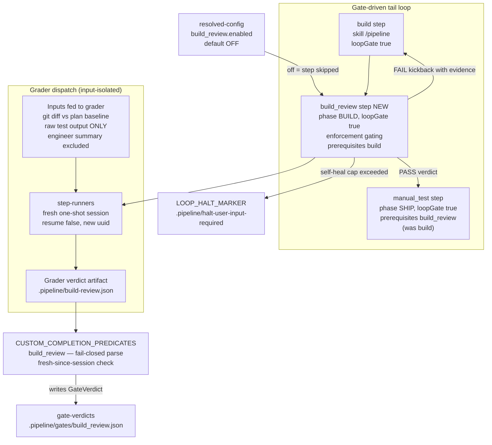
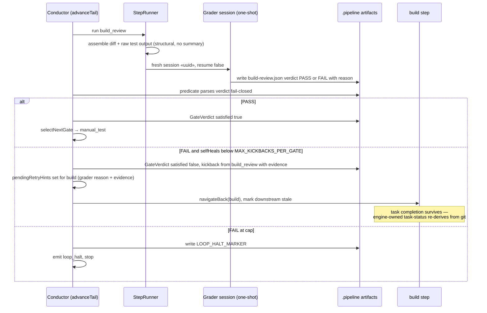

# Feature Architecture: build_review judgement gate (build → manual_test seam)

**Last updated:** 2026-07-07
**Scope:** New first-class loopGate step `build_review` between `build` and `manual_test` in the
conductor engine — grader dispatch, verdict predicate, kickback wiring, opt-in config flag.

## Gate topology (BUILD tail)

## Kickback sequence

## Legend

- **NEW** — components introduced by this feature; everything else exists today.
- `build_review.enabled` — per-project opt-in flag in `.ai-conductor/config.yml`, resolved
  safe-by-default (absent → off → step skipped, `manual_test` prerequisite auto-satisfied by skip).
- Grader inputs are assembled **structurally** by the engine (git diff + captured test output);
  the maker session's transcript and summary are never passed — input isolation is enforced by
  construction, not convention. Session isolation is already unconditional (#325).
- Kickback/cap machinery mirrors the existing `manual_test → build` self-heal block
  (`conductor.ts` daemon path) and the generic `scanKickbackVerdicts` bound.

## Change Log

| Date | Change | Reason |
|------|--------|--------|
| 2026-07-07 | Initial feature diagram | DECIDE phase for intake jstoup111/ai-conductor#324 |
