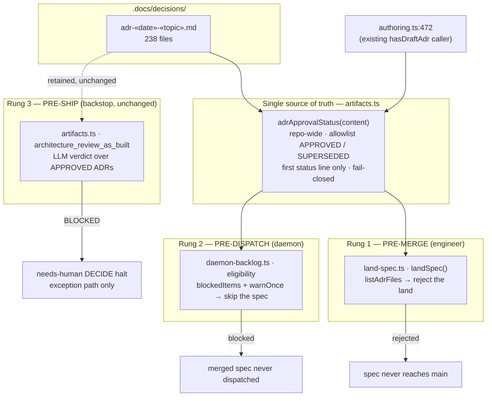
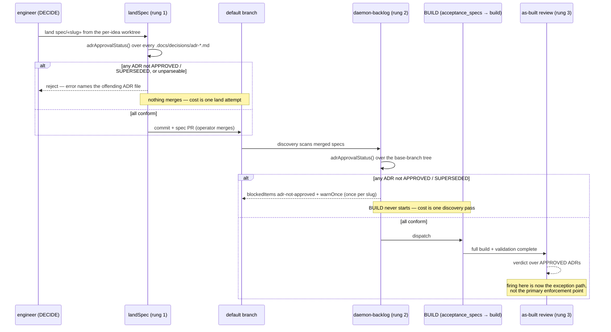

# Components + Sequence: ADR approval read from one parser at three rungs

**Last updated:** 2026-08-08
**Scope:** Where the "is this ADR approved?" signal is defined and where it is read — the
shared `adrApprovalStatus()` contract, the engineer land rung, the daemon discovery rung, and
the retained as-built ship backstop. Source: jstoup111/ai-conductor#662.

## Diagram: one parser, three rungs

## Diagram: where each rung fires in the feature lifecycle

## Legend

- **`adrApprovalStatus()`** is the one new seam. It replaces `hasDraftAdr()`, whose regex matched
  only the literal word *draft* — a status the repo's 238 ADRs never use, so that gate had never
  fired on real content. Both existing callers (`land-spec.ts:316`, `authoring.ts:472`) migrate to
  the new contract.
- **Repo-wide scope** is deliberate and operator-decided: `listAdrFiles()` already walks the whole
  `.docs/decisions/` directory, and nothing reliably scopes an ADR to a feature (only 16/238 carry
  a `Feature:` line).
- **Fail-closed on unparseable** is the operator-decided disposition, matching the release gate's
  treatment of an unknown surface name as malformed rather than silently accepted. The parser must
  therefore tolerate every status form actually in use — `Status: X`, `**Status:** X`,
  `- **Status:** X`, bold wrapping, trailing prose (`APPROVED (operator-approved 2026-07-29)`,
  `SUPERSEDED in part by …`), and trailing whitespace.
- **First status line only** is what removes a known false positive: an ADR that merely *quotes*
  another artifact's status marker in its prose currently blocks the land.
- **Rung 3 is unchanged.** The as-built review keeps its LLM verdict and its needs-human-DECIDE
  routing; the point of rungs 1 and 2 is that it stops being the *first* place the violation is
  discovered, after a full build has already been paid for.
- The daemon rung mirrors the adjacent `stories-not-approved` block in `daemon-backlog.ts` — same
  `blockedItems` shape (`slug` / `reason` / `remedy`) and the same `warnOnce` log-once discipline,
  so a blocked spec surfaces on the dashboard with a remedy instead of failing silently.

## Change Log

| Date | Change | Reason |
|------|--------|--------|
| 2026-08-08 | Initial generation | DECIDE for adr-approval-gate-before-build (#662) |
