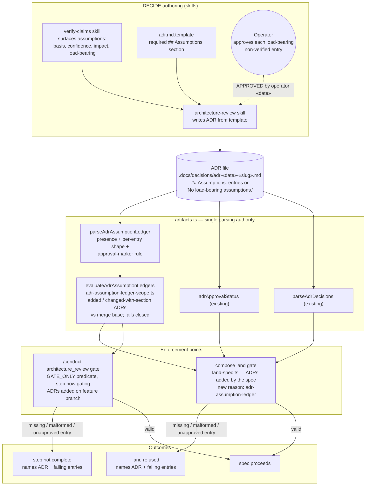
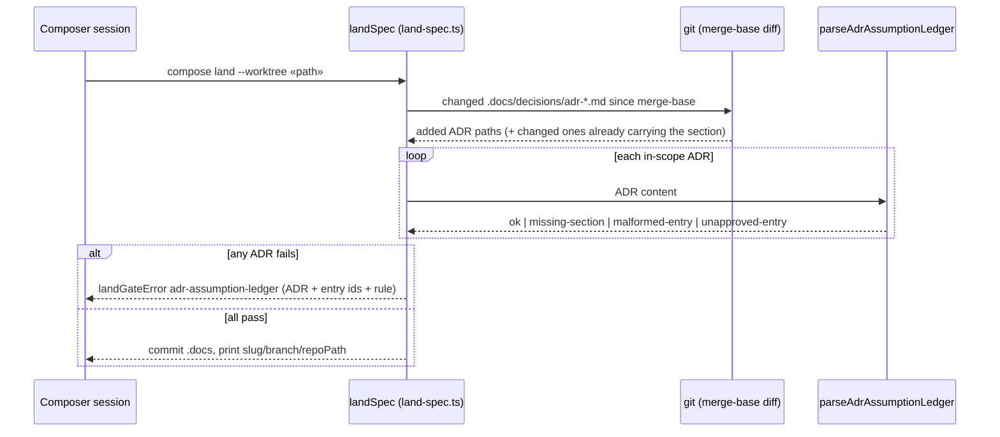

# Components: Machine-checked ADR assumption ledger

**Last updated:** 2026-10-10
**Scope:** How an ADR's `## Assumptions` ledger is authored, parsed once, and enforced at the
two DECIDE paths that author ADRs (intake jstoup111/ai-conductor#542).

## Diagram

## Sequence: compose land with a ledger

## Legend

- **AUTHOR** — prompt-level authoring. These skills produce the section; they are not what enforces it.
- **PARSE** — pure functions in `src/conductor/src/engine/artifacts.ts`. `parseAdrAssumptionLedger` is
  new; the other two exist and are shown because the same gates already call them.
- **GATES** — the two DECIDE paths that author ADRs: composer `land` (pre-merge) and the `/conduct`
  in-run DECIDE (`architecture_review` gate predicate; the step moves from advisory to gating so a
  failure blocks rather than auto-skipping). Both inspect only ADRs the spec newly added, plus changed
  pre-existing ADRs that already carry the section, so the legacy corpus is exempt. Daemon discovery
  is deliberately **not** a rung, following adr-2026-09-02-adr-decision-citability-contract D4.
- Dashed edge — a human action recorded in the artifact, not a runtime call.
- `«…»` — placeholder.

## Change Log

| Date | Change | Reason |
|------|--------|--------|
| 2026-10-10 | Initial generation | DECIDE for intake jstoup111/ai-conductor#542 (Approach A, Tier M) |
| 2026-10-10 | Dropped daemon-discovery rung; conduct rung via gating architecture_review | Operator decisions during architecture review |
| 2026-10-10 | Added shared in-scope evaluation (`evaluateAdrAssumptionLedgers`) between parser and both gates | /plan update; one owner per adr-2026-09-23 |
