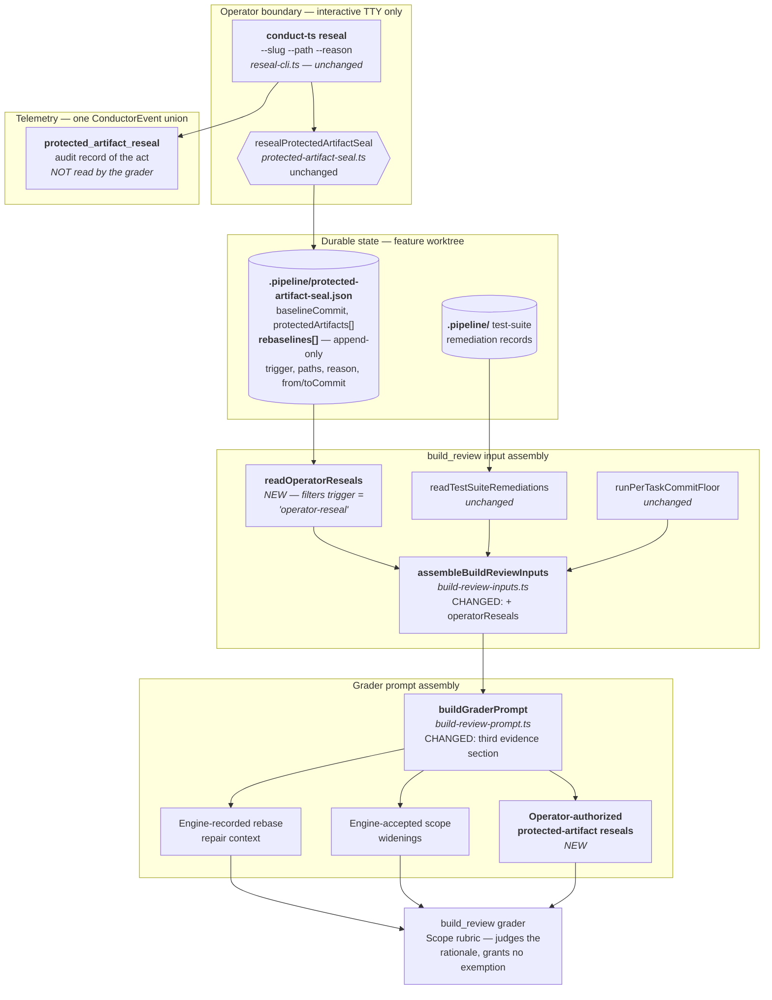
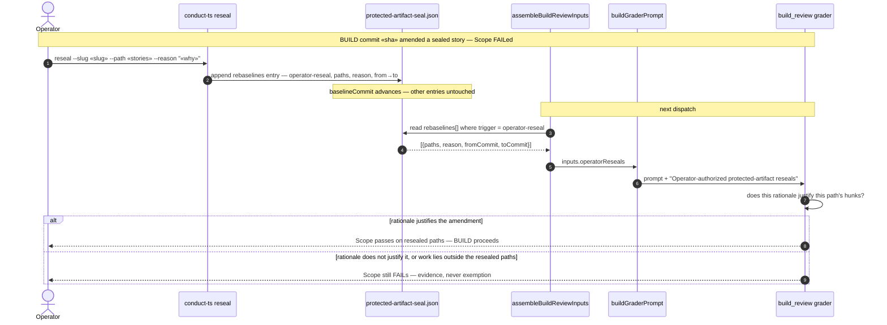

# Architecture: Operator reseal as a third build_review Scope evidence channel

**Date:** 2026-08-12
**Track:** Technical
**Tier:** M (lightweight review)
**Related:** `.docs/track/an-operator-s-protected-artifact-reseal-is-invisib.md`,
`.docs/complexity/an-operator-s-protected-artifact-reseal-is-invisib.md`
**Builds on:** `.docs/architecture/2026-07-27-protected-artifact-seal-self-amendment-1047.md`
(#1056, merged — landed the seal), `.docs/architecture/no-operator-command-to-reseal-a-protected-decide-a.md`
(landed `conduct-ts reseal`), `.docs/architecture/out-of-plan-production-edits-reach-build-review-in.md`
(#1426, merged — landed the accepted-widenings evidence channel this design mirrors)
**Source:** intake `jstoup111/ai-conductor#1502`

## Context

`conduct-ts reseal` is the audited way an operator authorizes a DECIDE-artifact amendment
committed after BUILD entry. It succeeds, and it records everything a reviewer would need:
`resealProtectedArtifactSeal` appends to `seal.rebaselines[]` a record carrying
`trigger: 'operator-reseal'`, the exact `paths`, the operator's **verbatim** `reason`, and the
`fromCommit`/`toCommit` range (`protected-artifact-seal.ts:1109-1139`).

Nothing reads it. `build-review-prompt.ts` contains no reference to the seal, and its Scope
rubric (`build-review-prompt.ts:49`) admits exactly one justification for modifying a `.docs/`
DECIDE artifact — "when the approved plan justifies it". A post-BUILD authorization can never
appear in a plan approved before BUILD, so the grader re-derives the identical Scope failure on
every dispatch and the feature cannot leave `needs-human`.

Observed on `interrupted-self-host-runs-leak-provider-homes-unt` (#1223) across three
consecutive dispatches on 2026-08-11, producing zero commits. **Every reseal is exposed** — the
command's entire purpose is authorizing the exact shape the rubric rejects.

The seal governs a different mechanism entirely (the write-guard's protected-artifact HALT);
note that `reseal --clear-halt` clears only halts of that class, never this one.

## The design in one line

The evidence already exists on disk. Read it, and render it beside the two evidence sections the
prompt already has.

### Why the seal file and not the event

`reseal-cli.ts` also emits a `protected_artifact_reseal` `ConductorEvent`. The grader does **not**
read it. Per the event-spine skill's §4-C, the grader's question is *durable state* — "which paths
are authorized right now, on what stated rationale" — not an occurrence in time. The seal is
already the authority the write-guard consults; deriving the same authorization by replaying
events would fork that authority across two reader paths. The event remains the audit record of
the act. **No spine change; no new channel; no new file.**

### Why evidence and not exemption

The two existing operator/engine channels (`build-review-prompt.ts:103-119`) both reach the
grader as judged evidence, and this one is built to match: the rubric text instructs the grader to
judge whether each rationale actually justifies its amendment, and states that unmatched work
remains subject to every rubric item. A reseal whose stated reason does not justify the amendment
can still fail Scope. A reseal of paths A and B renders only A and B — path C is never labeled,
so it is judged exactly as it is today.

## Component view (C4 level 3 — reseal → grader)

## Sequence view — the dispatch that today halts forever

## Load-bearing findings

| # | Finding | Confidence | Basis |
|---|---------|-----------|-------|
| 1 | The operator's rationale and path set are already persisted; nothing new must be recorded | 97% | `protected-artifact-seal.ts:1109-1139` read directly |
| 2 | `rebaselines[]` is append-only and survives rebase rotation, so reseal evidence never orphans | 95% | `persistProtectedArtifactSealRotation` spreads `...seal.rebaselines` (`:1157-1158`); `createProtectedArtifactSeal` returns any existing seal unchanged (`:1066`) |
| 3 | The seal file can never itself appear as an out-of-scope hunk | 96% | `MACHINERY_AUTHORED_PATHS` excludes `.pipeline/` from the graded diff (`build-review-inputs.ts`) |
| 4 | Scoping to resealed paths is deterministic, not prompt-dependent — the engine chooses what to render | 95% | mirrors `renderedAcceptedWidenings` construction (`build-review-prompt.ts:32-36`) |
| 5 | Rendering must tolerate a missing/malformed seal (fresh feature, pre-BUILD) without failing input assembly | 90% (inferred) | `assembleBuildReviewInputs` already degrades to `[]` for `repairContext` when the plan is not in a feature root |

## Assumptions resolved during DECIDE

| Assumption | Resolution | Basis |
|---|---|---|
| Only `trigger: 'operator-reseal'` rebaselines should reach the grader | **Confirmed.** Exactly three trigger values exist repo-wide: `operator-reseal` (`reseal-cli.ts:199`), `defensive-history-rewrite` (`protected-artifact-seal.ts:1008`), and `proactive-rebase` (`rebase-translate.ts:470`). The latter two are machinery rotations carrying no operator rationale; rendering them would hand the grader unjudgeable noise that reads as blanket authorization. The filter is on the literal `operator-reseal`. | verified, 96% |
| The verbatim `reason` reaches an LLM prompt and is operator-authored, so it must not read as an instruction | **Confirmed by design.** The section renders the rationale as a **claim to be judged**, in the same framing the accepted-widenings section already uses ("explicit evidence, not exemptions... Judge whether each rationale actually justifies the widened path"). The grader is told to weigh it, never to obey it. | verified, 92% |

## Explicit non-goals

- **No change to `reseal` itself.** Its CLI surface, interactivity gate, refusal paths, and event
  emission are untouched.
- **No blanket exemption and no diff-hunk stripping.** Approach B (excluding resealed hunks from
  the graded diff, the `MACHINERY_AUTHORED_PATHS` pattern) was considered and rejected during
  `/explore`: it makes an unjustified reseal unfailable, contradicting a stated outcome, and blinds
  the Tautology and Completeness rubrics to real content in those files.
- **The missing `protected_artifact_reseal` audit record** reported in #1502's Notes is out of
  scope. `reseal-cli.ts` does emit the event through `AuditTrailWriter`; the operator looked in
  `.pipeline/events.jsonl`, which is a different sink. If a real gap remains it warrants its own
  ticket.

## Change Log

| Date | Change | Reason |
|------|--------|--------|
| 2026-08-12 | Initial authoring | DECIDE for intake #1502 |
