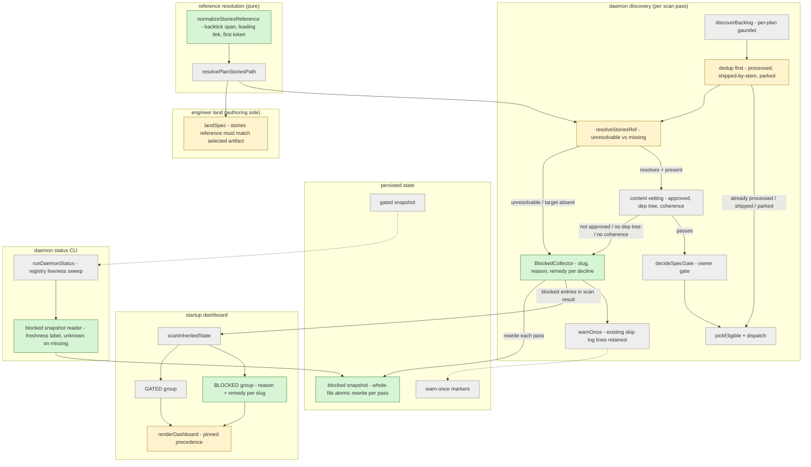
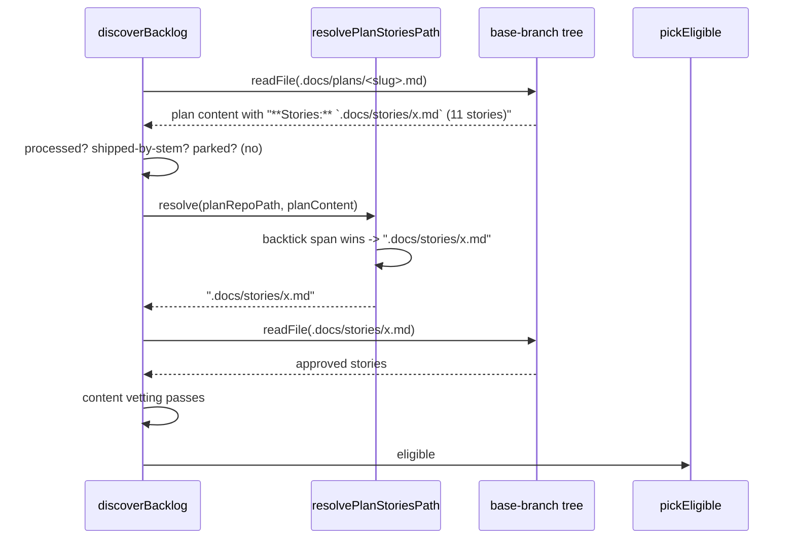
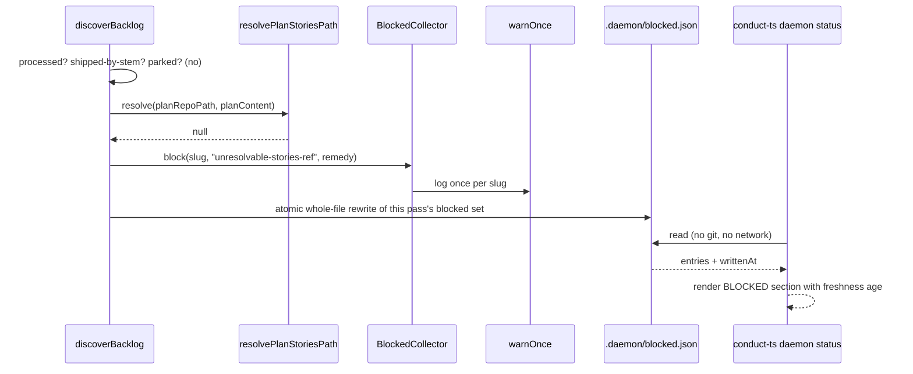

# Components + Sequences: Blocked Merged Specs Are Visible, Never Skipped

**Last updated:** 2026-08-05
**Scope:** How a merged spec that cannot build becomes first-class visible state: a
token-first stories-reference resolver, a reordered per-plan gauntlet in `discoverBacklog`
that emits structured `blocked` entries after dedup, a `BLOCKED` dashboard group mirroring
the `GATED` pattern from #208, and a per-pass `.daemon/blocked.json` snapshot read by
`conduct-ts daemon status`. PRD:
`.docs/specs/annotated-stories-line-makes-a-merged-spec-silentl.md` (issue #1330).

## Component View

## Sequence: a merged spec with an annotated stories line

## Sequence: a merged spec whose stories reference cannot resolve

## Key Decisions Reflected Here

- **Dedup precedes classification.** Processed / shipped-by-stem / parked checks move ahead of
  stories resolution so that legacy plans (82 in this repository) are never reported as
  blocked. Content-hash shipped dedup is unavailable when stories cannot resolve, so
  stem-match plus processed markers are the dedup available on that path — see
  `adr-2026-08-05-blocked-classification-after-dedup`.
- **`BLOCKED` is a distinct state, not `HALTED`.** HALTED is worktree-marker-derived and drives
  rehabilitation, escalation, re-kick, and park reconciliation. A blocked spec has no
  worktree and its remedy is on the default branch — see
  `adr-2026-08-05-blocked-is-a-distinct-state-from-halted`.
- **Snapshot read model.** `daemon status` reads a per-pass atomic snapshot rather than
  re-scanning repositories, exactly as `adr-2026-07-03-gated-snapshot-status-read-model`
  established for gated work.
- **Token-first normalization.** The resolver normalizes the reference before validating it,
  rather than special-casing a trailing parenthetical — see
  `adr-2026-08-05-token-first-stories-reference-normalization`.
