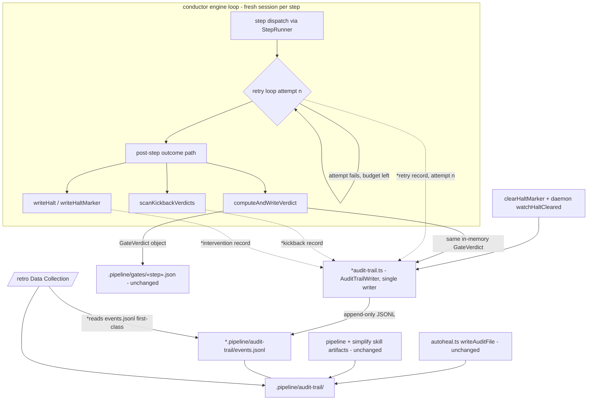
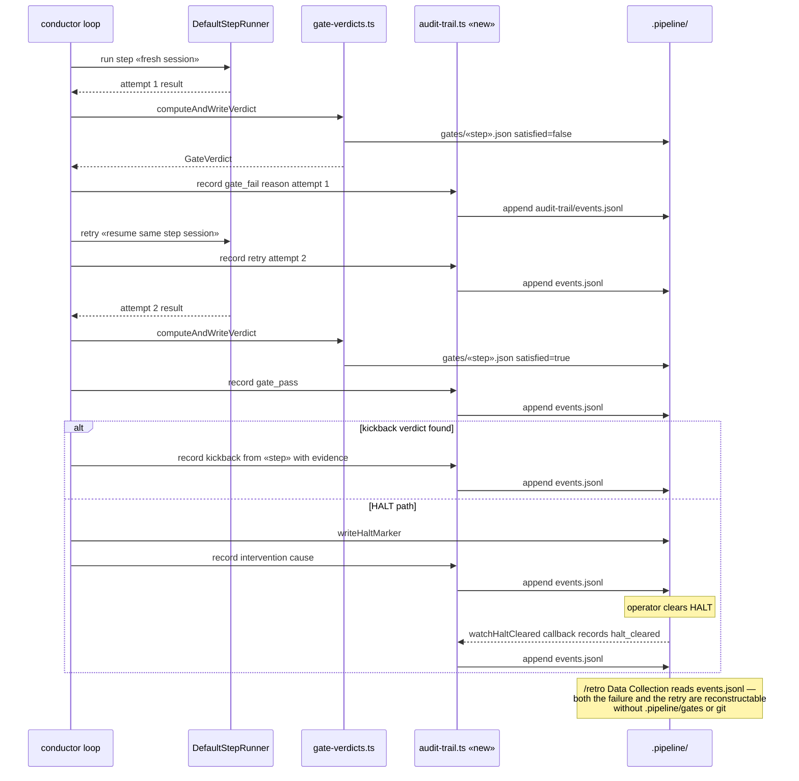

# Architecture: audit-trail write-completeness for retro (ai-conductor#328)

**Last updated:** 2026-07-07
**Scope:** engine event-sink audit writer — every step/gate/retry/kickback/HALT outcome
appends a structured record to `.pipeline/audit-trail/events.jsonl` so `/retro` can
reconstruct run friction under fresh-session-per-step (#325) without conversational
recall. New elements marked with `*`.

## Diagram

## Legend

- `*` — new in this feature; everything else exists today.
- Solid arrows — existing data flow; dotted arrows — new audit-record emissions.
- `AuditRecord` (JSONL line): `step`, `phase` (decide/build/ship), `event`
  (`gate_pass` | `gate_fail` | `kickback` | `retry` | `intervention` | `halt_cleared`),
  `reason?`, `cause?`, `attempt?`, `at` (epoch ms).
- Gate records are derived from the **same in-memory `GateVerdict`** the engine writes to
  `.pipeline/gates/«step».json` (`gate-verdicts.ts`), so verdict and audit record cannot
  diverge. A clean single-pass step still emits one `gate_pass` record — absence of a
  record for an executed step is provably a bug, not a silent success.
- `halt_cleared` is a **new emission** — today clearing is a bare unlink observed only by
  the daemon watcher; the writer records it as a first-class event.
- Skills are NOT instrumented: step retries, kickbacks, and HALTs are all driven by the
  engine loop, so the engine emits every record deterministically.

## Sequence: induced gate failure + retry, then kickback/HALT variants

## Change Log

| Date | Change | Reason |
|------|--------|--------|
| 2026-07-07 | Initial generation | Spec for #328 audit-trail write-completeness (engineer DECIDE) |
| 2026-07-07 | Plan update: writer subscribes to the ConductorEventEmitter bus (EventPersister pattern) rather than per-seam calls; `halt_cleared` is a first-class ConductorEvent with `cause: operator\|rekick`; writer paths root at injected projectRoot (never cwd) | /plan + conflict resolutions locked the mechanism |
