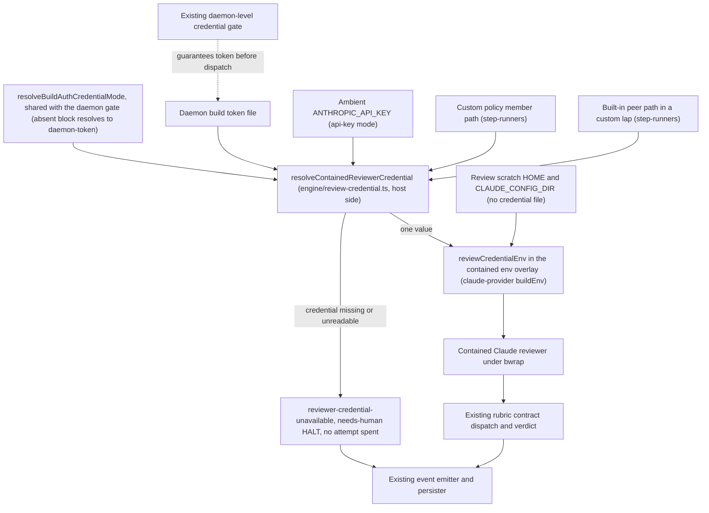

# Components: Authenticate contained Claude build_review reviewers

**Last updated:** 2026-09-24
**Scope:** Proposed component boundaries for #2737. The existing build_review containment flow in the conductor process gains a credential step keyed on the resolved build-auth mode and a credential refusal ahead of the first review attempt; no new deployment, service, or persistent store.

## Diagram

## Responsibilities and limits

The credential step runs host-side, outside containment, and reads the same resolved build-auth mode the daemon-level gate reads. In `daemon-token` mode, including an absent block, it reads the daemon build token and supplies it as `CLAUDE_CODE_OAUTH_TOKEN`. In `api-key` mode it confirms the ambient `ANTHROPIC_API_KEY` the review allowlist already admits. It never reads the operator's stored Claude login and never falls back between sources.

When the mode's credential is missing, empty, or unreadable, the member is refused before any provider attempt with the deterministic closed cause `reviewer-credential-unavailable`, which halts `needs-human` without charging the mechanical-fault allowance. In daemon runs the existing gate normally prevents this; the refusal is the backstop for interactive runs and races.

The contained env overlay adds the single value. Scratch HOME and CLAUDE_CONFIG_DIR, the bwrap mount set, the host-state probe, and write probes are unchanged. Codex reviewers keep their existing seeded-login path. Non-contained steps are untouched.

## Evidence and design status

Verified: `claude-provider.ts` buildEnv overlays scratch HOME and CLAUDE_CONFIG_DIR for a contained reviewer and filters the ambient env to the allowlist; `child-environment.ts` admits the `ANTHROPIC_` and `CLAUDE_` prefixes; both containment paths in `step-runners.ts` seed only a Codex login; `resolved-config.ts` resolves an absent `build_auth` block to `daemon-token`; `daemon-cli.ts` wires the daemon-level token gate for every project; `conductor.ts` injects the daemon token only on the self-host path. The daemon token authenticating `claude -p` from a fresh config dir is proven by adr-2026-07-07 Decision 5's smoke.

## Legend

Engine components run inside the conductor host process. The reviewer is the existing Claude provider boundary under bwrap containment. Solid arrows show data flow of the credential value and the refusal or verdict outcome; the dotted arrow is the existing gate's precondition.

## Change Log

| Date | Change | Reason |
|---|---|---|
| 2026-09-24 | Initial component proposal | Operator chose to key the contained reviewer's credential on the resolved build-auth mode for #2737 |
| 2026-09-24 | Named the planned resolver, shared mode helper, and overlay option | /plan update for #2737 |
