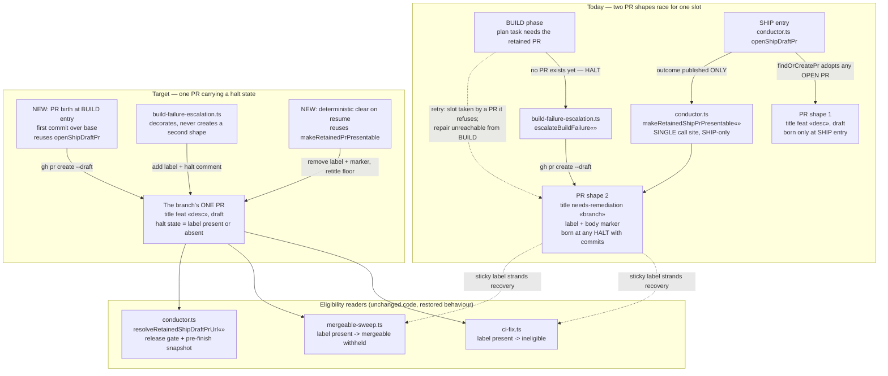

# Components: one branch, one PR, one halt state

**Last updated:** 2026-08-09
**Scope:** the components that own a feature branch's pull-request identity — draft-PR birth,
HALT escalation, presentation repair, and the two eligibility readers that consume the
`needs-remediation` label. Source issue: jstoup111/ai-conductor#1415.

## Diagram

## Legend

- **Today** — the defect. `makeRetainedShipPrPresentable` exists and is correct, but its only
  call site (`conductor.ts`) is guarded by `step.phase === 'SHIP'` **and** an
  `openShipDraftPr` outcome of `published`. A HALT that occurs in BUILD therefore leaves a
  placeholder that nothing on the retry path adopts, repairs, or de-labels.
  `resolveRetainedShipDraftPrUrl` will happily *return* that placeholder to the release gate,
  but applies no repair on the way through.
- **Target** — PR birth moves earlier (BUILD entry, first commit over base) and escalation is
  demoted from *creator* to *decorator*. A branch then has exactly one PR whose halt condition
  is a removable label, not a second immutable shape competing for the slot.
- **Consumers** — no change to `ci-fix.ts` or `mergeable-sweep.ts` logic; their sticky-label
  precedence is correct. What changes is that the label now has a deterministic clearing path,
  so "sticky" stops meaning "permanent".
- `«»` marks variable parts of labels (function arguments, branch names, descriptions).

## Change Log

| Date | Change | Reason |
|------|--------|--------|
| 2026-08-09 | Initial generation | DECIDE phase for issue #1415 (engineer session) |
