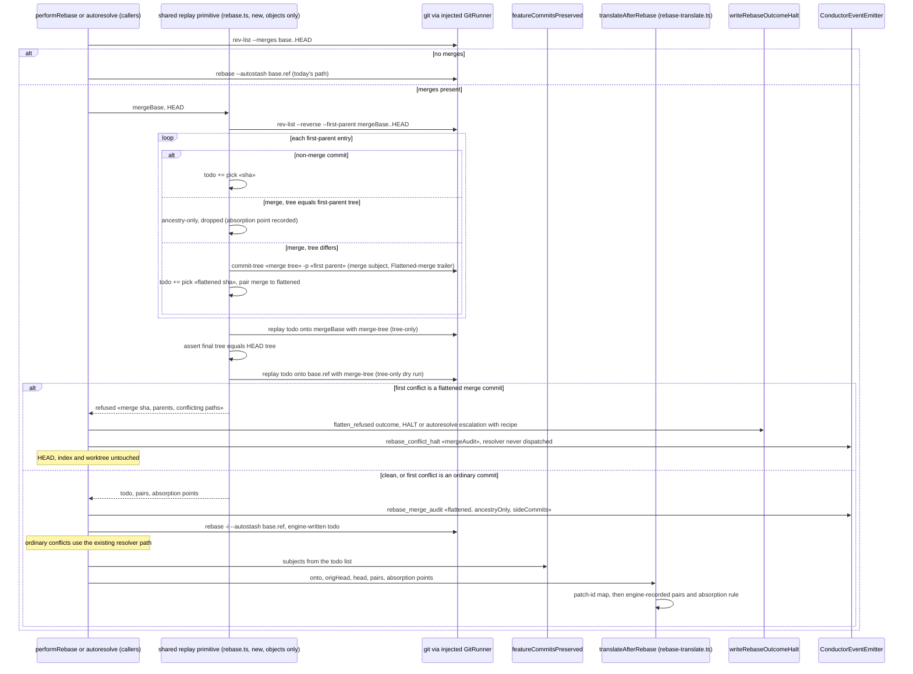

# Sequence: First-parent flattening of merge-bearing feature branches before rebase

**Last updated:** 2026-09-29
**Scope:** How `performRebase` flattens a merge-bearing feature branch into an explicit replay list
before any worktree change. The list holds the first-parent commits plus one flattened commit per
merge that carries content, and ancestry-only merges are dropped. A tree-only dry run gates the
flattened replay. The replay then reuses today's `git rebase` conflict machinery, and translation
maps merge and side-lineage shas to their absorption point. A branch with no merges in `base..HEAD`
takes today's path unchanged.

## Diagram

## Legend

- **ancestry-only merge**: its tree equals its first parent's tree. It contributes no content to
  the first-parent line, only ancestry, typically to keep a repair or evidence boundary reachable,
  so it is dropped from the replay.
- **flattened merge commit**: a new object whose tree is exactly the merge's tree and whose parent
  is the merge's first parent. Picking it replays the side-branch contribution and the merge
  resolution as one diff. It carries the merge's subject and a `Flattened-merge: «sha»` trailer.
- **side-lineage commit**: a commit reachable only through a merge's second parent. It is never
  replayed on its own, which removes the add/add conflicts from replaying duplicated lineage twice.
  Its content arrives through the flattened merge commit, or it was already present on the first
  parent when the merge was ancestry-only.
- **absorption point**: the post-image a merge or side-lineage sha translates to when it has no
  patch-id match. That is the flattened merge commit, or for an ancestry-only merge the first
  surviving first-parent successor, so the evidence range only shrinks.
- **tree-only**: `merge-tree --write-tree` and `commit-tree` write git objects but never a ref, the
  index, or the worktree. A refusal therefore leaves the checkout byte-identical.
- The audit reports only through the existing event spine: one new `rebase_merge_audit` variant
  with an `EVENT_SINKS` row, and the halt extends `rebase_conflict_halt`. It adds no sidecar and no
  log line.

## Change Log

| Date | Change | Reason |
|------|--------|--------|
| 2026-09-29 | Initial generation | DECIDE for #2498, Approach B |
| 2026-09-29 | Shared primitive for performRebase and autoresolve; distinct flatten_refused outcome | Conflict check: resolver dispatch on stateless halt; duplicated rebase in autoresolve.ts |
| 2026-09-29 | Replaced remerge-delta replay with first-parent flattening | Probe: side-lineage replay conflicts in place on 5/5 merge-bearing branches; flattening reproduces HEAD's tree on all 5 |
