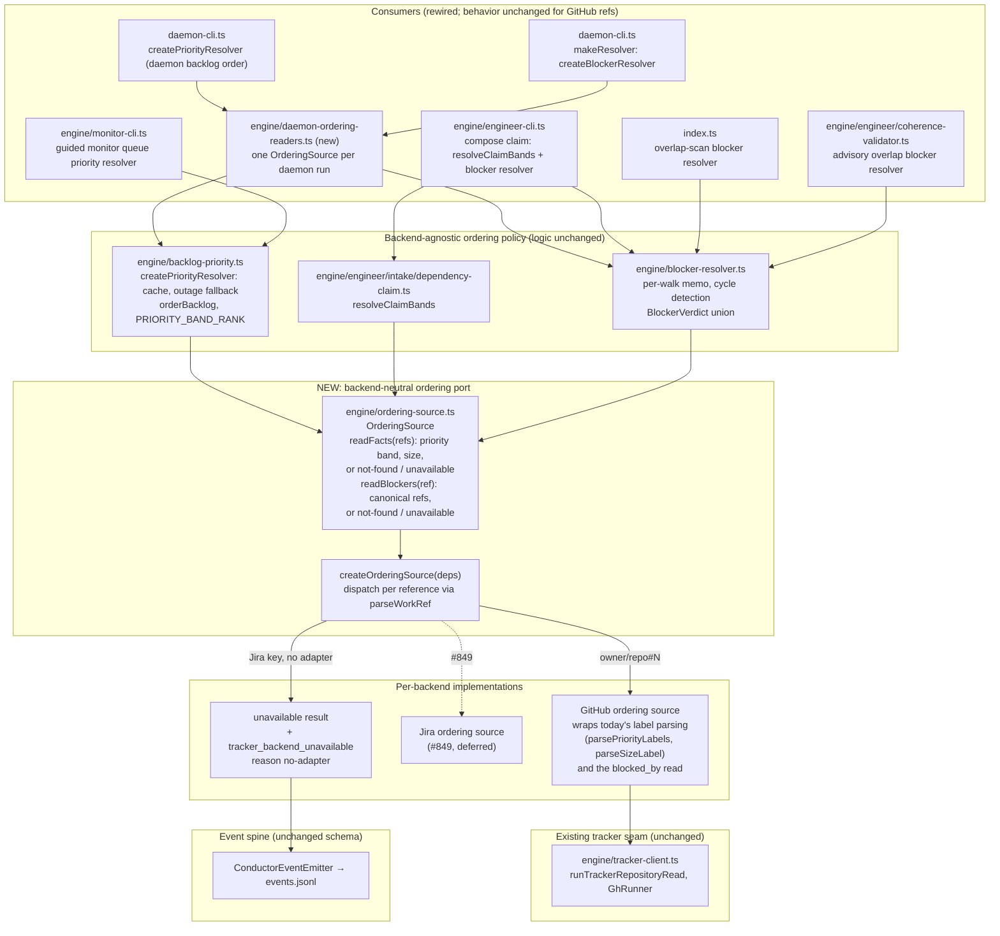

# Components: Backend-Neutral Backlog Ordering Reads (#851)

**Last updated:** 2026-10-10
**Scope:** Target-state component view of the backend-neutral ordering port. The daemon, intake claim, the monitor queue,
the overlap scan, and the land-time coherence check read priority, size, and dependency facts through
this port. The diagram covers the new port, its GitHub implementation, the per-reference backend
dispatch, and the six rewired consumers. Jira reads (#849), intake filing and backfill (#850), and
write-backs (#852, #853) are out of scope. Paths are relative to `src/conductor/src/`.

## Diagram

## Legend

- **Consumers:** the six construction sites that today build a GitHub label reader or a
  `GhRunner`-backed blocker resolver directly. After this change each one builds an `OrderingSource`
  and passes it to the policy layer.
- **Policy layer:** ordering, caching, outage fallback, the per-walk memo, and cycle detection stay
  exactly as they are. They consume normalized facts, not raw GitHub labels or `blocked_by` JSON.
- **OrderingSource (new):** the only path to ordering facts. It returns normalized values: a
  `PriorityBand`, an `S`/`M`/`L` size, and blockers as canonical source-ref strings. It also returns
  two non-fact outcomes: `not-found`, and `unavailable` when the backend has no adapter.
- **Dispatch:** chooses a backend per reference from its parsed `WorkRef` kind. GitHub references go
  to the GitHub implementation. A Jira key goes to `unavailable`, which emits
  `tracker_backend_unavailable` instead of being silently treated as not found.
- **Dashed edge:** deferred integration. #849 registers the Jira implementation behind the same port.

## Change Log

| Date | Change | Reason |
|------|--------|--------|
| 2026-10-10 | Initial generation | #851 DECIDE: backend-neutral ordering reads |
| 2026-10-10 | Added the monitor-cli consumer | #851 plan: sixth construction site found |
| 2026-10-10 | Added the daemon-ordering-readers helper | #851 plan Task 8: one shared source per daemon run |
