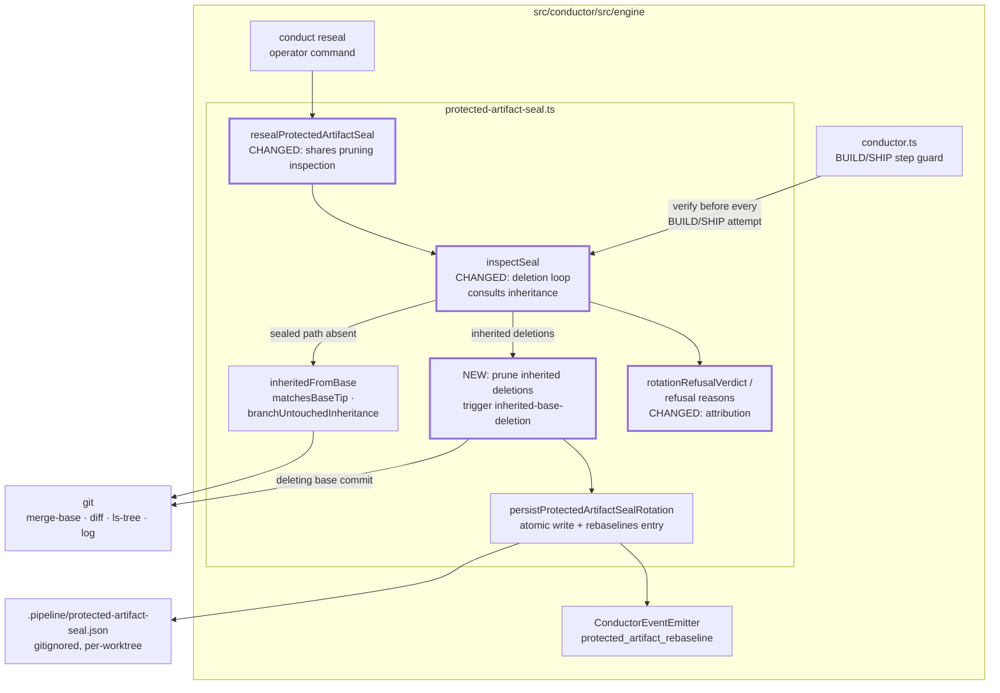
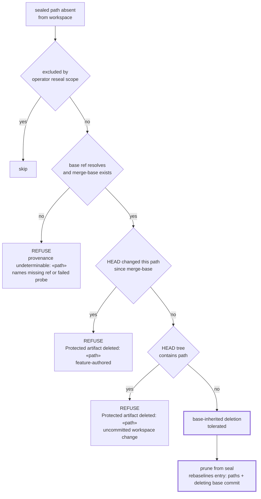
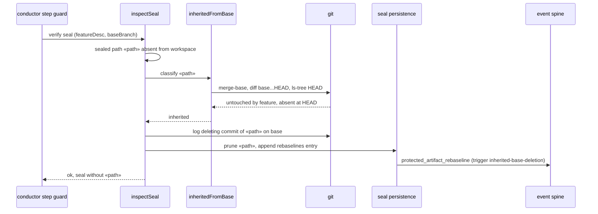

# Architecture: inherited base deletion of sealed protected artifacts (#1752, absorbs #1676)

**Stem:** `base-inherited-artifact-deletion-deadlocks-both-se`
**Tier:** M — lightweight architecture pass
**Builds on:** `.docs/architecture/manual-rebase-strands-protected-artifact-seal.md` (#1229 provenance
probe), `.docs/architecture/no-operator-command-to-reseal-a-protected-decide-a.md` (operator reseal)

## Scope

No component moves and no module gains a dependency. Changes stay inside
`src/conductor/src/engine/protected-artifact-seal.ts`:

1. The deletion loop in `inspectSeal` consults the existing base-inheritance probe
   (`inheritedFromBase` → `matchesBaseTip` / `branchUntouchedInheritance`), the same one the
   "added" and "changed" checks already use.
2. Each sealed path confirmed as an inherited deletion is pruned from the seal through the existing
   atomic seal persistence. That write appends a `rebaselines` entry (trigger
   `inherited-base-deletion`) recording the pruned paths and the base commit that deleted each one.
   It then emits the existing `protected_artifact_rebaseline` event, so no new channel is added.
3. `resealProtectedArtifactSeal` goes through the same inspection, so an operator reseal no longer
   refuses because an inherited deletion exists somewhere else in the seal.
4. Every refusal reason names the artifact and its attribution: `feature-authored`,
   `base-inherited`, or `provenance undeterminable`.

Out of scope: rotation's exactly-append-only test for a feature's own plan. `conduct reseal` stays
the documented recovery for that shape. The step topology, the seal file version, and the event
union's variants are unchanged. The only addition is an optional per-path deleting-commit field on
the rebaseline record.

## Component view (C4 level 3, seal boundary only)

## Per-path deletion classification

## Verification flow after a rebase across a base deletion

## Legend

- **CHANGED / NEW** nodes (thick border) are the only behavioral changes.
- `«path»` is any sealed protected `.docs/` artifact path.
- "Feature-authored" means the feature branch changed the path after its merge-base with the base
  branch. "Base-inherited" means the base branch alone removed it.

## Change Log

| Date | Change | Reason |
|------|--------|--------|
| 2026-10-07 | Initial generation | #1752 / #1676 DECIDE, Approach C (tolerate + prune with audit) |
| 2026-10-07 | Plan update: prune persists only on an `ok` composed verdict and is folded into the rotation write when rotation is permitted (ADR D4 as revised); refusal labels use the closed attribution set | /plan |
