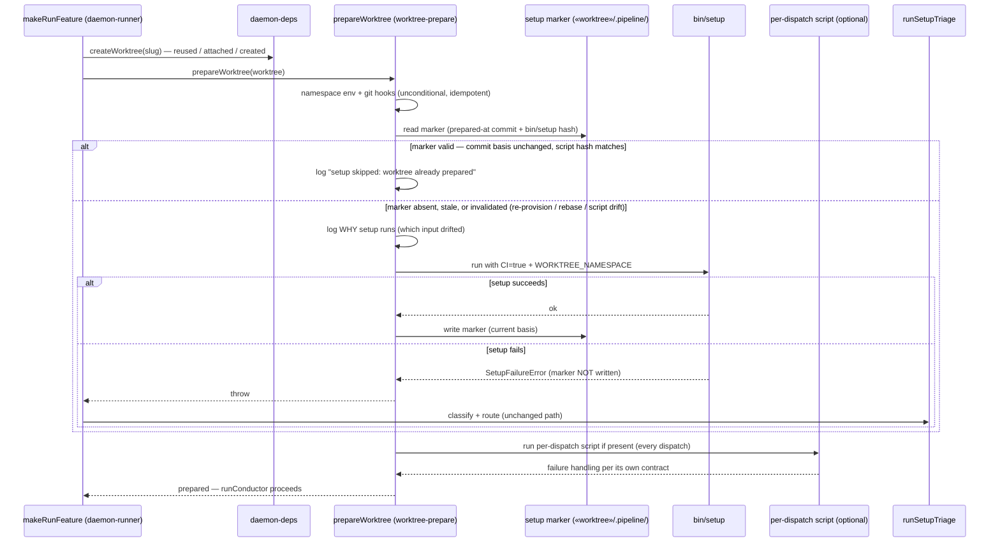

# Sequence: Marker-gated project setup and the per-dispatch lifecycle script

**Last updated:** 2026-08-26
**Scope:** How a daemon dispatch decides whether to run the project's `bin/setup` (once per
worktree provisioning, re-run only on named invalidation), and where the new optional
per-dispatch lifecycle script runs. #1930.

## Diagram

## Legend

- **Marker** — durable per-worktree record of the last *successful* setup and the basis it was
  prepared against. A failed setup never writes it, so a kept-after-failure worktree re-runs
  setup on re-dispatch.
- **Invalidation** — re-provisioning (fresh worktree has no marker), the checkout moving
  underneath the prepared state (engine rebase / base drift), or a `bin/setup` content change.
- **Per-dispatch script** — the documented lifecycle mechanism for behavior that genuinely
  needs to run on every dispatch; `bin/setup` is no longer that vehicle.

## Change Log

| Date | Change | Reason |
|------|--------|--------|
| 2026-08-26 | Initial generation | DECIDE for #1930 (engineer spec) |
