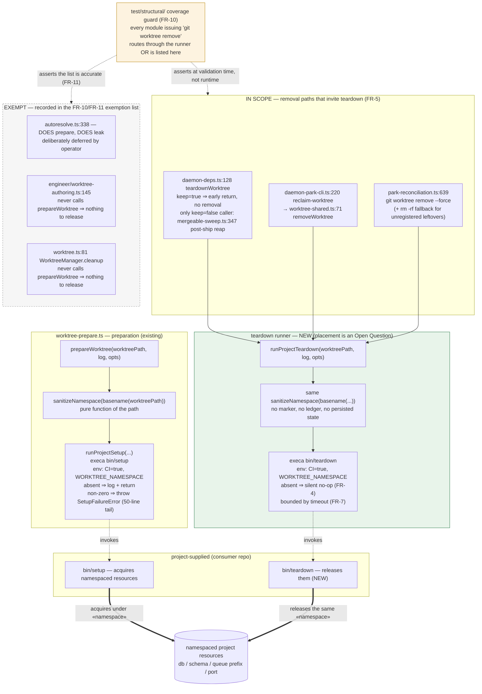
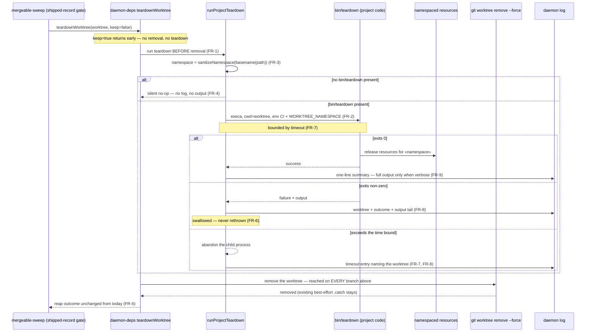

# Architecture: project teardown hook before worktree removal

**Last updated:** 2026-08-07
**Scope:** The acquire/release symmetry between the existing project setup entrypoint and the
new project teardown entrypoint; the three in-scope removal paths that invite it; the
containment boundary that keeps project-supplied code out of harness control flow; and where
the FR-10 coverage guard sits relative to the runtime path.

## Diagram 1 — Component view: acquire and release symmetry

## Diagram 2 — Sequence: containment boundary on the post-ship reap

The reap path is drawn because it is the highest-frequency in-scope removal; the reclaim and
reconciliation paths differ only in who triggers them, not in the containment behavior.

## Legend

- **Acquire/release symmetry** is the load-bearing structure. The namespace is a pure
  function of the worktree path (`sanitizeNamespace(basename(worktreePath))`), so the
  teardown runner recomputes exactly what the setup run used. No marker file, ledger, or
  persisted state is introduced — which is why a worktree recreated from its branch, having
  lost its transient `.pipeline/` state, still tears down correctly (FR-3).
- **The containment boundary** is the `runProjectTeardown` box. Every failure mode of
  project-supplied code — non-zero exit, timeout, spawn error — terminates there and becomes
  a log entry. The `git worktree remove` step is reached on every branch of the sequence,
  which is what makes FR-6 and FR-7 true by construction rather than by discipline.
- **Solid arrows into the runner** are the three in-scope invocation points (FR-5). Note
  that `daemon-deps.ts:128` covers two product paths at one code point: the post-ship reap
  is its only `keep=false` caller, while `daemon-runner`'s two calls pass `keep=true` and
  return before any removal.
- **The dashed exempt box** is not dead space — FR-11 requires its contents to be recorded
  accurately. `autoresolve.ts:338` is materially different from the other two: it *does* call
  `prepareWorktree` and *does* leak. It is exempt by operator decision, not because it is
  harmless, and the exemption list must say so.
- **The guard sits off the runtime path.** It executes in the validation suite, never during
  a build. Its arrows are assertions about the shape of the code, not calls. This is the
  distinction that makes it machinery under this repository's design principle: a newly added
  removal path fails validation at authoring time rather than leaking silently in production.
- **Guillemets** `«namespace»` / `«slug»` denote a variable part of a label.

## Change Log

| Date | Change | Reason |
|------|--------|--------|
| 2026-08-07 | Initial generation | Feature DECIDE — teardown hook before worktree removal (M tier) |
| 2026-08-07 | Reviewed against the implementation plan; no structural change | Plan-update pass. The plan's 18 tasks introduce no component, seam, or boundary the diagrams do not already show — the reconciliation single-invitation placement and the `keep === true` ordering were both settled during architecture review and are already drawn. |
