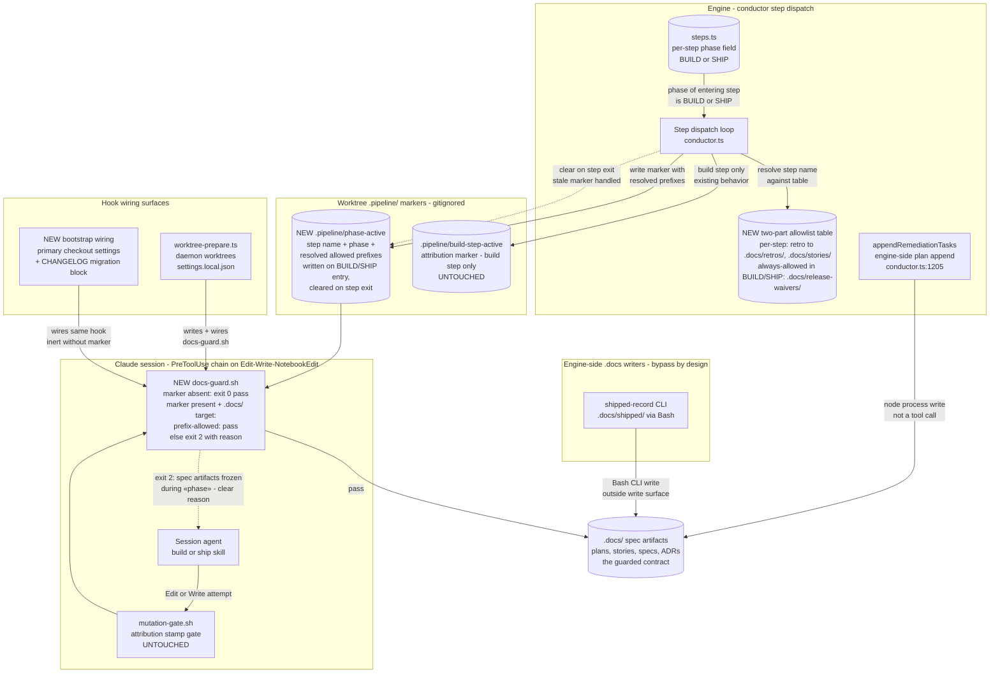

# Components: Phase-Scoped .docs Write-Guard (#788)

**Last updated:** 2026-07-22
**Scope:** The new spec-artifact write-guard that mechanically blocks BUILD/SHIP-phase
session edits under `.docs/` — (1) a phase-keyed marker written by the conductor around
every BUILD/SHIP step, (2) a typed engine-side allowlist table resolved into the marker,
and (3) a new `docs-guard.sh` PreToolUse hook on the write surface — shown against the
existing, untouched attribution seam (`build-step-active` + MUTATION_GATE_HOOK) and the
engine-side `.docs` writers that bypass the guard by design.

## Diagram

## Legend

- **NEW** — the four surfaces this feature adds: the `phase-active` marker, the
  allowlist table, `docs-guard.sh`, and bootstrap wiring. Every other node exists today.
- **Orthogonality** — `build-step-active` (attribution stamps) and `phase-active`
  (spec freeze) are separate markers with single meanings; `docs-guard.sh` runs as a
  sibling of `mutation-gate.sh` in the same PreToolUse chain, and neither reads the
  other's marker.
- **Phase-keyed, not name-keyed** — the marker is written for any step whose
  `steps.ts` phase is BUILD or SHIP, so future steps added to either phase inherit the
  guard automatically (the attribution marker's `step.name === 'build'` guard is the
  counterexample this avoids).
- **Default-deny inside `.docs/`** — the hook blocks any `.docs/` prefix not explicitly
  allowed by the marker's resolved list; new `.docs/` subdirectories are protected
  without code changes.
- **Bypass by design** — engine-process writers (`appendRemediationTasks`) and
  Bash-mediated CLI writers (`shipped-record`) are outside the PreToolUse write surface;
  this is the operator-accepted scope (write-surface only).
- `«…»` — placeholder for a variable value.

## Change Log

| Date | Change | Reason |
|------|--------|--------|
| 2026-07-22 | Initial generation | DECIDE phase for #788 (engineer spec authoring) |
| 2026-07-22 | Allowlist node updated to two-part model (always-allowed .docs/release-waivers/) | Conflict-check resolution (release-waiver authoring during BUILD) |
