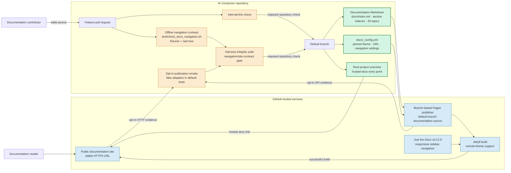

# Components: Browsable documentation site

**Last updated:** 2026-07-30
**Scope:** Repository-owned documentation, pull-request validation, default-branch publication, and the public reader experience.

## Diagram

## Legend

- Green nodes are repository-owned sources; the Markdown remains the only documentation content authority.
- Orange nodes are deterministic pull-request checks. Internal links remain covered by the existing checker; the navigation contract additionally rejects missing site metadata and orphaned topics.
- Blue nodes are GitHub-hosted publication and presentation components. The existing branch publisher remains authoritative and publishes only default-branch content.
- A failed build does not replace the last successfully published site and remains visible in the repository's Pages deployment status.

## Change Log

| Date | Change | Reason |
|------|--------|--------|
| 2026-07-30 | Initial design | Complete the existing Pages publication path with a landing page, durable navigation, and deterministic coverage checks |
| 2026-07-30 | Plan update | Name the concrete source, validation, integrity, and opt-in smoke boundaries selected by the implementation plan |
