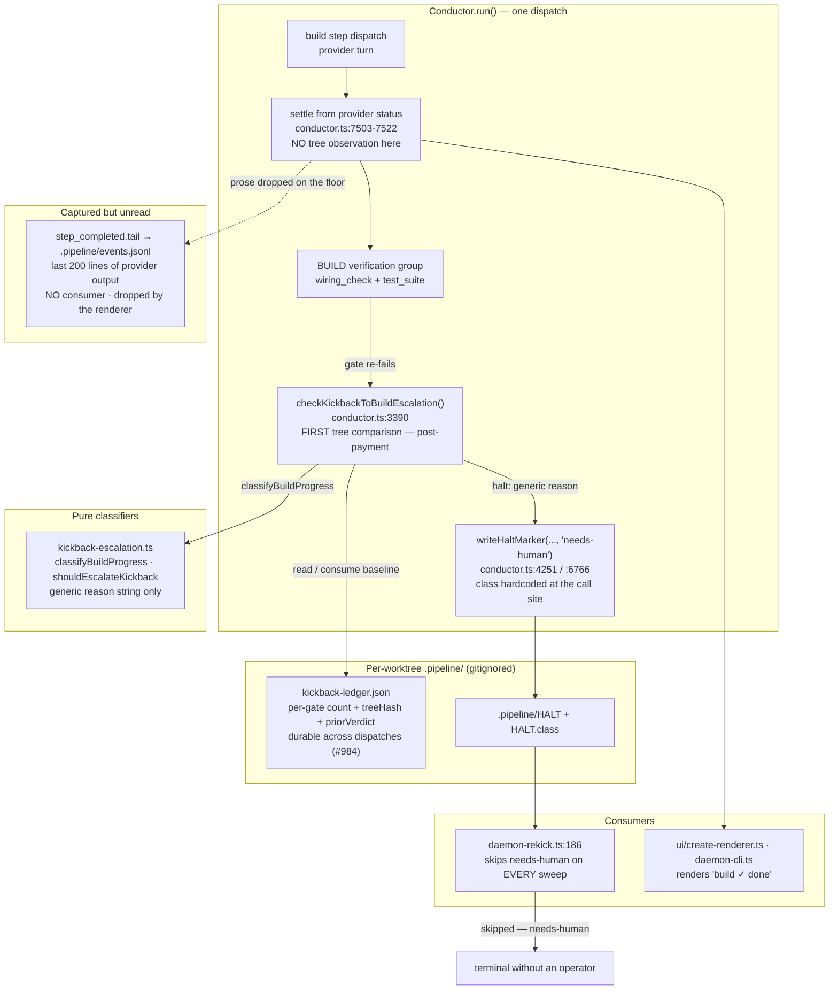
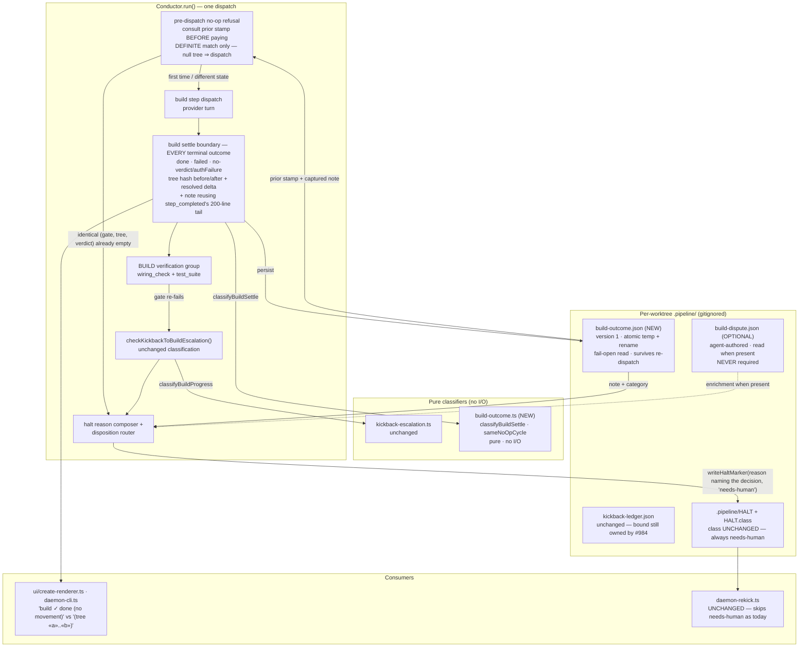

# Architecture: engine-stamped build outcome for a disputed kickback

Issue: jstoup111/ai-conductor#1336
Tier: M
Track: technical

## Problem shape

When `wiring_check` kicks back to `build`, the build agent sometimes answers by *disputing the
gate in prose* rather than editing the tree ("Task 2's contract is false — this must return to
DECIDE", "the reported failure came from a stale context"). Three things then happen, and all
three are structural, not incidental:

1. The build step settles from the provider's own status. Nothing at the step boundary asks
   whether the turn moved anything, so the log prints `build ✓ done` for a turn that changed
   zero bytes.
2. The agent's conclusion has no consumer. It **is** captured — `step_completed` carries `tail`,
   the last 200 lines of `successOutput` (`conductor.ts:7508`), into `.pipeline/events.jsonl`
   (`event-persister.ts:125,195`) — but `daemon-cli.ts:2055` drops `tail` when rendering and
   nothing anywhere reads it back. The halt reason is composed from the detector's generic string,
   so the conclusion never reaches the operator.
3. The no-op is discovered at the *gate's re-failure*, which is downstream of a fully paid build
   dispatch (0.5M–2.4M input tokens observed). The bound from #984 caps how many laps happen; it
   does not stop the next lap from being paid for before it is recognized as identical.

## Current state (as-built)

**Three seams, each verified in source:**

- `conductor.ts:3362` `captureKickbackToBuildContext` and `:3390`
  `checkKickbackToBuildEscalation` are the *only* tree-hash observation points, and both sit on
  the gate's failure path — never on the build step's own boundary.
- `build-progress-watcher.ts` emits `build_progress` / `build_no_progress`, but on a polling
  cadence during a long build. The observed failures settled in **1 turn**, so no heartbeat fired
  and the operator-visible record is `build ✓ done` alone.
- `daemon-rekick.ts:186` skips `needs-human` unconditionally, so every re-kick sweep passes over
  the feature carrying a reason string that says only that nothing moved — never what the agent
  concluded or what the operator is being asked to decide.

## Target state

## Key structural decisions

**The observation point moves to the build step's own settle boundary — it is not added to the
gate path.** Everything the four outcomes need is derivable from one stamp taken where the build
turn ends: the log line, the durable record of what the agent said, the fingerprint that makes a
repeat recognizable, and the material the halt reason quotes. Putting it at the gate instead
would keep the record downstream of payment, which is precisely the defect.

**The stamp is engine-authored; the agent artifact is enrichment only.** This repo's Design
Principle is explicit that a repeatedly-violated rule needs machinery, not a stronger prompt. An
agent-authored dispute contract would have covered **zero** of the four observed halts, because
disputing in prose is exactly what the agents did. So `.pipeline/build-outcome.json` is written
by the engine from data it already computes (`currentTreeHash`, `countResolvedTasks`) plus the
`tail` `step_completed` already carries, and `.pipeline/build-dispute.json` is read when present
and ignored when absent. The feature is fully functional with no agent change at all.

**The note reuses `step_completed`'s existing 200-line tail bound — it is not an unbounded
verbatim capture.** The bound already exists (`conductor.ts:7508`) and the same material already
lands in the same gitignored `.pipeline/` directory, so the stamp introduces **no new
secrets-exposure class and no new size class**. It re-records, under the same cap, material the
engine already persists.

**The stamp is written on every terminal outcome of the build step, not only on success.**
Success, `step_failed`, and a no-verdict outcome (including `authFailure`) each write a stamp
naming which occurred. A success-only stamp would leave the pre-dispatch refusal comparing against
a stale cycle whenever an attempt failed in between.

**The refusal fires only on a DEFINITE match, and its null polarity is inverted from
`classifyBuildProgress`.** `kickback-escalation.ts:38` folds a null tree hash into `'no-work'` —
correct there, because the conservative direction for *escalating a spin* is to assume no progress.
It is the wrong direction here: an unobservable tree must mean "dispatch", never "refuse", or the
guard declines legitimate work on absent evidence. The two guards deliberately fail in opposite
directions, and the refusal must not reuse that helper.

**The `category` field is advisory and never gates control flow.** When `build-dispute.json` is
absent, the category is inferred from prose and is a heuristic. It may enrich the halt reason and
the stamp; only the tree-derived `moved` / `no-movement` classification may gate the refusal, the
escalation, or the disposition.

**`build-outcome.json` is a new sidecar, not a field on `kickback-ledger.json`.** The ledger's
lifecycle is *the bound* (#984): per-gate counts consumed and reset by progress, cleared on a
fresh feature session. The stamp's lifecycle is *the observation*: one record per build settle,
independent of whether any gate ever kicks back. Grafting them would couple a guard to a log.
The new module follows the same atomic temp-file + `rename(2)` + fail-open-read pattern
(`kickback-ledger.ts:67-116`), so it is conventional rather than novel.

**The cross-dispatch repetition bound RECONCILES with #984 — it does not duplicate it.** #984
already made the kickback *count* durable across dispatches. What it does not do is refuse the
next dispatch: the count is bumped only after `consumeKickbackBudget` runs, which is downstream
of a fully paid build turn. The addition here is a **pre-dispatch refusal**: before re-entering
`build` under an active kickback, compare the current `(gate, tree hash, gate verdict, escalation
rung)` tuple against the last stamp. An exact match means this identical cycle has already been
observed to produce nothing, so it halts without paying. Any difference in any component — a moved
tree, a different gate, a changed verdict, a higher model/effort rung — dispatches normally. The
rung is in the key even though `attempt` resets per dispatch (`conductor.ts:4896`), so the guard
can never refuse a strictly more-capable retry without that property depending on a scoping detail
elsewhere. The bound's *cap* semantics stay entirely in `kickback-ledger.ts`.

**Progress is keyed on the tree hash, never on reason text.** Inherited verbatim from
adr-2026-07-06/#984's analysis: only `wiring_check` produces deterministic reason strings;
`build_review`, `manual_test`, and `test_suite` do not. Reason text is recorded for the operator
message and never used as a comparison key.

**The `HaltClass` union is NOT extended — every halt here stays `needs-human`.** A new
`needs-decide` member was considered and deliberately rejected (operator decision, 2026-08-05).
It would have unlocked no automatic behavior: `daemon-rekick.ts:186` would have had to skip it
exactly as it skips `needs-human`, so the only gain was a label, paid for with a change to a
union that has three consumers (`daemon-rekick.ts:186`, `halt-class-migration.ts:73`,
`daemon-cli.ts:1424`) plus its migration path.

Operator legibility is delivered instead by the two surfaces that already carry text: the
**halt reason** names what the operator must decide, and `.pipeline/build-outcome.json` carries
the machine-readable `category` (`disputes-gate` / `belongs-to-decide` / `silent-no-movement`)
alongside the verbatim note. Anything that wants to branch on the distinction reads the stamp;
nothing needs to branch on the class. This also keeps the negative path preserved by
construction — the disposition every no-movement halt writes is byte-identical to today's.

**The engine never adjudicates the dispute.** Two agents claimed the gate's evidence was stale.
`artifacts.ts:2580` re-derives wiring evidence only when HEAD moved, so a no-commit build leaves
the recorded verdict standing *by design*. Whether that design is right is #1249/#1175's
question, and forcing a re-derive at an unchanged HEAD would change `wiring_check` freshness
semantics. This change records the claim and names the decision; it does not rule on it.

**A build that genuinely moved the tree is untouched.** The stamp classifies `moved` and every
downstream path — kickback budget, escalation, halt disposition — behaves exactly as today. There
is no path in this design by which a real wiring gap becomes an automatic pass or an unbounded
retry.

## Change Log

| Date | Change | Reason |
|------|--------|--------|
| 2026-08-05 | Initial generation | DECIDE for jstoup111/ai-conductor#1336 |
| 2026-08-05 | Dropped the proposed `needs-decide` HaltClass member | Operator decision — it unlocked no automatic behavior; legibility moves to the halt reason and the stamp's category |
| 2026-08-05 | Applied review conditions C1–C5 | `architecture-review-2026-08-05-…` — corrected the "prose is discarded" framing (it is captured in `step_completed.tail` and merely unread), definite-match refusal with inverted null polarity, escalation rung in the key, stamp on every terminal outcome, 200-line bound, advisory-only category |
