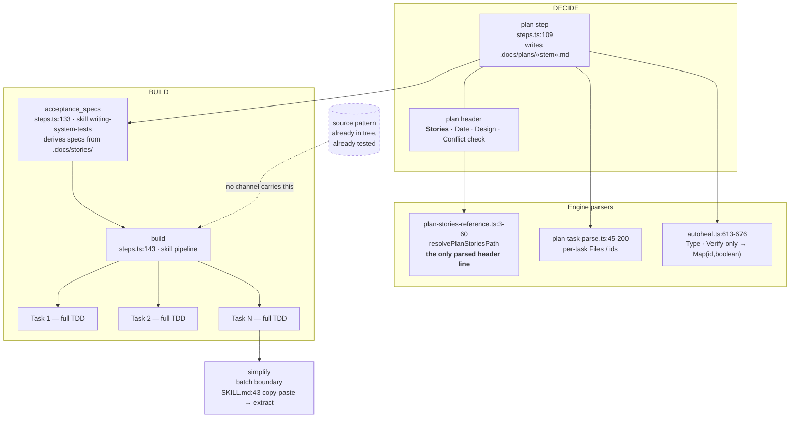
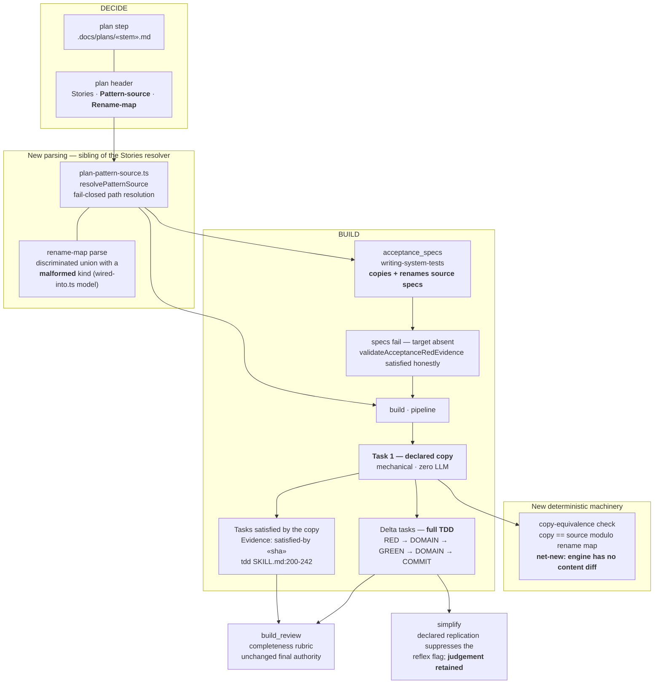
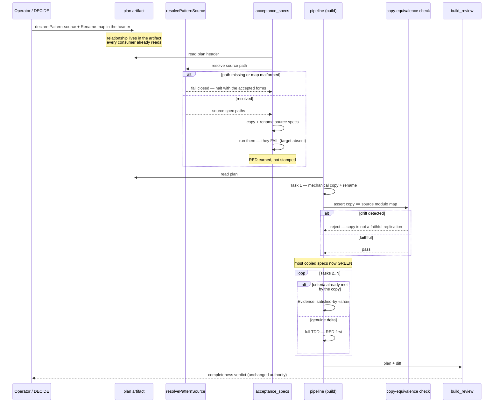

# Architecture: declared pattern replication for Nth-of-a-kind BUILD work

**Stem:** `build-dispatches-every-plan-task-through-a-full-ge`
**Tier:** M
**Track:** technical
**Last updated:** 2026-08-09

## Scope

When a feature adds the Nth instance of an established in-repo pattern — another gate, another
step, another provider adapter — BUILD today derives every acceptance spec and every task test
from scratch, even though a near-identical, already-tested source sits beside it in the tree.
Nothing in the artifact set can say "this is a replication of that," so nothing can act on it.

This design adds one declared, parsed relationship (**plan header → source pattern + rename map**)
and gives it two consumers: `acceptance_specs`, which copies and renames the source feature's
specs instead of deriving them, and `build`, whose Task 1 performs the implementation copy
mechanically so that Tasks 2..N run full TDD only on the **deltas**.

**Explicitly not in scope.** No persistent pattern registry and no drift gate linking a source to
its replicas over time (operator decision, 2026-08-09: the link is one-time, consumed during the
build). No new conductor step, no new artifact type, no new skill.

## Constraints this design is built against

| Constraint | Source | How this design satisfies it |
|---|---|---|
| No new flow, no new skips; "smallness lowers the floor, never removes the safety net" | `adr-2026-07-21-s-tier-pipeline-knobs` D1/D4 | Nothing is added to any `skippableForTiers` list; no gate is disabled. D4 binds tier-conditional weakening; this is not tier-conditional and weakens nothing. |
| Deterministic where possible; LLM only where necessary | `CLAUDE.md` Design Principles | The copy and its equivalence check are mechanical. The LLM is spent only on the deltas — the part that is genuinely judgement. |
| Extend the existing event spine; never add a parallel channel | `.agents/skills/event-spine/SKILL.md` | The relationship rides the plan artifact, which every consumer already reads. No sidecar file, no second telemetry path. |
| Acceptance RED must be genuine | `artifacts.ts:1238-1300` | Copied specs fail because the target does not exist yet at `acceptance_specs` time. RED is earned, not stamped. |

## Current state — the replication relationship has nowhere to live

Two facts shape everything below, both verified rather than assumed:

- **Neither `acceptance_specs` nor `build` receives artifact text.** Both are dispatched as a bare
  `/«skill»` prompt with a `[Conduct step N/M] Feature: «desc»` system prompt
  (`step-runners.ts:550-554`, `:2019-2040`). The skills read artifacts off disk themselves. So
  reaching a new plan line from either step is a skill-prose change, not a dispatch change.
- **Per-task RED is not enforced anywhere.** The only mechanical RED is feature-level
  (`validateAcceptanceRedEvidence`). The per-task floors in `per-task-commit-floor.ts:54-105` and
  `:113-184` are advisory — they prepend WARNING lines and never change `success`. Final authority
  is `build_review`'s LLM completeness rubric, the one step that receives full plan text
  (`build-review-inputs.ts:17-24`).

## Target state — one declared relationship, two consumers

## Replication flow

## Component placement

| Component | Location | Status | Precedent it follows |
|---|---|---|---|
| `Pattern-source` / `Rename-map` header grammar | `skills/plan/SKILL.md` | new prose | `**Stories:**` header contract, `skills/plan/SKILL.md:311-326` |
| `resolvePatternSource` | `src/conductor/src/engine/plan-pattern-source.ts` | new module | `plan-stories-reference.ts:25-60` — traversal refused, non-`.docs/` refused, absent-line fallback |
| Rename-map parse with a `malformed` kind | same module | new | `wired-into.ts:19,100,167` — discriminated union whose malformed branch lists the accepted forms |
| Declared-path-must-resolve gate | same module | new | `wiring-probe.ts:655-667` `resolveWaiverRef` — `fileExists` → `waived` / typed `gap` |
| Copy-equivalence check | `src/conductor/src/engine/` | **net-new machinery** | none — the engine compares paths, never contents. `full-suite-fingerprint.ts` is the nearest content-hashing shape. |
| Spec copy + rename | `skills/writing-system-tests/SKILL.md` | new prose | its existing stories-driven derivation path |
| Declared copy task + delta-only TDD | `skills/pipeline/SKILL.md` | new prose | pre-completion scan (`:113-118`) and design-conformance check (`:124-131`) — cheap checks before expensive dispatch |
| Declared-replication awareness | `skills/simplify/SKILL.md` | prose amendment | `:43` copy-paste row, narrowed to undeclared duplication |

## Risks

| Risk | Mitigation |
|---|---|
| The copy commit is large and swamps `build_review`'s plan-vs-diff rubric | The copy is a **declared** task with its own `**Files:**`; the equivalence check makes the diff mechanically verifiable rather than requiring the grader to read it |
| A copied spec passes trivially and hides a missing behavior | The copy runs at `acceptance_specs`, **before** the target exists, so it must fail first. A spec that passes at that point is a genuine finding, not an accepted state |
| `Evidence: satisfied-by` becomes a rubber stamp for delta work | The sha must exist and be an ancestor of HEAD (existing derivation); `build_review` still judges plan-vs-diff completeness independently |
| The declared source is real but wrong (analogous-looking, semantically different) | Fail-closed resolution catches only nonexistent paths. A wrong-but-real source degrades quality rather than halting — accepted, and the delta tasks' RED is the backstop |
| `simplify` stops catching genuine accidental duplication | Suppression is scoped to the **declared** replication only; simplify's extraction judgement is explicitly retained (operator decision, 2026-08-09) |

## Change Log

| Date | Change | Reason |
|------|--------|--------|
| 2026-08-09 | Initial authoring | DECIDE for the declared-pattern-replication feature |
