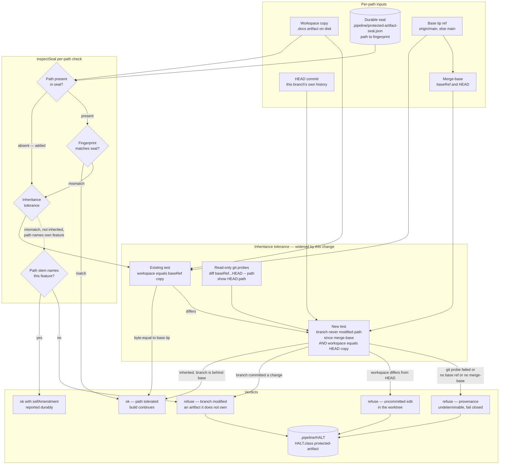

# Components: Provenance-aware protected-artifact inheritance tolerance

**Last updated:** 2026-08-05
**Scope:** The base-inheritance tolerance inside `inspectSeal`
(`src/conductor/src/engine/protected-artifact-seal.ts:566-641`) — which protected artifacts a
feature branch may carry without owning them, and what the seal says when it refuses.

## Diagram

## Component responsibilities

| Component | Responsibility | Changed by this spec |
|---|---|---|
| `inspectSeal` | Walks discovered protected paths; decides tolerate / self-amend / refuse | Refusal branches carry a cause, not one flat string |
| `matchesBaseTip` | Byte-equality against the base tip's copy | Unchanged — kept as the first accepted case |
| *new* untouched-inheritance probe | Asks git whether **this branch** modified the path since its merge-base, and whether the workspace matches HEAD | New |
| `resolveBaseTipRef` | Resolves `origin/<base>` then `<base>`, read-only, no fetch | Unchanged; its `undefined` result now maps to an explicit undeterminable refusal rather than a silent no-tolerance |
| `namesOwnFeature` | Scopes durable self-amendment reporting | Unchanged |
| Halt writer | Persists `reason` to `.pipeline/HALT` + `HALT.class` | Unchanged mechanism; richer `reason` text flows through it |

## Why the tolerance is a union, not a replacement

The new predicate is added **beside** `matchesBaseTip`, not in place of it. Base-tip equality
accepts some content the untouched-inheritance probe would refuse — most importantly a workspace
copy that differs from `HEAD` but equals the base tip, which today passes. Replacing the test would
silently convert those passes into halts, which is a regression this spec does not want to buy.
Union semantics make the change strictly widening: every path tolerated today is still tolerated.

## Trust boundary

Both accepted cases rest on the same assumption the seal already makes: **the build agent cannot
advance the base ref.** Base-tip equality trusts `origin/<base>`; the untouched-inheritance probe
trusts the merge-base derived from that same ref. An agent that could rewrite `refs/remotes/origin/main`
could defeat either one equally, so the widening adds no new exposure — it inherits an existing one.
That assumption is recorded explicitly in the ADR rather than left implicit in the diagram.

## What does not change

- Protected-artifact **discovery** (`PROTECTED_ARTIFACT_DIRECTORIES`, `workspaceProtectedPaths`).
- The `protected-artifact` HALT class, the retry budget, and step topology.
- Seal creation and rotation (`createProtectedArtifactSeal`, `rotateProtectedArtifactSeal`).
- The `deleted` refusal branch — a missing protected artifact still halts unconditionally.
