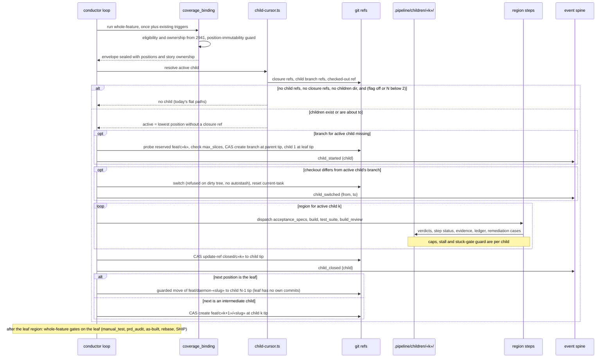
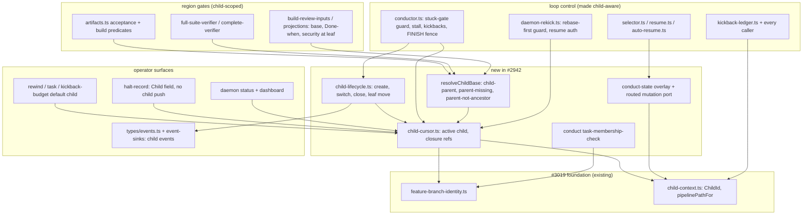

# Sequence + Components: Per-child BUILD region for stacked features

**Last updated:** 2026-10-07
**Scope:** How the build loop completes a stacked feature child by child (#2942). It covers the
active-child cursor, child branch creation, switching and closure, the per-child region
(`acceptance_specs` → `build` → `test_suite` → `build_review`), per-child caps, the commit-hook
membership check, halt records, and the rebase guards that hold until #2943. Restack (#2943), fix
routing (#2944), publication (#2945) and concurrency (#2948) are out of scope. With no child, every
path below collapses to today's flat loop.

## Diagram: child lifecycle in one worktree

## Diagram: components touched

## Legend

- **Child cursor.** The cursor is derived from git, never from a state file:
  - **Closure** is a monotone engine ref, `refs/conductor/«slug»/closed/c«k»`. It is written by
    compare-and-swap, sits outside `refs/heads`, is never pushed, and survives worktree recreation.
  - **Ancestry** is only a divergence check. If a closed child's tip is not an ancestor of the next
    child, the engine halts needs-human, because the stack needs a restack (#2943).
- **Positions** come from the sealed `coverage_binding` envelope, never plan text (umbrella ADR D5).
- **"No child".** The flag gates only the creation of children. Once child refs or child state
  exist, they decide the cursor.
- **Leaf move.** The leaf is moved by a guarded `update-ref` only when it has no commits of its
  own. Otherwise the engine halts.
- **Region stores** live under `.pipeline/children/«k»/` (#3019 seam). Whole-feature state stays
  flat: `coverage_binding`, task-status, `current-task`, growth budgets, receipts for whole-feature
  gates, and HALT.

## Change Log

| Date | Change | Reason |
|------|--------|--------|
| 2026-10-07 | Initial generation | DECIDE for #2942 (Approach B, revised after adversarial review) |
