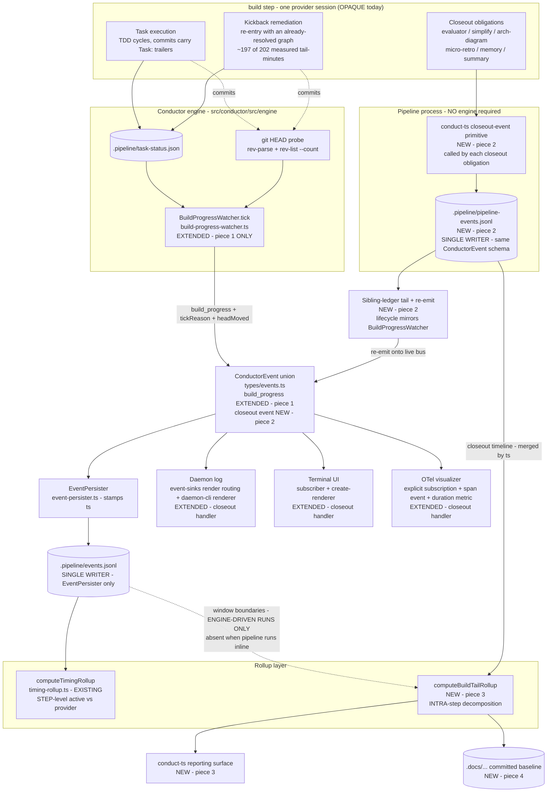
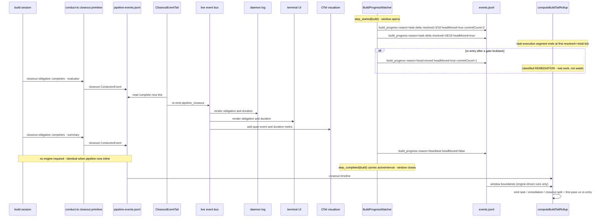

# Components: BUILD post-task tail telemetry

**Last updated:** 2026-08-09
**Scope:** Making the `build` step's interior legible. Today `build` is one opaque provider session (measured 6-60 min) whose only external signal is `BuildProgressWatcher` polling `.pipeline/task-status.json` plus a git HEAD probe — so task execution, kickback remediation, and closeout ceremony are indistinguishable in the ledger. This feature adds engine-side tick provenance, **pipeline-emitted closeout events on the bus**, an intra-step tail rollup over the merged ledgers, and a committed baseline. No change to gate semantics, step ordering, dispatch behavior, or the closeout obligations themselves.

**Decoupling constraint (operator direction).** The pipeline must not depend on the engine to be
instrumented. It stays runnable **inline** — invoked directly in a session with no conductor
driving it — and still produces a complete closeout timeline. The engine is therefore a
*consumer* of pipeline telemetry, never its source. This rules out the engine-side artifact
observer considered in the first draft of this diagram.

> **Original assertion (superseded):** `CONSUMERS["Existing ledger consumers daemon log /
> terminal UI / OTel export UNCHANGED - additive fields only"]` reached by
> `LEDGER --> CONSUMERS`.
>
> **Amended 2026-08-09 by #1176:** Source audit during build review showed that assertion was
> false for `pipeline_closeout`: daemon-log and terminal rendering require the render
> manifest/subscriber handlers, while OTel requires its own explicit subscription and handler.
> The corrected diagram places all three on the live bus and leaves the engine ledger
> single-writer.

## Diagram

## Sequence: one build window, decomposed

## Legend

- **NEW / EXTENDED** nodes are this feature; everything else exists today.
- **Closeout telemetry is on the bus, emitted from the pipeline's own process.** Each obligation calls a `conduct-ts` primitive that appends a real `ConductorEvent` — same union, same schema — to a pipeline-owned ledger. No engine, no daemon, and no IPC are required, so an inline pipeline run produces the same timeline as an engine-driven one. This is not prompt discipline: the emitting obligation is already hard-gated (the non-empty stat-check on `review.json` is an existing blocking gate), so the gate extends to require the recorded event. Precedent: `task-cli` already writes engine-consumed `.pipeline/task-status.json` from inside the build worktree.
- **One writer per ledger file.** `EventPersister` keeps `.pipeline/events.jsonl`; the pipeline owns `.pipeline/pipeline-events.jsonl`; readers merge by `ts`. This is not tidiness — `parseLedger` (`timing-rollup.ts:26-39`) returns `null` on a *single* malformed line, degrading every rollup over that ledger to `partial`, so a cross-process interleaved append would be whole-ledger corruption that stays invisible until read.
- **Tail-and-re-emit** lifts the pipeline's events onto the live bus. The daemon log is selected by `EVENT_SINKS.render` and handled by `daemon-cli.ts`; the terminal UI subscribes and renders through `ui/subscriber.ts` and `ui/create-renderer.ts`; OTel subscribes explicitly and records a span event plus a duration metric. `EVENT_SINKS.persist` remains false for `pipeline_closeout`, so re-emission cannot create a second writer for `.pipeline/events.jsonl`. The tail timer lifecycle mirrors `BuildProgressWatcher` exactly (`.unref()`'d interval, stopped in a `finally`).
- **Dotted edge from the ledger** marks the one engine-dependent input: `build` window boundaries (`step_started` / `step_completed`). Absent on an inline run, where the rollup degrades to a closeout-only timeline rather than failing.
- `build_progress` gains `tickReason` (`task-delta` | `head-moved` | `heartbeat`) and an explicit `headMoved` boolean. Today heartbeat ticks hard-code `commitCount: undefined` (`build-progress-watcher.ts:376`), so an absent `commitCount` cannot be distinguished from "HEAD did not move" after the fact — a classifier built on it under-counts real work.
- **Step-level vs intra-step.** `computeTimingRollup` (from #1101) measures whole steps and cannot see inside `build`; `computeBuildTailRollup` sits alongside it and decomposes a single `build` window. Neither replaces the other.
- **Re-entry.** A window whose *first* observed tick already reads `resolved == total` is a re-entry (the graph was complete on entry). 19 of 24 measured windows were re-entries; conflating them with first-pass windows is what makes the naive "time after tasks resolve" metric wrong.

## Decisions settled (see adr-2026-08-08-pipeline-owned-closeout-timestamps)

Two drafts of this diagram were superseded during `/architecture-review`, both by operator
direction, and the reasoning is recorded in the ADR so neither is re-proposed:

1. **Engine-side artifact observer** — rejected: an inline pipeline run with no engine would
   produce no closeout timeline, and watching a path set fails *silently* when an artifact is
   renamed.
2. **Artifact-carried timestamps read post-hoc** — rejected: closeout timing would never reach
   the bus, creating a second telemetry channel invisible to the daemon log, UI, and OTel
   exporter, and forcing a permanent reader adapter over three different timestamp conventions.
3. **Appending to the shared `events.jsonl`** — rejected on the `parseLedger` fail-closed
   behavior above; `appendFileSync` is atomic only under `PIPE_BUF` (4096 bytes) and existing
   `step_completed` records routinely exceed it.
4. **Filesystem mtime as the time source** — rejected: mtimes do not survive worktree
   recreation (issue #497) and change on copy.

## Out of scope

No parallelization of closeout obligations, no obligation pruning, no closeout receipt, no
change to the 15s evaluator cooldown, and no change to gate semantics or step ordering. Each
was evaluated against the measurement and deferred to a v1 follow-up blocked on this telemetry.

## Change Log

| Date | Change | Reason |
|------|--------|--------|
| 2026-08-09 | Corrected closeout live-consumer wiring | Build-review remediation found re-emission had no daemon, terminal UI, or OTel subscriber |
| 2026-08-08 | Initial generation | DECIDE phase for intake jstoup111/ai-conductor#1176 |
