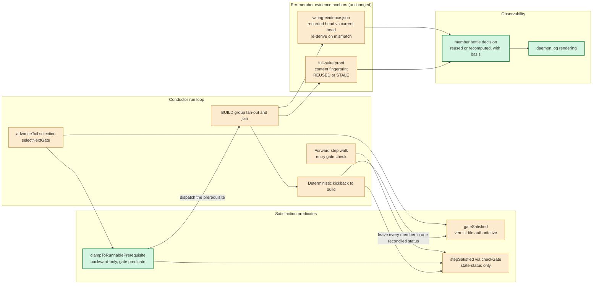
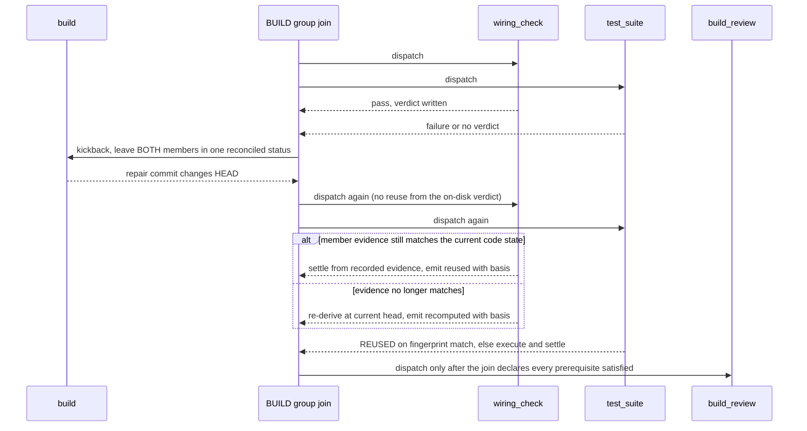

# Components: BUILD-verification member reuse after a repair

**Last updated:** 2026-08-03
**Scope:** Proposed satisfaction boundary for the deterministic BUILD-verification group
(`wiring_check`, `test_suite`) across a BUILD repair, and the reconciliation of the two
step-satisfaction predicates that currently disagree.

## Diagram

## Repair-and-rejoin Sequence

## Legend

- **Green (proposed):** the tail-selection clamp, and the per-member settle-decision events with their
  daemon.log rendering.
- **Amber (existing):** everything this change consumes rather than invents — both satisfaction
  predicates, the concurrent group core and its join, the kickback path, and each member's own
  code-state-anchored evidence.

## Invariants this topology enforces

1. A member is declared satisfied only by the round that verified it. No on-disk gate verdict, step
   status, or timestamp is sufficient authority on its own.
2. Each member's validity is decided by exactly one authority — its own evidence anchor. No second,
   coarser authority is layered over it.
3. `build_review` is dispatched only when every declared prerequisite is satisfied under the same
   predicate its own entry check uses.
