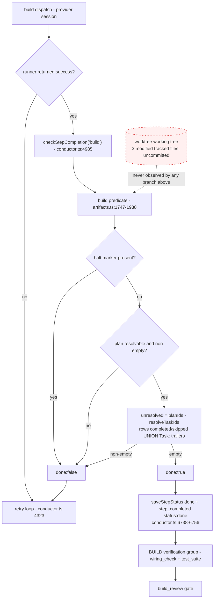
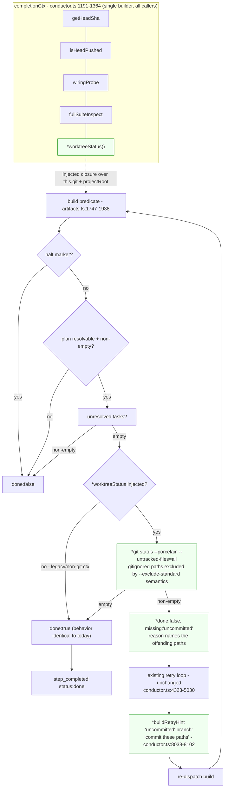
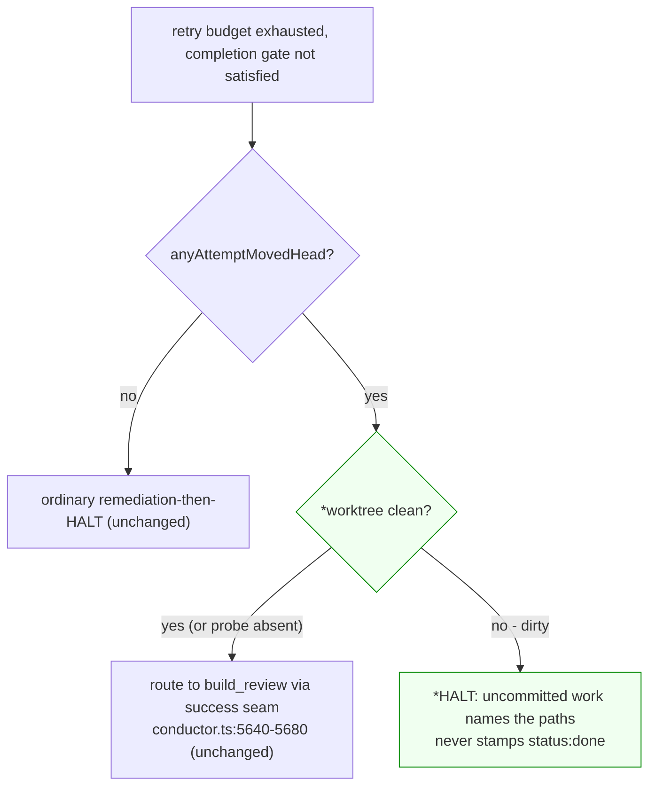
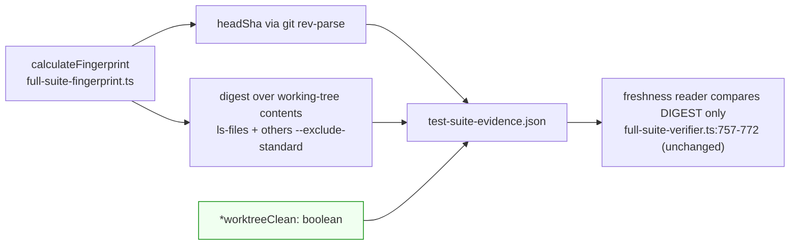

# Architecture: uncommitted-work floor under BUILD completion (ai-conductor#1270)

New elements marked with `*`. Everything unmarked ships today and is unchanged.

## Today: the trust gap

The build step's completion predicate routes on plan-task resolution alone. Nothing in the
path observes the working tree, so a session that authored correct work and never committed it
resolves exactly like one that committed everything — provided the plan's tasks were already
resolved by earlier attempts (the observed #1270 shape: a *repair* dispatch whose predecessor
had already resolved every task id).



Consequences that follow mechanically, all four observed in #1270:

- `step_completed status:done` is emitted with HEAD unmoved (`conductor.ts:6746`).
- `wiring_check` compares its recorded `head` against a HEAD that never moved, so prior-HEAD
  evidence reads as current (`artifacts.ts:1322-1348`).
- `test-suite-evidence.json` is stamped `provenanceHeadSha: <pre-fix sha>`
  (`full-suite-verifier.ts:649,799`) — a truthful record of HEAD, but not of the content tested.
- The only copy of the work is the working tree, so every documented worktree-recreate recovery
  discards it.

## Changed: one conjunct, one injected probe, one honest label



### The second door: the `anyAttemptMovedHead` escape

A conjunct in the predicate is **not sufficient on its own**. The build step has a second,
gate-bypassing route to `step_completed status:done` — the budget-exhaustion escape introduced by
`adr-2026-07-23-commit-movement-liveness-floor` at `conductor.ts:5640-5680`:

```ts
if (step.name === 'build' && anyAttemptMovedHead) {
  state.build_routed_reason = `routed: unresolved [...] after ${attempt} attempts with commit movement`;
  succeeded = true; successOutput = result.output; stepResult = result; break;
}
```

That `break` lands directly on the success tail at `conductor.ts:6740` and stamps `'done'`
**even though the completion gate said not-done**. So a build that (a) committed something on an
early attempt and (b) left the final attempt's work uncommitted would exhaust its budget, take
this door, and reproduce #1270 exactly — with the new conjunct in place and silently overridden.

Closing that door is therefore part of this change, not an afterthought:



This preserves the ADR's intent precisely. The escape exists so that **real work that landed** is
judged by `build_review` rather than thrown away by a retry-budget technicality. Work sitting
uncommitted in the tree has *not* landed — it is invisible to `build_review`, which grades the
diff — so routing it onward asserts a completeness the grader cannot actually assess. Halting with
the offending paths is the behavior that matches the ADR's own reasoning.

### Why the retry loop, not a terminal failure

The miss is returned through the same `{done:false, reason}` channel every other completion
miss already uses, so it inherits the whole existing apparatus for free: `lastError`
(`conductor.ts:5021`), the retry hint that steers the next dispatch (`:8038-8102`), the
kickback/stall accounting, and the `build_review` backstop. The result is **self-healing** —
the next attempt is told exactly which paths to commit — rather than the operator-wedge that
a terminal failure would produce.

Critically, this cannot resurrect the wedge class the liveness-floor ADR eliminated. The stall
breaker classifies `no_task_progress` only when the attributed count is pinned **and** HEAD did
not move. A dirty tree that the next attempt commits moves HEAD, which is `unattributed_progress`,
not a stall. A dirty tree the next attempt refuses to commit exhausts the budget with zero HEAD
movement — and, per this ADR, that is a genuine wedge that *should* halt, now with a reason that
names the files instead of the misleading "retries exhausted".

### Evidence-label honesty (narrow)

`provenanceHeadSha` is write-only — no code in `src/` reads it (verified: the only occurrences
are two type declarations, two shape validators, three write sites). Freshness for `test_suite`
is decided by the content fingerprint, which already hashes tracked **and** untracked-not-ignored
working-tree files (`full-suite-fingerprint.ts:590-598`), exactly as
`adr-2026-07-25-content-addressed-full-suite-proof` requires. So the evidence is not stale —
its *label* is merely incomplete, and an operator reading `provenanceHeadSha` reasonably
misreads it as "the state that was tested" (which is what happened in #1270).

The fix is correspondingly narrow: one additive optional boolean recording whether the tree was
clean when the fingerprint was taken. No reader is added, no gate changes, no freshness semantics
move.



## Explicitly out of scope

- **#1249** (a retained `wiring_check` pass surviving a BUILD repair) is a *different* defect in
  a *different* mechanism — group-membership retention in `resolveGroupMembership`, not
  working-tree observation. This spec neither fixes nor touches it.
- **#1269** (daemon parks on unsatisfied prerequisites rather than re-running them) is the
  recovery-routing half of the same incident and stays with #1269.
- Generalizing the conjunct to steps other than `build` (`acceptance_specs` also authors files).
  Deferred deliberately — see the ADR's Decision 6.
