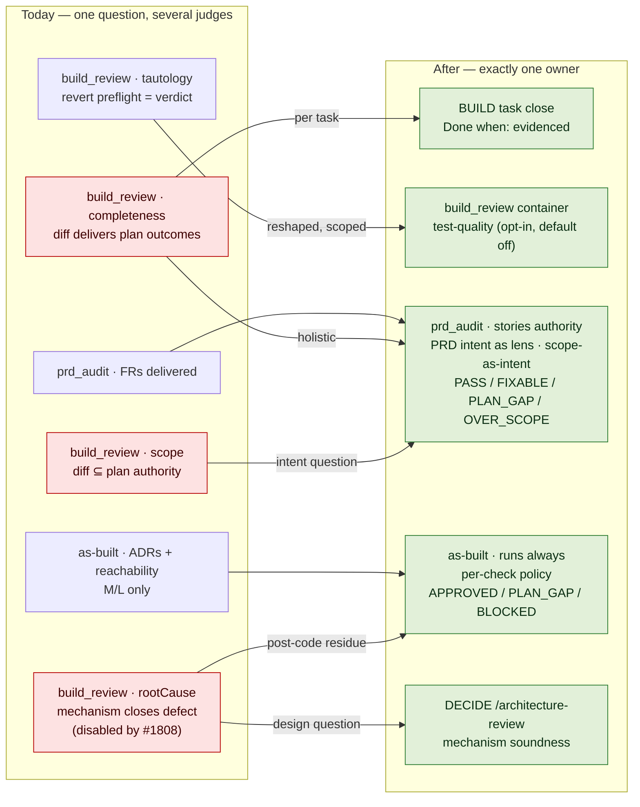
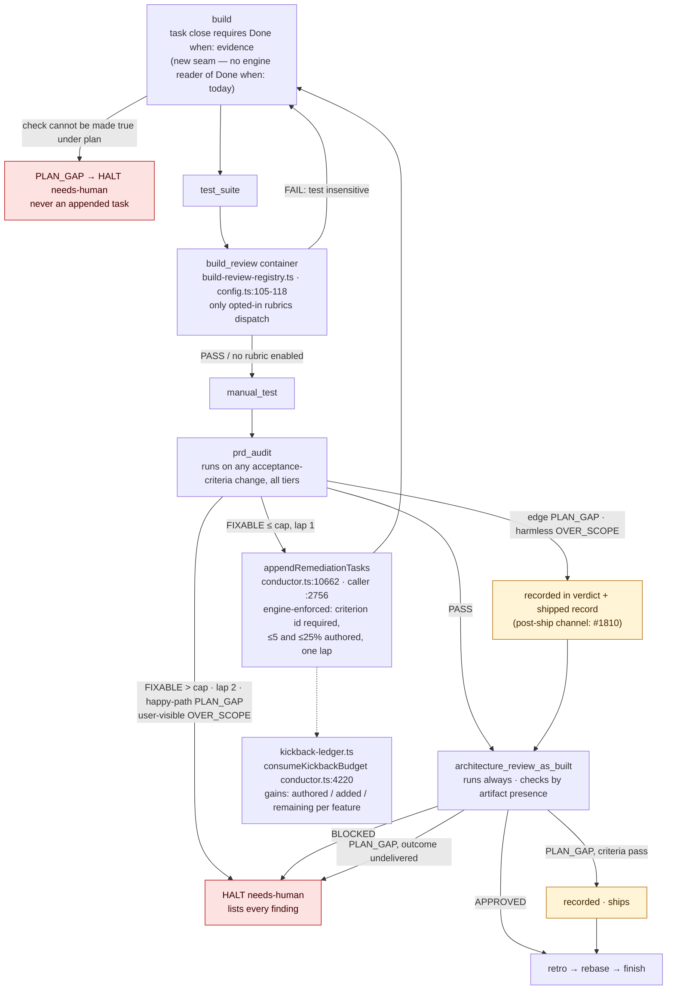
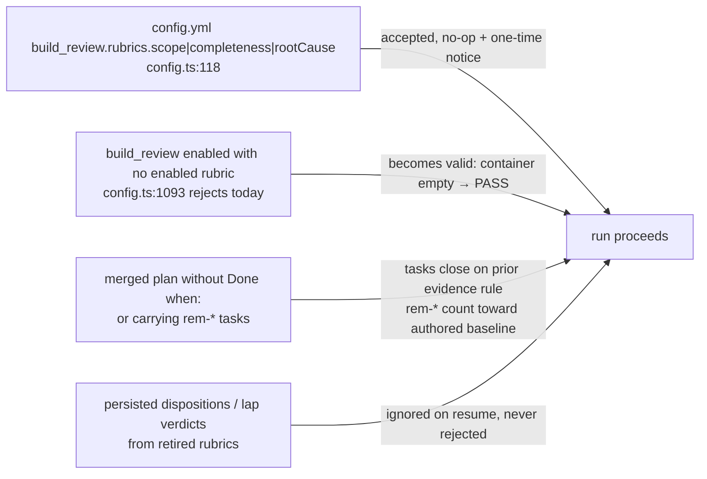

# Architecture: One owner per review question

**Last updated:** 2026-08-22
**Scope:** The review gates `build_review`, `prd_audit`, and `architecture_review_as_built`, BUILD
task close, the kickback ledger and remediation append path in `conductor.ts`, and the config
surface for rubrics. Covers jstoup111/ai-conductor#1805. PRD:
`.docs/specs/build-review-re-judges-what-the-plan-architecture-.md`.

All line references are at worktree base `b6289d647`.

## Diagram: ownership today vs after (L3)

## Diagram: the BUILD → SHIP path after consolidation (L3)

## Diagram: backward compatibility (L3)

## Legend

- **Red** — retired or halting. Retired rubrics are removed with their code and tests (FR-23); the
  only survivors are the no-op config acceptance and tolerant readers shown in the third diagram.
- **Green** — the single owner of each question after the change.
- **Amber** — a non-blocking finding recorded at ship; consumed later by #1810.
- Verified at base: `config.ts:1093` rejects an all-disabled rubric set, so the empty container is
  a behavior change; `appendRemediationTasks` (`conductor.ts:10662`) is today the only plan
  appender and stays so; no engine module reads `Done when:` (grep over `src/conductor/src/engine`
  is empty), so task-close evidence is a new seam. Inferred: the `remediate` step path at
  `conductor.ts:2756` is where the cap is enforced — confirm in architecture-review.

## Change Log

| Date | Change | Reason |
|------|--------|--------|
| 2026-08-22 | Initial generation | DECIDE for #1805 |
| 2026-08-22 | Plan update: named the new seams (covers-marker.ts, as-built-policy.ts, accepted-widenings.ts, growth record in kickback-ledger.ts) and the removed as-built→build route | /plan Task breakdown |
