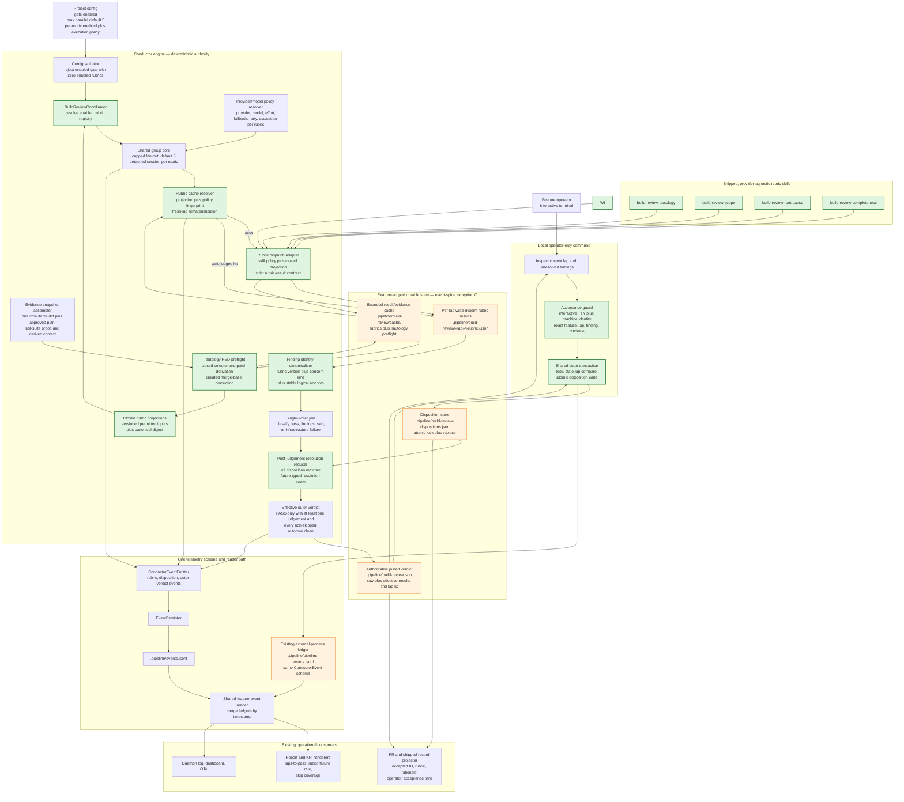

# Components: build_review rubric fan-out and operator dispositions

**Last updated:** 2026-08-13
**Scope:** The proposed `build_review` boundary: four independently configured rubric skills,
one engine-owned evidence snapshot and join, durable per-finding operator dispositions, the
existing event spine, reporting, and publication evidence. Issue #1542.

## Diagram



## Boundary decisions

- **Engine owns trust and orchestration.** `build_review` remains one engine-native lifecycle gate.
  The engine alone assembles the immutable input snapshot, selects and caps branches, validates
  results, creates finding IDs, applies dispositions, joins the outer verdict, and routes failures.
  A rubric skill supplies judgement policy only; it cannot choose inputs, accept a risk, or publish
  the gate verdict.
- **Rubric policy moves out of the inline prompt.** The four surviving shipped skills are consumer-facing,
  provider-agnostic policy modules. Their model-table rows provide defaults, while project config
  may independently override provider, model, reasoning effort, fallback order, retry budget, and
  retry escalation for each rubric.
- **One source snapshot, closed projections, write-disjoint branches.** The engine freezes one lap's
  base, HEAD, diff, plan, current `test_suite` proof, and derived evidence, then derives a versioned
  permitted-input projection for each rubric. A skill cannot observe inputs outside its projection.
  Each branch writes only its rubric-and-lap-specific result, and the join is the sole writer of the
  compatibility verdict path.
- **Green proof is reused; Tautology gets only the missing RED experiment.** The upstream
  code-valid `test_suite` PASS prevents a redundant HEAD run. An engine preflight keeps changed
  tests and substitutes merge-base production code in an isolated checkout. It records normal test
  failure as RED evidence and treats setup, execution, or cleanup inability as infrastructure
  failure without modifying either live checkout. A separate exact-input preflight cache avoids
  repeating this deterministic run on unchanged re-dispatches; failures never cache.
- **Semantic results may cache; verdict freshness may not.** Every rubric cache key includes its
  contract/projection versions, projection digest, and resolved execution policy. A valid judged hit
  is stamped into a current-lap branch artifact and rejoined; skips bypass the provider, failures do
  not cache, and no old aggregate verdict can satisfy completion.
- **Raw judgement stays independent of accepted risk.** Rubric sessions never receive the
  disposition store. The join first records raw findings, then matches accepted IDs to compute the
  effective verdict. Reporting can therefore distinguish grader failure rate from operator-accepted
  risk instead of making acceptance look like a grader pass.
- **Future claims compose after raw judgement.** The operator identified separate forthcoming work
  for Tautology/Scope claims or bypasses. This architecture reserves only a typed post-judgement
  resolution seam over stable finding identities. It does not define that work's records,
  authorization, matching, expiry, or effect, and rubric skills and semantic caches never receive
  those inputs.
- **Finding identity excludes prose and locations that naturally drift.** Each rubric skill emits a
  versioned concern kind and stable logical anchors, plus separate human-readable evidence
  locations. The engine canonicalizes and hashes the identity fields; summaries and line numbers
  are excluded. A materially different concern must have a different concern kind or logical
  anchor and therefore remains blocking.
- **Operator acceptance is a guarded transaction.** The CLI requires an interactive terminal,
  resolves the machine-scoped operator identity, requires a non-empty rationale, and binds to the
  exact feature, current lap, and current finding under the same lock used by the join. It refuses
  stale or mismatched requests before mutation. Provider subprocesses are non-interactive and
  cannot cross this boundary.
- **Compatibility is at the join.** Existing consumers keep reading `.pipeline/build-review.json`
  and the public `build_review` gate. Legacy verdicts remain fail-closed and are never inferred to
  carry accepted dispositions.

## Event-spine verdict

```text
Event spine
  Channel?    yes — rubric execution, disposition attempts, and effective verdicts are occurrences
  Concern:    occurrence — operators and metrics need to know what happened and when
  Verdict:    extend the ConductorEvent union; sibling operator ledger uses the same schema and reader
  Exception:  A + B for the separate CLI process and concurrent-writer safety; C for current verdict, disposition, and cache state
```

> **Amended 2026-08-13 by #1542 architecture review:** reuse and generalize the existing
> `.pipeline/pipeline-events.jsonl` external-process ledger instead of adding an operator-specific
> third file. The existing same-schema sibling pattern already satisfies exceptions A and B; its
> writer and readers need generalization, not duplication.

The external-process ledger is not a bespoke audit format. It contains `ConductorEvent` records and
enters the same timestamp-merged reader path as `.pipeline/events.jsonl`. The disposition store,
current verdict, and bounded semantic-result cache are durable state, not reconstructed telemetry;
cache hits themselves are occurrences on the event spine.

## Legend

- **Green** — new judgement-policy or deterministic control boundaries.
- **Orange** — new or evolved durable artifacts; only the sibling operator ledger is an event file,
  and it uses the existing event schema.
- `«lap»` and `«rubric»` are runtime identifiers.
- Dashed trust is intentionally absent: graders do not read disposition state, and the operator
  command does not write grader result files.

## Change Log

| Date | Change | Reason |
|------|--------|--------|
| 2026-08-13 | Confirmed plan wiring and exact-input preflight cache | Post-plan architecture-diagram/review pass |
| 2026-08-14 | Removed the build-review-wiring skill node; fan-out is four rubric branches | Wiring rubric retired repository-wide by adr-2026-08-14-retire-build-review-wiring-rubric (PR #1577) |
| 2026-08-13 | Reserved a typed post-judgement resolution seam | Account for future Tautology/Scope claims without designing them in #1542 |
| 2026-08-13 | Added isolated Tautology RED preflight and per-rubric semantic-result cache | Reuse upstream green proof and bound repeat token spend |
| 2026-08-13 | Reused the existing external-process event ledger | Architecture review found the approved same-schema sibling pattern already exists |
| 2026-08-13 | Initial proposed architecture | DECIDE phase for issue #1542 |
