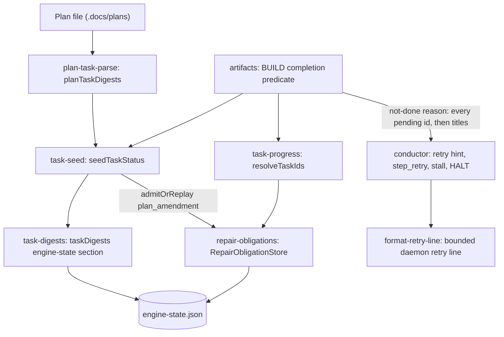

# Components: BUILD task reopen on plan text change

**Last updated:** 2026-10-02
**Scope:** Engine components touched by #2014 and how they connect. The runtime flow is in [the sequence diagram](sequences/build-step-completes-with-every-plan-task-still-pe.md).

## Diagram

## Legend

New: `planTaskDigests` and the `taskDigests` engine-state section. Changed: `seedTaskStatus` admits `plan_amendment` obligations; the BUILD predicate's not-done reason names every pending task. Unchanged: the obligation store, resolver, rebase translation and daemon line bound. `adr-2026-09-06-reopened-task-resolution` D11 governs the new admission source.

## Change Log

| Date | Change | Reason |
|------|--------|--------|
| 2026-10-02 | Initial component view | #2014: stale `Task:` trailers resolved rewritten plan tasks |
