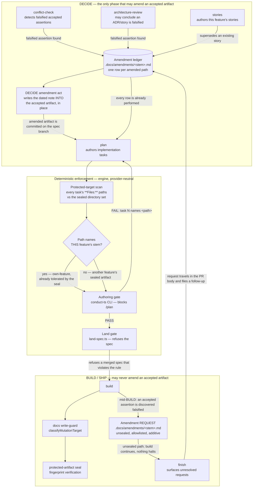

# Components: Amendment of accepted `.docs/` artifacts is a DECIDE-time act

**Last updated:** 2026-08-04
**Scope:** Where an amendment to an already-accepted `.docs/` artifact may be authored, which
skills may direct one, and the deterministic checks that reject a direction pointing anywhere else.
**Refs:** jstoup111/ai-conductor#1293

## The seam that is broken today

Amendment intent is produced correctly at DECIDE and then handed to the wrong phase. Three DECIDE
skills can each conclude "this change falsifies an accepted assertion", and today each of them can
only express that conclusion as *work for someone else to do later*:

- `conflict-check` writes a `## Required Amendments (same change set)` section.
- `architecture-review` writes "amend both in the same change set with a dated note" into its report.
- `stories` is told to "note any stories that supersede or modify existing ones", with no form.

None of the three performs the amendment. `plan` then turns the intent into a task with the sealed
paths on its `**Files:**` line, and BUILD — the one phase forbidden to touch those paths — is handed
the job. The seal is right to refuse it.

## Diagram



## Component responsibilities

### The amendment ledger — `.docs/amendments/<plan-stem>.md`

One new artifact, deliberately placed **outside** the four sealed directories
(`.docs/architecture`, `.docs/plans`, `.docs/specs`, `.docs/stories`). It is the single machine-readable
place where "this change falsifies that accepted assertion" is recorded, whoever noticed it. Each row
carries the amended path, the assertion it falsifies, and whether the amendment has been performed.

Placing it outside the sealed set is what lets BUILD write to it without tripping the seal, which is
what makes the mid-BUILD route non-blocking. Placing it under `.docs/` is what keeps it in the spec
diff and in the PR.

### The DECIDE amendment act

The amendment is written **into the accepted artifact, in place**, during DECIDE, on the spec branch,
before BUILD ever runs. Because the seal baseline is taken at first BUILD entry, an amendment landed
at DECIDE **is** the baseline. There is no collision to tolerate, no rotation to perform, and no
reseal command required — which is why this design does not depend on #1281 shipping first.

The note form is the convention already in use across this repository's own corpus and named as
"established" inside three artifacts, but codified in no skill:

```
> **Amended YYYY-MM-DD by #NNN:** <what the assertion now says, and why>
```

### The deterministic protected-target scan

Reuses, never reimplements: `parsePlanTaskPaths` for the task→paths map, and the seal module's own
sealed-directory set and own-feature stem predicate for the policy. If what "sealed" means ever
changes, the scan changes with it for free.

Two enforcement points, because one is not enough:

- **Authoring-time** (CLI, blocking) — catches it while the plan author can still fix it.
- **Land-time** (`land-spec.ts`, blocking) — catches a merged spec authored by a session that ignored
  the authoring check. Prompt discipline is not enforcement; this is the deterministic backstop.

### Why enforcement cannot live in a host hook

`.claude/settings.local.json` and the Claude session hooks do not govern Codex — #1254 recorded a Codex
BUILD session committing a protected artifact straight through the write-guard that stops Claude. Every
check in this design is therefore engine-side and provider-neutral.

## Interfaces this change does not alter

- The seal's fingerprint format, its `version: 2` schema, and its three existing tolerances
  (own-feature self-amendment, base-tip inheritance, rotation-on-history-rewrite).
- `remediation-append`'s write into the feature's **own** plan, which the own-feature tolerance covers.
- The `retro` step's existing `.docs/stories/` write allowlist entry.
