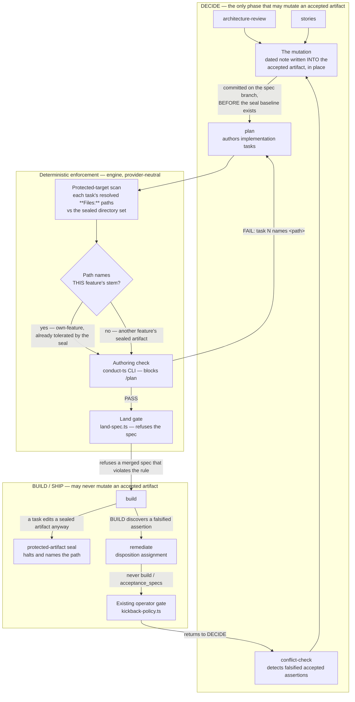

# Components: DECIDE mutates accepted `.docs/` artifacts; no later phase may

**Last updated:** 2026-08-04
**Scope:** Where an amendment to an already-accepted `.docs/` artifact may be performed, which skills
may direct one, and the deterministic checks that reject a direction pointing anywhere else.
**Refs:** jstoup111/ai-conductor#1293

## The seam that is broken today

Amendment intent is produced correctly at DECIDE and then handed to the wrong phase. Three DECIDE
skills can each conclude "this change falsifies an accepted assertion", and today each can only
express that conclusion as *work for someone else to do later*:

- `conflict-check` writes a `## Required Amendments (same change set)` section.
- `architecture-review` writes "amend both in the same change set with a dated note" into its report.
- `stories` is told to "note any stories that supersede or modify existing ones", with no form.

None of the three performs the mutation. `plan` then turns the intent into a task with the sealed
paths on its `**Files:**` line, and BUILD — the one phase forbidden to touch those paths — is handed
the job. The seal is right to refuse it.

The fix is not to find BUILD a way to do it. It is to have DECIDE do it.

## Diagram



## Component responsibilities

### The mutation itself

Written into the accepted artifact, in place, during DECIDE, on the spec branch, before BUILD ever
runs. Because the seal baseline is taken at first BUILD entry, a mutation landed at DECIDE **is** the
baseline. There is no collision to tolerate, no rotation to perform, and no reseal command required —
which is why this design does not depend on #1281.

The note form is the convention already in use across this repository's own corpus and named
"established" inside three artifacts, but codified in no skill:

```
> **Amended YYYY-MM-DD by #NNN:** <what the assertion now says, and why>
```

There is no separate record artifact. The mutation is the record, and git holds its history.

### The deterministic protected-target scan

Reuses, never reimplements: `parsePlanTaskPaths` for the task→paths map, and the seal module's own
sealed-directory set and own-feature stem predicate for the policy. If what "sealed" means ever
changes, the scan changes with it for free.

Two enforcement points, because one is not enough:

- **Authoring-time** (CLI, blocking) — catches it while the plan author can still fix it.
- **Land-time** (`land-spec.ts`, blocking) — catches a merged spec authored by a session that ignored
  the authoring check. Prompt discipline is not enforcement; this is the deterministic backstop.

### The mid-BUILD path

There is no BUILD-side component, deliberately. A BUILD-discovered falsification is a DECIDE finding
and routes to DECIDE through the existing remediation dispositions and operator gate. The diagram's
`BUILD → REMEDIATE → OPGATE → CONFLICT` edge is the whole mechanism; no new artifact appears on it.

### Why enforcement cannot live in a host hook

`.claude/settings.local.json` and the Claude session hooks do not govern Codex — #1254 recorded a Codex
BUILD session committing a protected artifact straight through the write-guard that stops Claude. Every
check in this design is therefore engine-side and provider-neutral.

## Interfaces this change does not alter

- The seal's fingerprint format, its `version: 2` schema, and its three existing tolerances
  (own-feature self-amendment, base-tip inheritance, rotation-on-history-rewrite).
- The seal halt itself, which remains the fail-closed backstop when a mutation reaches BUILD anyway.
- `remediation-append`'s write into the feature's **own** plan, which the own-feature tolerance covers.
- The `.docs` write allowlist, the `retro` step's `.docs/stories/` entry, and `build_review`'s Scope
  rubric.
