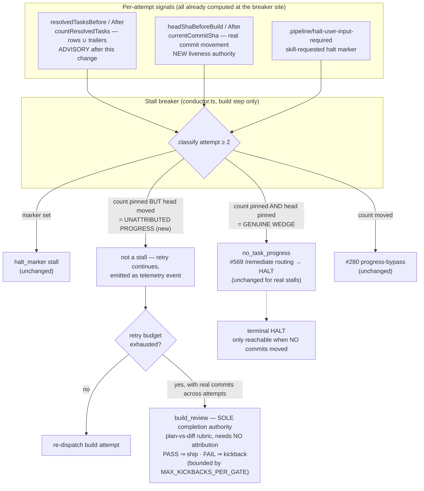
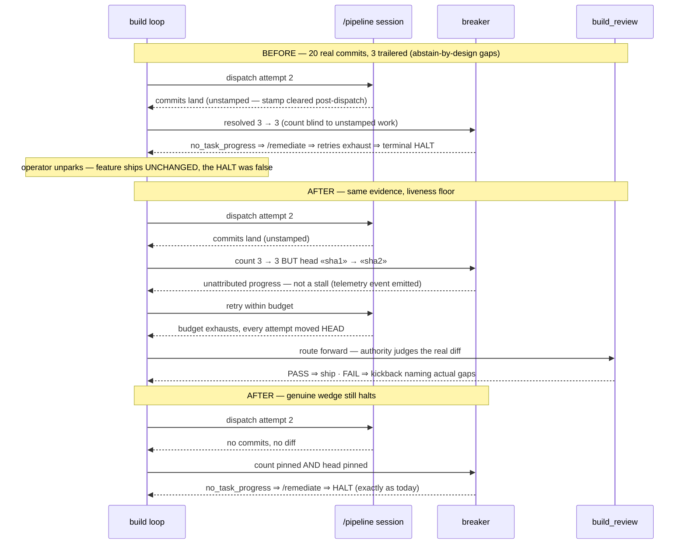

# Architecture — Builds stall when work lands without Task: trailer stamps

**Stem:** `builds-stall-when-work-lands-without-task-trailer-` · Tier M (lightweight diagram) · 2026-07-23 · Follow-on to #895 (closed dup of #859) — this is the residual defect

The stall circuit breaker's only liveness signal is the **attributed-task count**
(`countResolvedTasks` = completed/skipped rows ∪ `Task:`-trailered commits). Attribution
coverage is **structurally partial by design**: #519 chose abstain-or-loud (every uncertainty
path removes `.pipeline/current-task` and abstains — misattribution is worse than none),
`post-dispatch` clears the stamp the moment a Task-tool dispatch returns (main-session
commits after that are unstamped), and `Task: none` dispatches are legal. Verified live: a
halted worktree with 11 grammar-valid dispatches and 20 real commits carried trailers for
only 3 task ids — the machinery worked as designed and still undercounted. Therefore the
count can plateau while real work lands, and the breaker reads the plateau as
`no_task_progress` → terminal HALT → operator unparks → ships unchanged.

**Fix (operator-selected approach C):** give the breaker a **commit-movement liveness
floor** — it may declare `no_task_progress` only when the count is pinned **and** HEAD did
not move; when the retry budget exhausts on attempts that produced real commits, **route to
`build_review`** (the sole completion authority, #773/#859 — its plan-vs-diff rubric needs
no attribution) instead of terminal-HALTing. The attributed count is demoted to advisory
telemetry (retry hints, re-kick eligibility), stated once in contract text.

Key code facts (read directly this session, ~95% unless noted):

- Breaker: `conductor.ts:3768-3778` — `attempt >= 2 && resolvedTasksAfter <= resolvedTasksBefore`
  ⇒ `stalled = 'no_task_progress'`; `lastBuildStallReason` becomes the terminal HALT text.
- `currentCommitSha` is already imported and used at this loop (`conductor.ts:3054`, `:3740`),
  but the existing `headShaBeforeBuild` baseline is **per-step, not per-attempt** — the floor
  adds a per-attempt baseline `let`, rolled at loop bottom like `resolvedTasksBefore` (see A1).
- `detectZeroWorkProduct` is a stub pinned `false` (#773 Task 14, telemetry demotion,
  `attribution-enforcement.ts:183-190`) — the floor must NOT depend on it.
- Progress-bypass (#280 T4/T5): `resolvedTasksAfter > resolvedTasksBefore` bypasses the retry
  budget under an absolute `attempt_ceiling` — untouched by this feature.
- Genuine-stall routing (#569): daemon-mode `no_task_progress` synthesizes a `/remediate`
  prompt — preserved verbatim for real stalls (count pinned AND head pinned).
- `halt_marker` stalls (skill explicitly requests human input) — untouched.
- Kickback loop bound: `MAX_KICKBACKS_PER_GATE` already bounds build_review FAIL → build
  cycles, so routing on exhausted budget cannot loop forever.

## Component / dataflow (C4 component level)

## Sequence — the live failure vs target state

## Key architectural decisions

1. **Liveness authority = commit movement; attributed count = advisory.** Any signal built on
   per-task attribution undercounts by design (#519 abstain-or-loud is correct and stays).
   HEAD movement is attribution-independent, already computed at the site, and cannot be
   starved by stamping gaps. The count still powers retry hints (naming unresolved ids) and
   `daemon-cli.ts` re-kick eligibility — advisory uses, stated as such in one place.
2. **Exhausted budget + real work ⇒ route to the authority, never terminal-HALT.** Finishes
   the #773/#859 split: the deterministic loop only decides *when to stop dispatching*;
   `build_review` decides *whether the work is complete*, judging the diff itself. A FAIL
   verdict kicks back with named gaps, bounded by `MAX_KICKBACKS_PER_GATE` — so this cannot
   become an infinite build↔review loop, and it cannot become always-pass (negative path:
   a genuinely incomplete diff FAILs at the fail-closed rubric).
3. **Genuine wedges are provably preserved.** `no_task_progress` remains reachable exactly
   when count pinned ∧ head pinned; #569's /remediate routing and the HALT tail are
   untouched on that path. This is the feature's own negative-path story with a regression
   fixture shaped like the live halted worktree.
4. **No revival of deleted machinery.** `detectZeroWorkProduct` stays a pinned-false stub;
   no evidence-derivation engine, no SHA-reachability/wedge-class reasoning (#859 §4). The
   floor is two string comparisons on values already in scope.
5. **Empty-commit gaming is out of scope deliberately.** A no-op commit could defeat the
   floor (~85% confident this is acceptable): the downstream authority still FAILs an
   incomplete diff, so gaming the floor only buys retries, not a false ship. Cheaper and
   settled at build_review, not with diff-size heuristics in the breaker.

## Wiring surface (design-time)

- **Breaker classification change** — inline at the existing `conductor.ts` build-step retry
  loop (`:3768-3778`); no new export.
- **`unattributed_progress` telemetry event** — added to `types/events.ts` and emitted via
  the existing `emitTracked` at the classification site; consumed by the daemon log renderer
  like sibling build events.
- **Budget-exhaustion routing** — the existing retry-exhaustion tail in the same loop gains
  the route-to-`build_review` branch (reuses the step-advance path the completion gate takes).
- **Contract text** — `skills/pipeline/SKILL.md`, `docs/daemon-operations.md`,
  `src/conductor/README.md`: the count-is-advisory / movement-is-liveness statement.

## Surfaced assumptions (load-bearing)

- **A1 — HEAD movement must be measured per-attempt. RESOLVED (verified — the naive signal
  is WRONG).** `headShaBeforeBuild` is a `const` captured at **step entry**
  (`conductor.ts:3054`), outside the attempt loop (`:3149`) — using it would credit attempt
  N with attempt 1's commits, so one early commit would blind genuine-wedge detection for
  the rest of the step. The floor therefore introduces a **per-attempt SHA baseline** (a
  `let` re-captured each iteration, rolled at loop bottom exactly like `resolvedTasksBefore`
  already is). The per-step const stays untouched for zero-work telemetry.
- **A2 — routing on exhausted budget reuses an existing seam.** The completion gate already
  advances build → build_review; the new branch must take the same seam (not invent a second
  advance path). Verified the seam exists (`completion.done` path); the exact function to
  call is a `/plan`-time detail (~85%).
- **A3 — no other consumer treats `no_task_progress` as "any pinned count".** #569 and the
  auto-park path key off the `stalled` variable at this one site (verified callers at
  `:3939-4189`); `daemon-cli.ts` re-kick reads the HALT text, which this feature narrows but
  does not reshape (~85%). Conflict-check must sweep the #569/#280 story pair.

## Touched modules

- `src/conductor/src/engine/conductor.ts` — breaker classification (liveness floor),
  budget-exhaustion routing branch, stall-reason text
- `src/conductor/src/types/events.ts` — `unattributed_progress` event
- `skills/pipeline/SKILL.md`, `docs/daemon-operations.md`, `src/conductor/README.md`,
  `CHANGELOG.md` — contract text: count advisory, movement liveness
- Tests: regression fixture reproducing the live halted-worktree shape (real commits, sparse
  trailers) + genuine-wedge preservation fixture

## Change Log

| Date | Change | Reason |
|------|--------|--------|
| 2026-07-23 | Initial generation | DECIDE for the attribution-coverage stall defect (approach C) |
