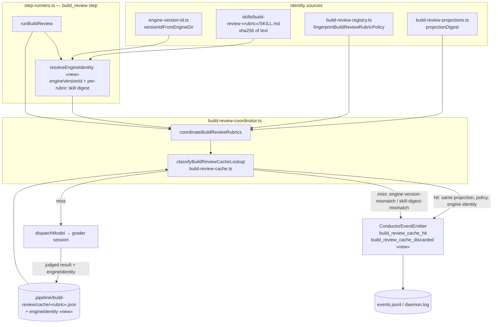

# Components: build_review rubric cache with engine identity (#1759)

**Last updated:** 2026-08-21
**Scope:** The build_review semantic cache path and the engine identity that must match before a cached rubric verdict is replayed. Planned state (approach C).

## Diagram

## Legend

- «new» marks components or fields introduced by this feature; everything else exists today.
- The cache identity becomes: rubric, contractVersion, projectionVersion, projectionDigest, policyFingerprint, **engineIdentity**. A mismatch on any part is a miss; the two new miss reasons carry their own names so the log distinguishes an engine-change discard from an ordinary projection miss.
- Legacy entries without `engineIdentity` miss closed (`invalid-entry`), matching how v1/v2 contract entries already behave.

## Change Log

| Date | Change | Reason |
|------|--------|--------|
| 2026-08-21 | Initial generation | DECIDE for #1759, engineer loop |
| 2026-08-21 | Plan update: unreadable SKILL.md settles as existing `cache-read-failed` (no new reason); identity resolved in step-runners and injected | /plan for #1759 |
