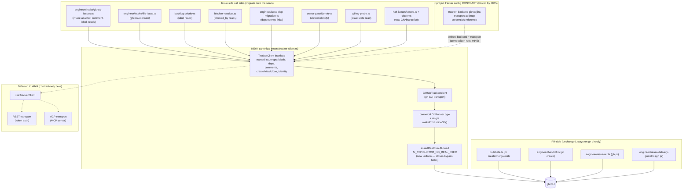

# Components: Canonical Tracker-Client Seam (#846)

**Last updated:** 2026-07-22
**Scope:** Target-state component view of the issue-side tracker access seam — the
canonical `TrackerClient` interface, its GitHub implementation over one guarded runner,
the per-backend transport contract (Jira implementations deferred to #849), and the
PR-side `gh` paths that intentionally stay outside the seam (#774: code remains on
GitHub). Paths are relative to `src/conductor/src/engine/`.

## Diagram

## Legend

- **Solid boxes/arrows** — built by this feature: the `TrackerClient` interface, the
  GitHub implementation, the single canonical runner + guarded production factory, and
  the migration of every issue-side call site.
- **Dotted arrows / Future subgraph** — contract-only in this feature: the config key
  shape is documented for #845 to host; `JiraTrackerClient` and its REST/MCP transports
  are built in #849 against this seam.
- **PR-side subgraph** — intentionally out of scope; per #774 code hosting stays on
  GitHub, so PR machinery keeps calling `gh` directly.
- `halt-issues`' existing object-shaped `GhAbstraction` folds into `TrackerClient`
  (it is already the target shape).
- The kill-switch guard is uniform in the target state: every real `gh` exec on the
  issue side flows through the one `makeProductionGh()`, which honors
  `AI_CONDUCTOR_NO_REAL_EXEC` (today the `engineer-cli.ts:513` and
  `halt-issues-cli.ts:103` copies bypass it).

## Change Log

| Date | Change | Reason |
|------|--------|--------|
| 2026-07-22 | Initial generation | DECIDE architecture step for #846 (engineer spec authoring) |
