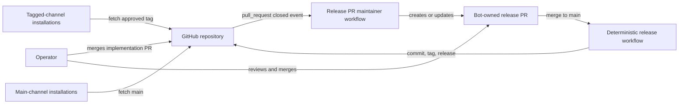
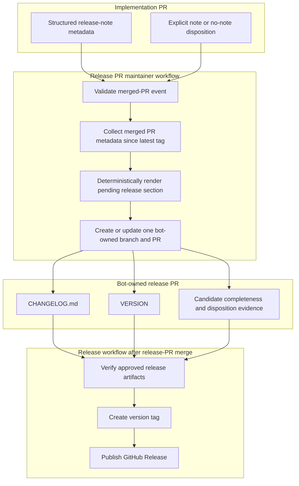
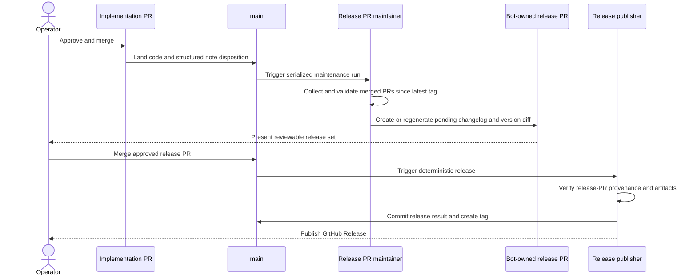
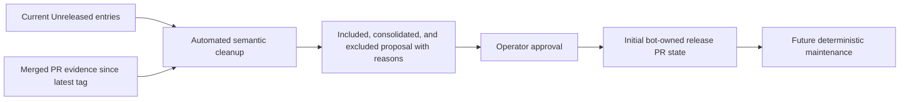

# Release-PR Architecture: ai-conductor

**Last updated:** 2026-08-01  
**Scope:** As-built repository-local flow for maintaining and publishing release notes without feature-branch writes to `CHANGELOG.md`.

## System Context

## Components and Ownership

## Merge-to-Release Sequence

## One-Time Transition

## Invariants

- Implementation branches never write `CHANGELOG.md` or `VERSION`.
- Exactly one bot-owned release PR is open for the pending release set.
- Maintenance runs are serialized and regenerate from authoritative merged-PR metadata, so retries are idempotent.
- A merged implementation PR has either a valid release note/category or an explicit no-note disposition.
- Only an operator-approved release PR can reach tagging and publication.
- The one-time semantic cleanup does not become a recurring GitHub Actions dependency.

## Legend

Solid arrows are deterministic repository or GitHub workflow transitions. The one-time cleanup is a migration activity with operator approval; normal maintenance is deterministic.

## Change Log

| Date | Change | Reason |
|------|--------|--------|
| 2026-08-01 | Initial proposed release-PR architecture | Replace the shared feature-branch changelog write target |
| 2026-08-01 | Plan alignment update | Named typed metadata, candidate, renderer, App-action, publisher, transition, and tagged-update seams |
