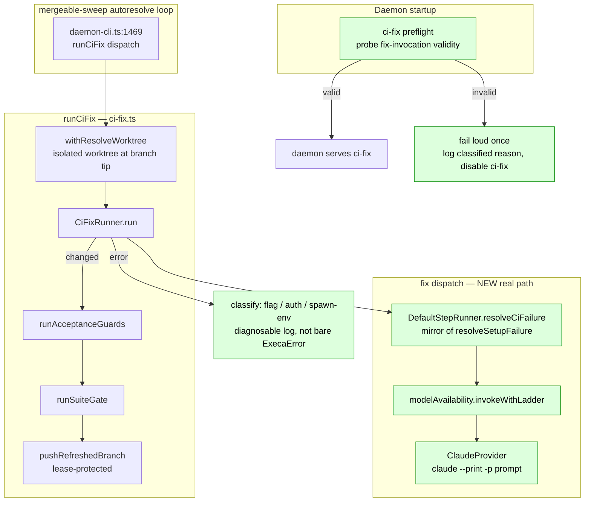

# Architecture: ci-fix-resolver-autofix

Lightweight (Medium tier). Shows the resolver's spawn contract change and the new startup
preflight gate. Unchanged pipeline stages are drawn dim/grouped.

## Component view (target state)

## Removed vs added

- **Removed:** `productionCiFixRunner` → `execa('claude', ['--fix-session', '--pr-url', …, '--hint', …])`
  (fictional flag; arg-parse crash).
- **Added:**
  - `DefaultStepRunner.resolveCiFailure(ctx)` — a real headless dispatch mirroring
    `resolveSetupFailure` (`step-runners.ts:697`): fresh one-shot session, `invokeWithLadder`,
    `resume:false`, `dangerouslySkipPermissions`, cwd = resolver worktree, CI-failure hint in the prompt.
  - `productionCiFixRunner` rewired to invoke that dispatcher (via the injected seam) instead of a raw `claude` flag.
  - Error **classification** at the resolver boundary — map a spawn failure to `flag-invalid`
    / `auth` / `spawn-env` / `unknown`, logged as a diagnosable line.
  - Startup **preflight** that probes fix-invocation validity once and fails loud (disables
    ci-fix with a classified reason) rather than crashing per-PR.

## Invariants preserved

- Resolver still runs inside `withResolveWorktree` — the primary checkout is never mutated.
- The guard → suite-gate → lease-push publish pipeline is unchanged; only what produces the
  `changed` outcome changes.
- `AI_CONDUCTOR_NO_REAL_EXEC` kill-switch still short-circuits to a no-op (tests/dry-run).
