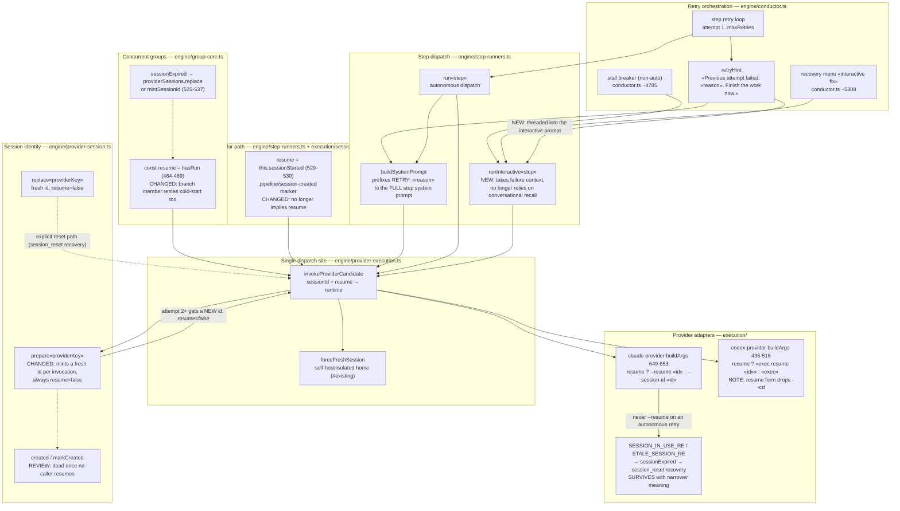

# Components: Cold-Start Within-Step Retries (#1071)

**Last updated:** 2026-07-27
**Scope:** All **three** independent within-step resume authorities in
`src/conductor`, the single dispatch site that consumes them, the provider adapters
that turn a resume flag into CLI arguments, and the two operator-facing interactive
recovery entrypoints.

Out of scope: `bin/conduct` (the shell conductor), and the
`.pipeline/conduct-session-id` OTel run-id file, which is written from the step
runner's own `this.sessionId` and is **not** the provider session identity under
provider-aware execution (`provider-session.ts` never writes it) — so per-invocation
session identity does not disturb `conductor.run.id`.

### The three resume authorities

Any fix that changes only one of these leaves a live path that still resumes:

| # | Authority | Location | Resume expression |
|---|---|---|---|
| A | Provider session scope | `engine/provider-session.ts:46` | `resume: session.created` |
| B | Concurrent-group branch | `engine/group-core.ts:464-469` | `const resume = hasRun` |
| C | Legacy scalar (no session store) | `engine/step-runners.ts:529-530` + `execution/session.ts:83-90` | `resume = this.sessionStarted` |

A is the one the issue names. B drives concurrent-group member retries when no
`providerSessions` scope is supplied. C drives single-provider runs with no session
store. All three flip to "resume" on the same trigger — *this step has dispatched at
least once* — so all three carry the same contamination.

## Diagram

## Legend

- **CHANGED `prepare`** — today `prepare()` returns the *same* id with
  `resume: session.created`, so attempt 2+ of a step dispatches
  `claude --resume «id»` into the failed attempt's conversation. After this change it
  mints a fresh id per invocation and never reports resume, so cold start is the only
  autonomous semantic and both providers agree.
- **Why the id must change, not just the flag** — `buildArgs` sends
  `--session-id «id»` when `resume` is false. Reusing the id the CLI already registered
  is precisely the condition `SESSION_IN_USE_RE` exists to catch, so suppressing the
  flag alone would trade a contamination bug for a session-lock bug.
- **`created` / `markCreated`** — their only consumer is `prepare()`'s resume
  derivation. Once no caller resumes they carry no decision; the review question is
  whether to delete them or retain them purely as scope bookkeeping.
- **`SESSION_IN_USE_RE` / `sessionExpired`** — the reset-and-retry safety net stays.
  Its meaning narrows from "a resumed conversation went stale" to "the CLI rejected the
  identifier we minted", which is still reachable (id collisions, external interference).
- **`forceFreshSession`** — the existing self-host suppression becomes redundant with
  the new default rather than conflicting with it; it is a subset of the new behavior.
- **NEW on `runInteractive`** — the one place where the prompt genuinely does not carry
  what the resumed session does. It sends a 12-word stub with an empty system prompt and
  `resume: true`. Cold-starting it without threading failure context would regress the
  operator's recovery experience, so the context becomes an explicit input.
- **Codex is in scope, not out.** #903 has **not** landed — a repo-wide search finds
  zero hits for `supportsSessionResume` or `coldStart`, and Codex resume is fully
  implemented (`codex exec resume «id»`) and exercised by passing tests. So the
  premise "Codex is already being made cold-start-only elsewhere" is false today.
  Cold start is therefore applied provider-neutrally here, which is what makes the
  "described identically" outcome achievable without a provider-conditional branch.
- **`«…»`** — placeholder for a variable value.

## Consequences

- A provider capability flag (`supportsSessionResume`) is **not** introduced. With no
  provider resuming, the flag would have no `true` case; a two-valued abstraction with
  one reachable value is cost without benefit, and it would preserve exactly the
  provider-conditional wording the issue asks to remove.
- `forceFreshSession` becomes a subset of the default and is a deletion candidate; its
  self-host test (`provider-execution.test.ts:116`) should survive as a regression
  guard on the general behavior.
- `provider-execution.test.ts:164` (`'still resumes within a step when no isolated
  self-host home is provisioned'`) asserts the behavior being removed and must be
  inverted, not deleted — it is the direct regression guard for this change.

## Change Log

- 2026-07-27 — Initial component view for #1071.
