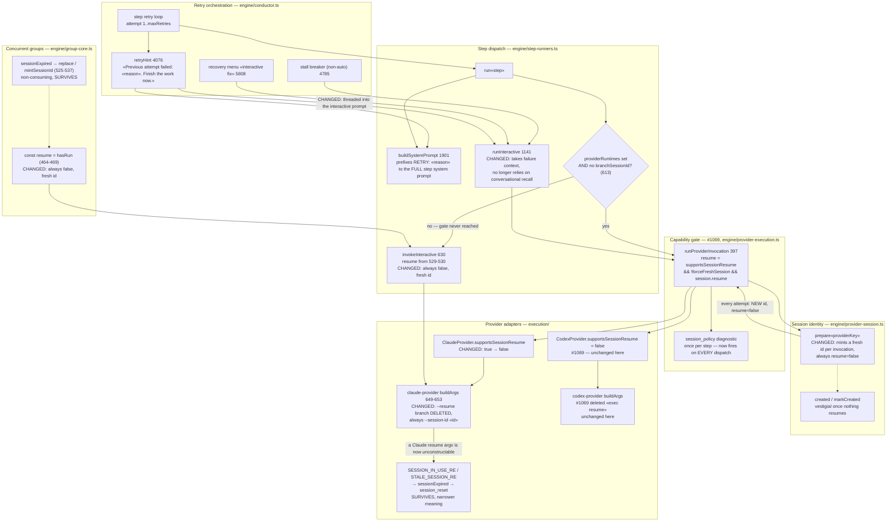

# Components: Claude Declares No Resume (#1071)

**Last updated:** 2026-07-27
**Scope:** What remains resumable after #1069 (issue #903) merges — Claude's capability
declaration and resume argv, session identity minting in `ProviderSessionScope`, the two
dispatch paths that never reach #1069's capability gate, and the operator-facing interactive
recovery entrypoints.

**Depends on #1069**, which adds `supportsSessionResume` to `LLMProvider`, sets Codex `false`,
deletes Codex's `exec resume` argv, gates resume in `runProviderInvocation`, and emits a
once-per-step `session_policy` diagnostic.

Out of scope: `bin/conduct` (the shell conductor), and `.pipeline/conduct-session-id`, which is
written from the step runner's own `this.sessionId` and is **not** the provider session identity
under provider-aware execution — so per-invocation minting does not disturb `conductor.run.id`.

### State after #1069, before this feature

| Path | Location | Resume expression | Gated by #1069? | Claude resumes? |
|---|---|---|---|---|
| Provider-aware | `provider-execution.ts:397` | `supportsSessionResume && !forceFreshSession && session.resume` | Yes | **Yes** — Claude declares `true` |
| Concurrent-group branch (scalar) | `group-core.ts:464-469` | `const resume = hasRun` | **No** | **Yes** |
| Legacy scalar | `step-runners.ts:529-530` | `resume = this.sessionStarted` | **No** | **Yes** |

`step-runners.ts:613` enters `runProviderAwareNormal` only when `providerRuntimes` is set and no
`branchSessionId` was supplied; otherwise `:630` dispatches `provider.invokeInteractive`
directly, never entering `provider-execution.ts`. Codex is nonetheless safe on all three after
#1069, because its argv branch is deleted — the guarantee is structural, not gate-dependent.
This feature applies the same technique to Claude.

## Diagram

## Legend

- **CHANGED `ClaudeProvider.supportsSessionResume`** — `true` → `false`. This alone makes the
  capability gate suppress Claude resume by the same path it already suppresses Codex, with no
  Claude-specific branch.
- **CHANGED `buildArgs`** — deleting the `--resume` branch mirrors what #1069 did to Codex. It
  is what makes the invariant hold on the two paths that never reach the gate: a resume cannot be
  constructed even if one is requested.
- **CHANGED `prepare`** — today it returns the *scope-stable* id with `resume: session.created`.
  #1069 explicitly declines to change this (*"Do not change `ProviderSessionStore` id minting or
  scoping"*). But `buildArgs` sends `--session-id «id»` whenever `resume` is false, so flipping
  the declaration without minting per invocation would dispatch against an id the CLI already
  registered — the `SESSION_IN_USE_RE` condition. The flip and the minting are one change.
- **The `FORK` node** is the crux of finding F3. #1069's ADR calls `runProviderInvocation` "the
  single place resume is decided"; that is true only down the `yes` edge.
- **`created` / `markCreated`** — their only consumer is `prepare()`'s resume derivation. Once
  nothing resumes they carry no decision; deletion is evaluated only after the guard tests pass.
- **`session_policy`** — #1069's diagnostic. Unchanged in scoping, but after this feature it
  describes every dispatch rather than the Codex subset, so its once-per-step bound is what keeps
  it from becoming log spam.
- **`SESSION_IN_USE_RE` / `sessionExpired`** — the reset-and-retry safety net stays. Its meaning
  narrows from "a resumed conversation went stale" to "the CLI rejected the identifier we
  minted", still reachable via collision, external interference, or a torn-down self-host home.
- **`«…»`** — placeholder for a variable value.

## Consequences

- After #1069 **and** this feature, no session is ever resumed, for either provider, on any
  dispatch path — the operator's stated end state.
- `supportsSessionResume` is retained with no reachable `true` case (ADR Decision 4): it remains
  #1069's fail-closed default for adapters added later, and with both argv branches deleted a
  `true` declaration could not construct a resume anyway.
- `forceFreshSession` (`provider-execution.ts:376, 546`) becomes a subset of the default and is a
  deletion candidate; its self-host test (`provider-execution.test.ts:116`) must survive as a
  regression guard on the general behavior.
- `provider-execution.test.ts:164` (`'still resumes within a step when no isolated self-host home
  is provisioned'`) asserts the behavior being removed and is inverted, not deleted.

## Change Log

- 2026-07-27 — Rewritten to sit on top of #1069: scope narrowed to the Claude declaration, argv
  deletion, per-invocation minting, the two ungated paths, and interactive context. The prior
  revision was authored without knowledge of #1069 and duplicated its Codex work.
- 2026-07-27 — Initial component view for #1071.
