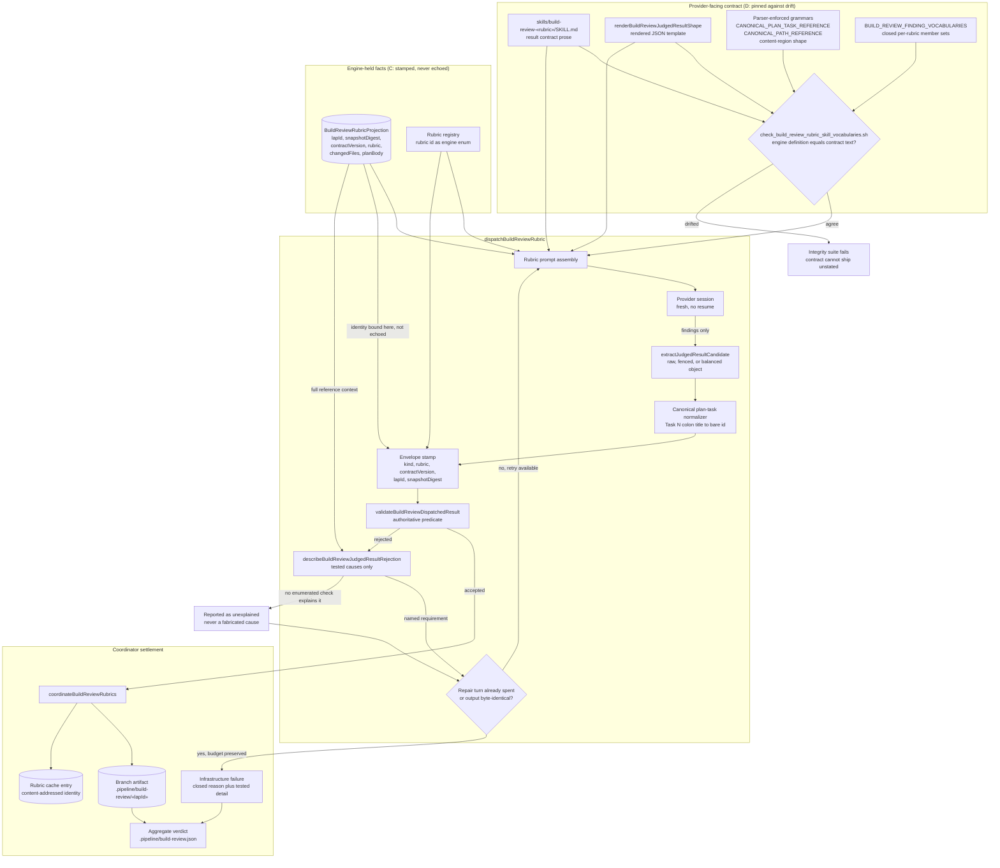

# Components: Engine-owned rubric judged-result boundary

**Last updated:** 2026-08-19
**Scope:** The build_review rubric judged-result trust boundary — prompt assembly, provider
dispatch, the validate-and-repair loop, and coordinator settlement — showing the four seams
that stop a conformant judgement being discarded and stop a rejection asserting an untested
cause.

## Diagram

## Legend

**Boundaries.** `CONTRACT` is provider-facing text; `ENGINE` is what the engine already holds
with certainty; `DISPATCH` is one rubric's round trip; `SETTLE` is the shared coordinator.

**The four seams.**

| Seam | Node(s) | Change |
|---|---|---|
| A — diagnosis integrity | `DIAGNOSE`, `UNEXPLAINED`, `REPAIR` | The diagnosis receives the full projection reference context, reports only causes it tested, and an unexplained failure says so instead of naming a field absent from the payload. A repair turn whose output is byte-identical does not consume the remaining budget. |
| B — plan-task canonical form | `NORM`, `GRAMMAR` | `Task N: <title>` is normalized to the bare canonical id before identity binding, and the required form is stated in the contract. |
| C — engine-owned envelope | `STAMP`, `PROVIDER` edge | The provider returns only `findings`. `kind`, `rubric`, `contractVersion`, `lapId` and `snapshotDigest` are stamped from `PROJ` and `REGISTRY`. Any envelope field the provider still sends is ignored, never validated. |
| D — grammar drift guard | `DRIFT`, `BLOCK` | The existing vocabulary drift check is extended to parser-enforced reference grammars, so a parser tightening cannot ship without its instruction. |

**Why identity is stamped rather than echoed.** `lapId` and `snapshotDigest` are members of
`BUILD_REVIEW_PROVENANCE_KEYS` — already excluded from the cache-identity digest as
rebase-volatile identities of the same content. The coordinator already stamps them on the
cache-hit path, where a judgement authored under a different lap is written under the current
one. Seam C removes the asymmetry by making the fresh-dispatch path behave the same way.
Freshness protection is unchanged: it lives in pre-dispatch input assembly and in the
content-addressed cache identity, never in a provider echo.

**Dotted vs solid.** All edges are solid; there are no advisory paths in this boundary. Every
edge that leaves `VALIDATE` or `DIAGNOSE` is a settled outcome.

## Change Log

| Date | Change | Reason |
|------|--------|--------|
| 2026-08-19 | Initial generation | DECIDE for `clean-rubric-judgements-rejected-as-invalid-provid` (#1683) |
