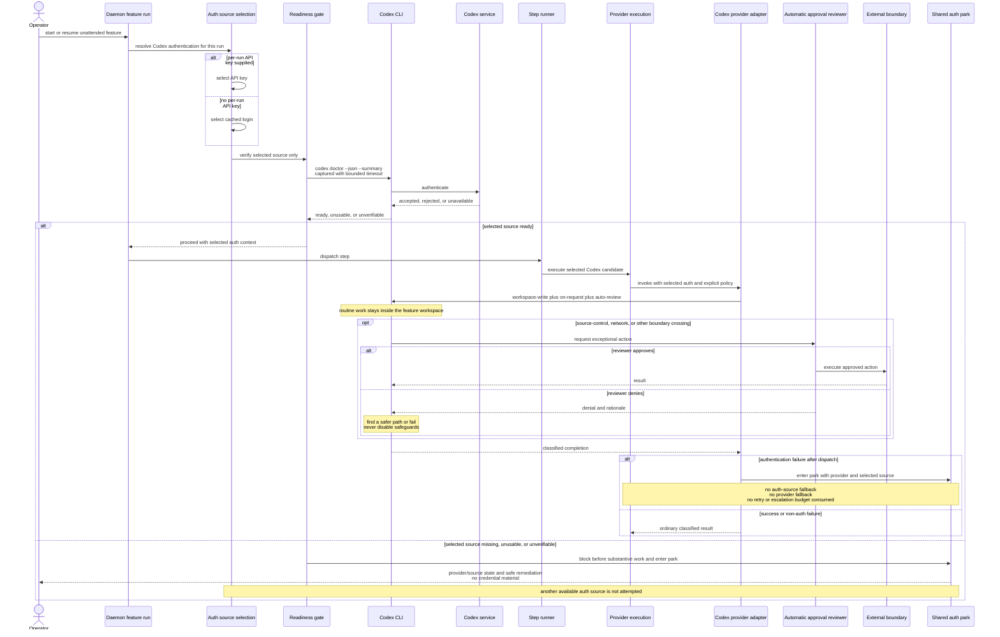
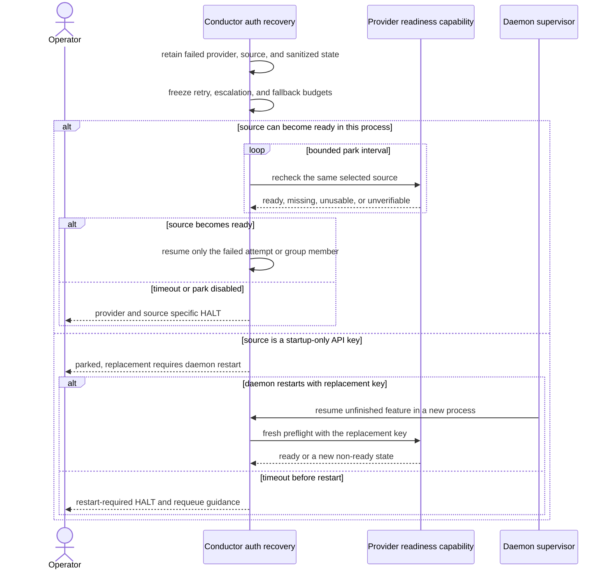
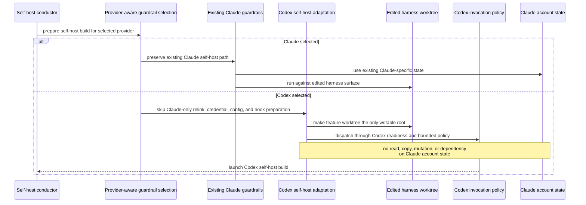

# Components + Sequences: Codex Authentication and Autonomous Execution Readiness

**Last updated:** 2026-07-25
**Scope:** Current provider-aware execution seams plus the planned Codex-specific
authentication readiness, bounded unattended policy, failure disposition, and self-host
isolation responsibilities for issue #905. Planned elements are marked **[NEW]** or
**[CHANGE]**; their boundaries follow the approved PRD and the approved shared-auth-park
ADR dated 2026-07-25.

## Component Diagram

```mermaid
graph LR
    Operator["Harness operator"]

    subgraph roots ["Composition and feature-run scope"]
        Daemon["Daemon composition root"]
        Feature["Per-feature provider execution context<br/>runtimes, sessions, events"]
        SelfHost["Self-host guardrail selection<br/>[CHANGE: provider-aware]"]
    end

    subgraph orchestration ["Existing provider-aware orchestration"]
        Runner["Step runner<br/>normal and auxiliary dispatches"]
        Execution["Provider candidate execution<br/>selection, model ladder, classification"]
        Recovery["Shared authentication recovery<br/>[CHANGE: one bounded park lifecycle]"]
        Events["Operator diagnostics and audit events"]
    end

    subgraph codexboundary ["Planned Codex invocation boundary"]
        AuthSelect["Authentication source selection [NEW]<br/>per-run API key, otherwise cached login"]
        Readiness["Authentication readiness gate [NEW]<br/>ready, missing, unusable, unverifiable"]
        Policy["Unattended invocation policy [NEW]<br/>workspace-write, on-request, auto-review"]
        CodexProvider["Codex provider adapter [CHANGE]<br/>scoped auth, explicit policy, classification"]
        AuthPark["Auth park coordinator [CHANGE]<br/>provider/source retained; source-specific readiness<br/>zero fallback, retry, and escalation budget"]
    end

    subgraph selfhost ["Self-host provider isolation"]
        ClaudeGuardrails["Existing Claude self-host guardrails<br/>throwaway Claude configuration"]
        CodexGuardrails["Codex self-host adaptation [NEW]<br/>skip Claude-only setup; use native worktree boundary<br/>plus provider-local readiness and policy"]
        Isolation["Isolation invariant<br/>Codex path never reads or mutates<br/>Claude account state"]
    end

    ApiKey["Operator-supplied per-run API key"]
    Cached["Cached Codex account login"]
    ClaudeState["Claude account and configuration state"]
    CodexCli["Codex CLI<br/>external"]
    CodexService["Codex service<br/>external"]
    ExternalOps["Source-control host and package services<br/>external boundary operations"]

    Operator --> Daemon
    Daemon --> Feature
    Feature --> AuthSelect
    ApiKey --> AuthSelect
    Cached --> AuthSelect
    AuthSelect --> Readiness
    Readiness --> CodexCli
    CodexCli --> CodexService
    Readiness -->|"ready"| Runner
    Readiness -->|"not ready"| AuthPark

    Runner --> Execution
    Execution --> Policy
    Policy --> CodexProvider
    CodexProvider --> CodexCli
    CodexProvider --> Events
    CodexProvider -->|"auth failure"| AuthPark
    AuthPark --> Recovery
    Recovery -->|"Codex readiness recheck"| Readiness
    Recovery --> Events
    CodexCli -->|"automatically reviewed escalation"| ExternalOps

    Daemon --> SelfHost
    SelfHost -->|"Claude selected"| ClaudeGuardrails
    SelfHost -->|"Codex selected"| CodexGuardrails
    ClaudeState --> ClaudeGuardrails
    CodexGuardrails --> Isolation
    CodexGuardrails --> Policy

    style AuthSelect fill:#e3f2fd,stroke:#1565c0,stroke-width:2px
    style Readiness fill:#e3f2fd,stroke:#1565c0,stroke-width:2px
    style Policy fill:#e8f5e9,stroke:#2e7d32,stroke-width:2px
    style CodexProvider fill:#fff3e0,stroke:#ef6c00,stroke-width:2px
    style AuthPark fill:#fff3e0,stroke:#ef6c00,stroke-width:2px
    style CodexGuardrails fill:#e3f2fd,stroke:#1565c0,stroke-width:2px
    style Isolation fill:#fce4ec,stroke:#ad1457,stroke-width:2px
```

## Sequence 1: Preflight, Dispatch, and Automatic Boundary Review

## Sequence 2: Shared Authentication Park and Recovery

## Sequence 3: Provider-Isolated Self-Host Dispatch

## Approved Invariants

- Authentication selection belongs to one feature-run Codex context: a supplied
  per-run API key wins; otherwise cached login is used. Rejection never selects a
  different authentication source.
- The Codex adapter evaluates readiness immediately before every unattended initial,
  model-ladder, auxiliary, or resumed dispatch. It captures raw doctor output and
  emits only a source kind plus a sanitized four-state verdict.
- `workspace-write`, `on-request`, and `auto_review` are set explicitly on every
  unattended Codex invocation, including resumed and auxiliary paths. The dangerous
  combined bypass is not used for routine Codex automation.
- Provider candidate execution keeps its existing recovery precedence: authentication
  failure is returned to recovery and never advances to another configured provider.
- Authentication failure does not consume task retry, effort-escalation, or
  model-escalation budget.
- Every built-in-provider authentication failure enters the same bounded park
  lifecycle. Provider-specific readiness determines whether the source recovers.
- A startup-only API key is explicitly restart-required; the harness does not claim
  hot reload or create another credential source.
- The automatic reviewer may approve exceptional source-control and network actions,
  but a denial never widens policy on retry or resume.
- Claude authentication sources, credential ownership, and permission policy remain
  unchanged; auth failures share the common park disposition.
- A Codex self-host build skips only Claude-specific relink/auth/sandbox preparation
  and uses the same provider-local readiness and native worktree boundary as other
  Codex dispatches. Provider-neutral self-host release gates remain active.

## Approved Architecture Decisions

- The Codex adapter owns source selection, child-environment scoping, strict
  `doctor` parsing, explicit policy arguments, and secret-safe completion
  classification for every invocation path.
- `doctor` evidence maps to `ready`, `missing`, `unusable`, or `unverifiable`.
  Unknown schemas, external failures, and conflicting evidence fail closed as
  `unverifiable`; raw diagnostic output is never surfaced.
- Codex auth failure retains provider/source context through serial and grouped
  recovery and enters the shared bounded auth park with zero retry or escalation
  budget. Cached login is rechecked through the Codex readiness capability; a
  startup-only API key requires daemon restart and never gains a new reload path.
- Self-host setup resolves the build provider before provider-specific preparation.
  The Codex branch uses the native worktree sandbox and never enters Claude setup.
- Codex skill discovery, `$skill` invocation, `AGENTS.md`, and edited-skill self-host
  parity remain owned by issue #904 rather than being duplicated in #905.
- An automatic-review denial is an actionable permission failure. It never selects a
  different auth source, advances provider/model fallback, or weakens policy on retry.

## Diagram Impact Boundary

Issue #905 changes internal conductor components and invocation sequences around an
already-supported external provider. It adds no new deployable container, datastore,
database relationship, user type, or external service integration. System-context,
container, and ERD diagrams therefore require no update.

## Legend

- **Blue** marks planned Codex-specific readiness or self-host responsibilities.
- **Green** marks the planned explicit unattended policy.
- **Orange** marks existing components whose contracts change.
- **Pink** marks the cross-provider isolation invariant.
- Solid arrows show control, credential selection, or invocation flow. Labels identify
  external or conditional boundaries.

## Change Log

| Date | Change | Reason |
|------|--------|--------|
| 2026-07-25 | Initial planned architecture | DECIDE input for issue #905, Medium tier |
| 2026-07-25 | Resolved auth probe, recovery, policy, and self-host boundaries | Operator-approved architecture ADR |
| 2026-07-25 | Replaced Codex-only HALT with shared auth park and source-specific readiness | Operator-approved PRD and superseding ADR amendment |
