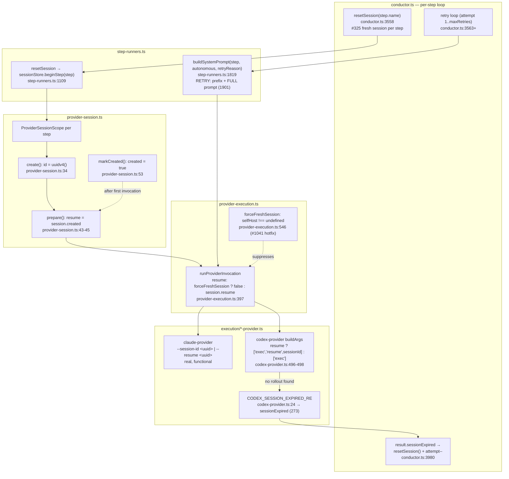
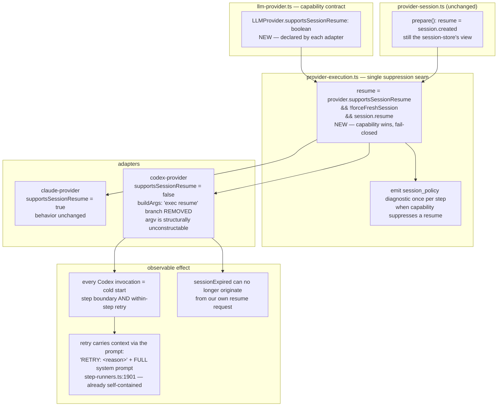

# Components: Codex fresh-session-per-step contract (#903)

**Last updated:** 2026-07-27
**Scope:** The provider-session dispatch seam — `ProviderSessionStore`/`ProviderSessionScope`
(`provider-session.ts`), `runProviderInvocation` (`provider-execution.ts:368-400`), the
`LLMProvider` `InvokeOptions` contract (`llm-provider.ts:112-113`), the Codex adapter's argv
builder (`codex-provider.ts:495-516`), and the conductor's fresh-session-per-step reset
(`conductor.ts:3544-3560`) plus its stale-session recovery branch (`conductor.ts:3980-3997`).

## Current wiring (as built)

### The defect this diagram encodes

`prepare()` returns `resume: session.created`, so **attempt 2+ within a step resumes**. For
Claude that works — `--session-id <uuid>` registers the id and `--resume <uuid>` finds it. For
Codex it cannot: `codex exec resume <id>` expects a Codex **rollout id** (uuidv7, minted by
Codex), while the harness supplies its own `uuidv4` (`provider-session.ts:34`), and `codex exec`
exposes no flag to pre-register a caller-supplied id. Every Codex resume therefore fails with
`no rollout found for thread id …`, is caught by the stdout regex at `codex-provider.ts:24`, and
round-trips through the conductor's stale-session branch — burning a real Codex invocation per
retry to learn something structurally knowable.

## Target wiring

## Component responsibilities after the change

| Component | Responsibility | Change |
|---|---|---|
| `LLMProvider` (`llm-provider.ts`) | Declares whether the provider can resume a harness-minted session id | **New** `supportsSessionResume` field |
| `ClaudeProvider` | Session create/resume via `--session-id` / `--resume` | Declares `true`; no behavior change |
| `CodexProvider` | One-shot `codex exec` dispatch only | Declares `false`; `exec resume` argv branch deleted |
| `runProviderInvocation` | The single place resume is decided | Capability gate ANDed in; emits a suppression diagnostic |
| `ProviderSessionStore` | Per-step scope + id minting for correlation/audit | Unchanged (the id stays useful as a log correlation key) |
| `conductor.ts` reset + stale branch | Step-boundary reset; stale-session recovery | Unchanged |

## Boundary with #1042

#1042 owns **where a Codex session could live** — self-host home provisioning, whether
`CODEX_HOME` under `/tmp` is acceptable, and whether provider session identity should be read
back from Codex instead of minted. This feature owns only **whether dispatch asks to resume at
all**, and answers "no, structurally." The two do not conflict: making resume unrequestable is a
precondition for #1042's decision, not a substitute for it. `forceFreshSession`
(`provider-execution.ts:376`, the #1041 hotfix) is deliberately left in place — it is
provider-agnostic and remains #1042's seam.
