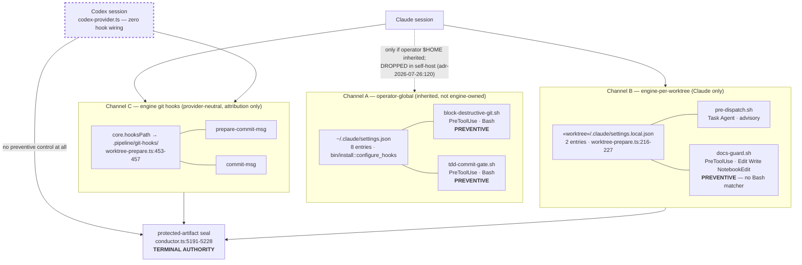
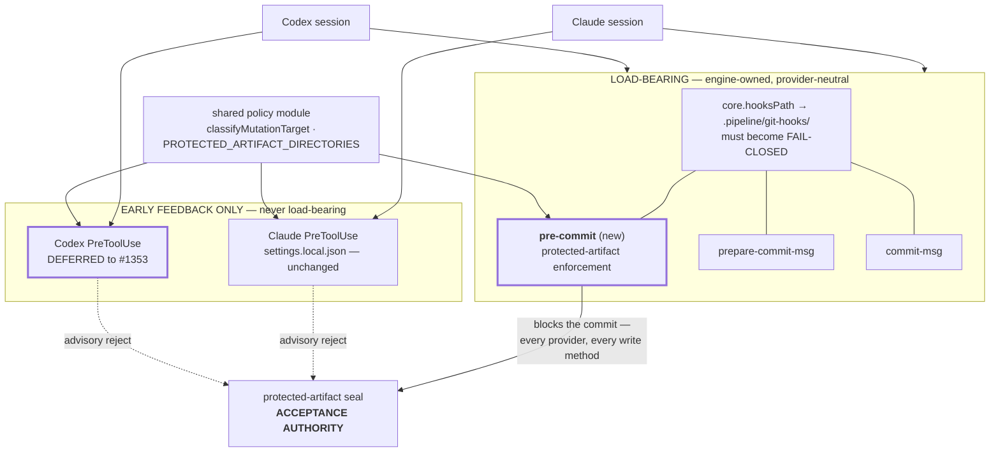
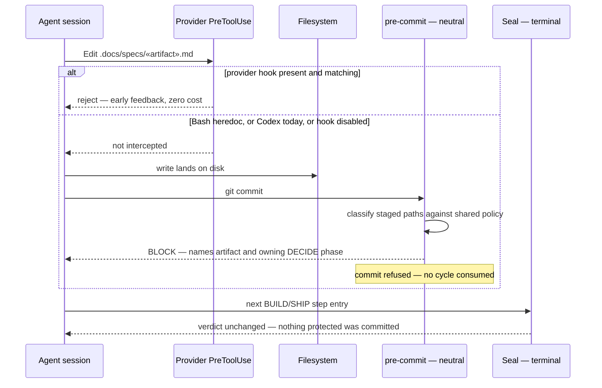
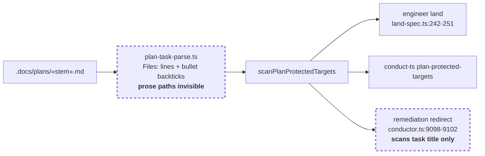

# Architecture: provider-neutral preventive controls for protected DECIDE artifacts (#1254)

**Stem:** `codex-lacks-preventive-hook-parity-protected-artif`
**Tier:** M — retiered from L after the verify-claims pass (see Scope)
**Last updated:** 2026-08-07

## Scope

Protected-artifact enforcement moves out of the Claude-only host-hook channel into an engine-owned,
provider-neutral one. Provider host hooks remain, demoted to early feedback. The terminal
protected-artifact seal keeps its role as acceptance authority and does not move.

**Descoped 2026-08-07** after the architecture review's verify-claims pass, each filed separately:

| Deferred | Why | Issue |
|---|---|---|
| Codex `PreToolUse` early-feedback layer | Once the neutral commit gate exists, this changes only *when* an agent sees the error, not *whether* it is caught. Unverified payload shape; seam fires only under `isSelfBuild()`. | #1353 |
| Destructive-git relocation | A different threat model (discarding work, not mutating a sealed artifact), and only partially coverable by git hooks. | #1354 |
| TDD-phase enforcement | Both TDD gates are **dormant** — nothing in the engine or any skill writes `.pipeline/tdd-phase` (`docs/reference/settings-and-hooks.md:156-162`). Relocating it would move a control that does not function. | #1009 |

What remains: one new git hook asset, one parser widening, one fail-closed fix, and the inventory.

Governing constraint — `adr-2026-07-26-concurrent-task-telemetry-and-symmetric-self-host-isolation:87`
(**APPROVED**):

> Provider-local hooks remain early feedback only.

This design satisfies #1254's parity outcome *without* amending that ADR: correctness relocates to a
channel every provider shares, rather than being replicated per provider.

## Current state — three disjoint channels, none provider-neutral



Verified failure modes visible above:

- **Codex has no preventive control.** `grep -n 'hook\|PreToolUse\|settings.local' codex-provider.ts`
  returns zero matches across 815 lines. Every mistake costs a terminal-audit cycle.
- **Channel A is not engine-owned.** The repo's own `.claude/settings.json` has no `hooks` key
  (`docs/reference/settings-and-hooks.md:125-126`); Channel A reaches a build only by inheriting the
  operator's `$HOME`, and self-host deliberately drops it (`adr-2026-07-26:120`). Destructive-git
  prevention is therefore absent in self-host on **both** providers.
- **`docs-guard` misses `Bash`.** Its matcher is `Edit|Write|NotebookEdit`, so a heredoc, `tee`,
  `sed -i`, or `python3 -c` write to `.docs/` bypasses it even on Claude — the #627 class.
- **Channel C is provider-neutral but carries only attribution**, never enforcement.

## Target state — one load-bearing channel, feedback fanned out



The `pre-commit` hook gates the **commit** rather than the write, which is why it is method-blind: a
heredoc, an inline interpreter, and an editor tool all converge on the same commit. That is the
property Channel B can never have, and it is what makes parity structural rather than replicated.

One shared policy module feeds all three consumers, closing the divergence where
`PROTECTED_ARTIFACT_DIRECTORIES` omits `.docs/decisions`
(`protected-artifact-seal.ts:17-22`) while the runtime classifier protects all of `.docs/` (`:205-207`).

## Enforcement sequence — a protected write on either provider



The terminal seal still runs and still decides acceptance. Its job changes from *catching* the
violation to *confirming* nothing slipped past — which is what keeps a bypassed, disabled, or
unsupported provider integration from producing a passing verdict.

## Pre-BUILD gates — closing the scanner blind spots

The violation in #1254 was authorized by the plan before any runtime control could matter, so the
gate chain gets tightened at the same time.



> **Amended 2026-08-07 by #1254:** the `PARSE` hole is closed by an *ambiguity rule*, not by
> harvesting prose. A task declaring `**Files:**` is scanned on its declared targets (unchanged); a
> task with no `**Files:**` **and** a foreign protected path in its body is rejected as ambiguous.
> Conflict-check C1 measured prose harvesting at 92/261 plans falsely rejected; the ambiguity rule
> measures at 7 tasks of 3,099 (0.23%). See the conflict report for the full corpus figures.

Both dashed nodes are verified holes, reproduced this session:

```text
$ conduct-ts plan-protected-targets .docs/plans/park-reconciliation-refusal-observability-1114.md
Task 18: .docs/specs/2026-07-04-operator-park.md          # EXIT=1

$ conduct-ts plan-protected-targets task16-only.md
No protected-target violations found.                      # EXIT=0
```

Task 16 is the task that actually performed the mutation. It declares no `**Files:**` line and names
its target inside a prose paragraph, which `plan-task-parse.ts:187-197` never harvests. The
whole-plan scan trips only on Task 18, via an unrelated bullet the parser mis-attributes to the last
open task. The gate that exists today would have blocked this plan by accident, not by design.

## Control classification

The inventory deliverable assigns every harness-supplied host control exactly one class.

| Control | Today | Target class |
|---|---|---|
| `pre-commit` (protected-artifact) | script absent; **nothing installs any `pre-commit`** (`settings-and-hooks.md:222-224`) | **required preventive safety** — this feature |
| `docs-guard.sh` | preventive, Claude, no `Bash` matcher | **superseded** by `pre-commit`; retained as early feedback |
| `block-destructive-git.sh` | preventive, Claude, operator-global only; absent in self-host | **required preventive safety, unresolved** — deferred to #1354 |
| `tdd-commit-gate.sh` | **dormant** — nothing writes `.pipeline/tdd-phase` (#1009); when the marker does exist it blocks *every* `Bash` call | **dormant** — out of scope pending #1009 |
| `hooks/pre-commit-tdd-gate.sh` | **dormant + uninstalled** — ships in-tree, copy-it-yourself only | **dormant** — out of scope pending #1009 |
| `pre-dispatch.sh` | advisory (attribution telemetry) | **advisory** — unchanged |
| `lint-after-edit.sh`, `spec-coverage-check.sh`, `diagram-coverage-check.sh`, `post-commit-derive-feedback.sh`, `stop-memory-reminder.sh`, `session-start-context.sh` | advisory | **advisory** — unchanged |
| `rate-limit-wait.sh` | **inert** — registered under `StopFailure`, not a host event (#1019) | **inert** — documented, out of scope |
| `write-fence.ts` | preventive, Claude self-host only | **intentionally provider-specific** (self-host live-boundary) |
| `prepare-commit-msg`, `commit-msg` | attribution, provider-neutral | **advisory** — unchanged |
| Codex `PreToolUse` | absent (0 matches in `codex-provider.ts`) | **early feedback** — deferred to #1353 |

A control classified *required preventive safety* must demonstrate equivalent observable prevention
on both providers and carry executable coverage for healthy, missing, disabled, malformed, and
bypassed paths. Nothing in the *advisory* or *intentionally provider-specific* rows carries that
obligation — which is what keeps the inventory honest rather than aspirational.

The inventory's first pass found **three controls that do not currently do anything**: both TDD gates
(#1009) and `rate-limit-wait.sh` (#1019). That is the inventory earning its place — a control that
silently does nothing is worse than an absent one, because the roster implies coverage that does not
exist.

## What the neutral gate does and does not cover

Stated precisely, because the earlier draft of this document overclaimed:

- **Covers:** a *committed* protected-artifact mutation, by any provider, via any write method
  (editor tool, `Bash` heredoc, `tee`, `sed -i`, inline interpreter). This is the #1254 failure.
- **Does not cover:** an *uncommitted* protected-artifact mutation. The seal tracks this as a
  distinct verdict — `Uncommitted protected artifact changed` (`protected-artifact-seal.ts:771-776`)
  — and continues to own it.
- **Does not cover:** a commit made with `--no-verify`, or one carrying `CONDUCT_ENGINE_COMMIT=1`
  (the established engine-bookkeeping escape already honored by `commit-msg`,
  `git-hook-assets.ts:140`). The new hook follows the same convention.
- **Does not cover:** a commit made outside the prepared worktree, since `core.hooksPath` is
  worktree-scoped.

Every uncovered path above lands on the terminal seal, which is exactly the division of labor
`adr-2026-07-26` prescribes. The honest claim for this feature is therefore **equivalent observable
early rejection in the normal path on every provider, with an unchanged terminal authority against
bypass** — not unbypassable prevention.

## Seams

| Concern | Seam | Status |
|---|---|---|
| Neutral hook install | `worktree-prepare.ts:399-416` writes git hooks; `:453-457` wires `core.hooksPath` | exists — add one asset |
| Hook asset source | `git-hook-assets.ts` | exists — add `pre-commit` |
| Fail-closed wiring | `writeGitHooksAndWire`, `worktree-prepare.ts:389-396` | **fails open today** — swallows every error and logs `git hooks: skipped` |
| Engine-commit escape | `CONDUCT_ENGINE_COMMIT=1`, `git-hook-assets.ts:140` | exists — new hook honors the same convention |
| Shared policy | `protected-artifact-seal.ts` `classifyMutationTarget` (`:193-209`) | exists — already re-exported to the hook generator |
| Plan path harvesting | `plan-task-parse.ts:138-197` | widen; three call sites consume it |
| Remediation redirect | `conductor.ts:9098-9102` | extend to `gap.rationale` |

The fail-open wiring is the one that must change: for attribution telemetry, skipping on error is
correct; for a load-bearing safety control it inverts #1254's own requirement that a missing or
disabled integration cannot yield a passing verdict.

## Risks

- **Widening `plan-task-parse.ts` risks false positives at the land gate.** Its output feeds three
  call sites, one of which blocks spec landing. Needs negative-path coverage proving a plan that
  merely *cites* an artifact as context still lands.
- **`core.hooksPath` is worktree-scoped.** A commit made outside the prepared worktree does not get
  the hook. The terminal seal remains the backstop for exactly this reason.
- **Hook wiring is a canonical breaking surface**, so the implementation PR carries a real
  `## Migration` block, not a waiver.
- **A blocked commit must not become a retry loop.** The gate's whole value is failing once instead
  of consuming kickback cycles; its diagnostic has to be actionable enough that the agent routes the
  amendment to DECIDE rather than retrying the commit.

## Change Log

| Date | Change | Reason |
|------|--------|--------|
| 2026-08-07 | Initial | DECIDE for #1254 |
| 2026-08-07 | Retiered L → M; descoped Codex hooks (#1353), destructive-git (#1354), TDD-phase (#1009); corrected the classification table; added explicit coverage boundaries | verify-claims pass corrected three claims — see `.pipeline/verify-claims-architecture_review.md` |
